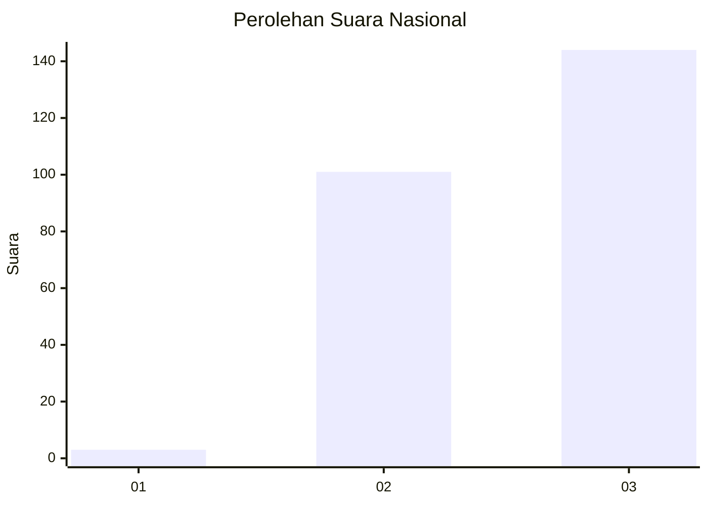
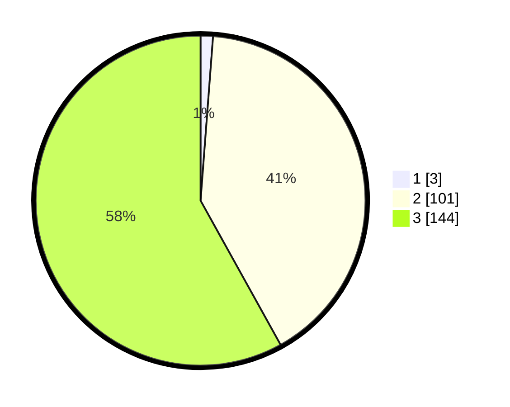

# Hasil

## Grafik

## Tabel

| No. | Nama Paslon    | Suara | Suara (raw) | Persentase |
|:--- |:-------------- | -----:| -----------:| ----------:|
| 1   | ANIES MUHAIMIN | 3     | [3][p-1]    | 1,21       |
| 2   | PRABOWO GIBRAN | 101   | [101][p-2]  | 40,73      |
| 3   | GANJAR MAHFUD  | 144   | [144][p-3]  | 58,06      |

[p-1]: https://github.com/gigit-pemilu/pemilu-2024/blob/main/pilpres/hitung-suara/sub/51-bali/sub/02-tabanan/sub/05-tabanan/sub/2011-buahan/sub/005-tps/sub/paslon-1.txt
[p-2]: https://github.com/gigit-pemilu/pemilu-2024/blob/main/pilpres/hitung-suara/sub/51-bali/sub/02-tabanan/sub/05-tabanan/sub/2011-buahan/sub/005-tps/sub/paslon-2.txt
[p-3]: https://github.com/gigit-pemilu/pemilu-2024/blob/main/pilpres/hitung-suara/sub/51-bali/sub/02-tabanan/sub/05-tabanan/sub/2011-buahan/sub/005-tps/sub/paslon-3.txt

## Foto C Plano

https://sirekap-obj-formc.kpu.go.id/baf6/pemilu/ppwp/51/02/05/20/11/5102052011005-20240216-095139--540a9d40-c7e5-4604-9f8d-e2cd73cdae7b.jpg

https://sirekap-obj-formc.kpu.go.id/baf6/pemilu/ppwp/51/02/05/20/11/5102052011005-20240216-095142--969269af-d4e8-4639-ae5a-949a21b4bc87.jpg

https://sirekap-obj-formc.kpu.go.id/baf6/pemilu/ppwp/51/02/05/20/11/5102052011005-20240216-095140--b761de93-5405-422c-bfd5-3f9e9085730b.jpg

## Metadata

| Key        | Value               |
| ---------- | ------------------- |
| Time Stamp | 2024-02-16 10:30:29 |

## DATA PEMILIH TETAP

Jumlah pemilih dalam DPT: **283**.
 * L: **142**.
 * P: **141**.

## DATA PENGGUNA HAK PILIH

Jumlah pengguna hak pilih dalam DPT: **252**.
 * L: **125**.
 * P: **127**.

Jumlah pengguna hak pilih dalam DPTb: **1**.
 * L: **0**.
 * P: **1**.

Jumlah pengguna hak pilih dalam DPK: **0**.
 * L: **0**.
 * P: **0**.

Jumlah pengguna hak pilih: **253**.
 * L: **125**.
 * P: **128**.

## JUMLAH SUARA SAH DAN TIDAK SAH

JUMLAH SELURUH SUARA SAH: **248**.

JUMLAH SUARA TIDAK SAH: **5**.

JUMLAH SELURUH SUARA SAH DAN SUARA TIDAK SAH: **253**.

