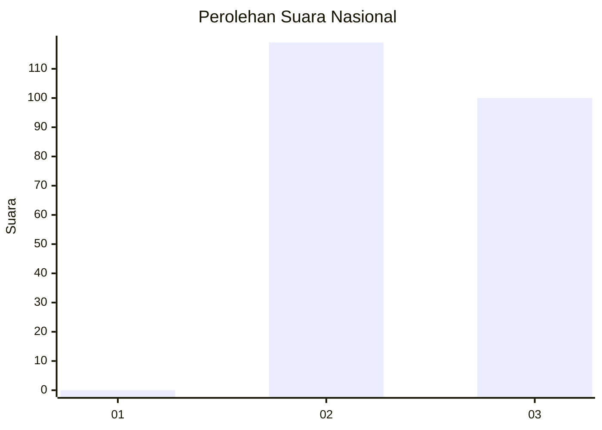
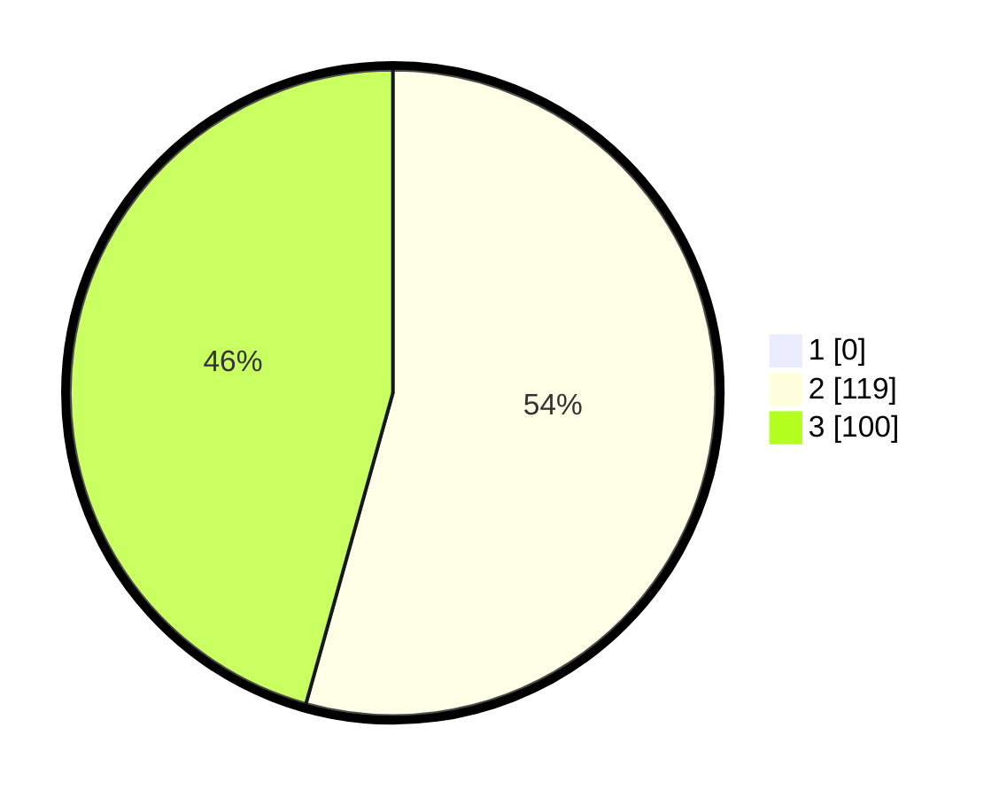

# Hasil

## Grafik

## Tabel

| No. | Nama Paslon    | Suara | Suara (raw) | Persentase |
|:--- |:-------------- | -----:| -----------:| ----------:|
| 1   | ANIES MUHAIMIN | 0     | [0][p-1]    | 0,00       |
| 2   | PRABOWO GIBRAN | 119   | [119][p-2]  | 54,34      |
| 3   | GANJAR MAHFUD  | 100   | [100][p-3]  | 45,66      |

[p-1]: https://github.com/gigit-pemilu/pemilu-2024/blob/main/pilpres/hitung-suara/sub/51-bali/sub/02-tabanan/sub/05-tabanan/sub/2011-buahan/sub/007-tps/sub/paslon-1.txt
[p-2]: https://github.com/gigit-pemilu/pemilu-2024/blob/main/pilpres/hitung-suara/sub/51-bali/sub/02-tabanan/sub/05-tabanan/sub/2011-buahan/sub/007-tps/sub/paslon-2.txt
[p-3]: https://github.com/gigit-pemilu/pemilu-2024/blob/main/pilpres/hitung-suara/sub/51-bali/sub/02-tabanan/sub/05-tabanan/sub/2011-buahan/sub/007-tps/sub/paslon-3.txt

## Foto C Plano

https://sirekap-obj-formc.kpu.go.id/df65/pemilu/ppwp/51/02/05/20/11/5102052011007-20240214-194008--55d337b5-6153-44bc-afe2-2ae777e2509b.jpg

https://sirekap-obj-formc.kpu.go.id/df65/pemilu/ppwp/51/02/05/20/11/5102052011007-20240214-194144--90c27e6d-0e2f-4bf3-ab33-e48f3ade7753.jpg

https://sirekap-obj-formc.kpu.go.id/df65/pemilu/ppwp/51/02/05/20/11/5102052011007-20240214-194255--de653c30-3ac0-41e6-addf-ed00a5c3f29e.jpg

## Metadata

| Key        | Value               |
| ---------- | ------------------- |
| Time Stamp | 2024-02-15 22:30:27 |

