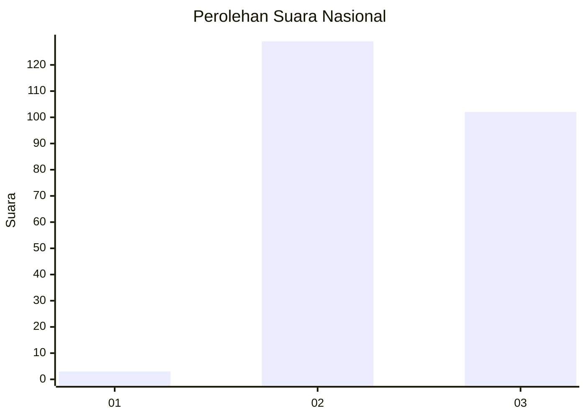
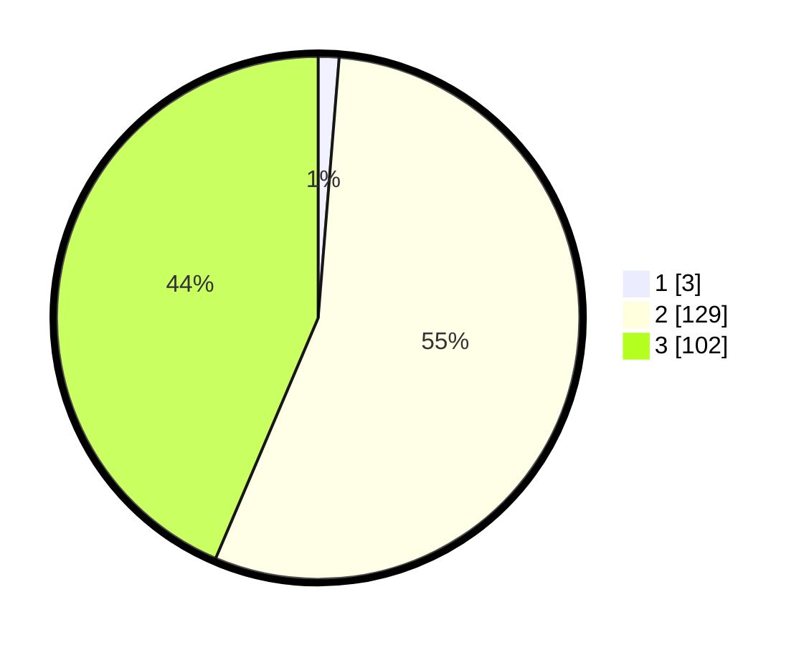

# Hasil

## Grafik

## Tabel

| No. | Nama Paslon    | Suara | Suara (raw) | Persentase |
|:--- |:-------------- | -----:| -----------:| ----------:|
| 1   | ANIES MUHAIMIN | 3     | [3][p-1]    | 1,28       |
| 2   | PRABOWO GIBRAN | 129   | [129][p-2]  | 55,13      |
| 3   | GANJAR MAHFUD  | 102   | [102][p-3]  | 43,59      |

[p-1]: https://github.com/gigit-pemilu/pemilu-2024/blob/main/pilpres/hitung-suara/sub/51-bali/sub/02-tabanan/sub/05-tabanan/sub/2011-buahan/sub/008-tps/sub/paslon-1.txt
[p-2]: https://github.com/gigit-pemilu/pemilu-2024/blob/main/pilpres/hitung-suara/sub/51-bali/sub/02-tabanan/sub/05-tabanan/sub/2011-buahan/sub/008-tps/sub/paslon-2.txt
[p-3]: https://github.com/gigit-pemilu/pemilu-2024/blob/main/pilpres/hitung-suara/sub/51-bali/sub/02-tabanan/sub/05-tabanan/sub/2011-buahan/sub/008-tps/sub/paslon-3.txt

## Foto C Plano

https://sirekap-obj-formc.kpu.go.id/475d/pemilu/ppwp/51/02/05/20/11/5102052011008-20240214-212513--7f9c2ebe-1942-42ec-8ed9-47e0618603e5.jpg

https://sirekap-obj-formc.kpu.go.id/475d/pemilu/ppwp/51/02/05/20/11/5102052011008-20240214-213445--b25fc37e-e0dc-48ca-8fd5-fe6904af8664.jpg

https://sirekap-obj-formc.kpu.go.id/475d/pemilu/ppwp/51/02/05/20/11/5102052011008-20240214-213810--67d5498c-3a9e-4388-8819-5cdedfd9dfdb.jpg

## Metadata

| Key        | Value               |
| ---------- | ------------------- |
| Time Stamp | 2024-02-16 12:51:22 |

## DATA PEMILIH TETAP

Jumlah pemilih dalam DPT: **272**.
 * L: **132**.
 * P: **140**.

## DATA PENGGUNA HAK PILIH

Jumlah pengguna hak pilih dalam DPT: **244**.
 * L: **118**.
 * P: **126**.

Jumlah pengguna hak pilih dalam DPTb: **1**.
 * L: **0**.
 * P: **1**.

Jumlah pengguna hak pilih dalam DPK: **0**.
 * L: **0**.
 * P: **0**.

Jumlah pengguna hak pilih: **245**.
 * L: **118**.
 * P: **127**.

## JUMLAH SUARA SAH DAN TIDAK SAH

JUMLAH SELURUH SUARA SAH: **234**.

JUMLAH SUARA TIDAK SAH: **11**.

JUMLAH SELURUH SUARA SAH DAN SUARA TIDAK SAH: **245**.

