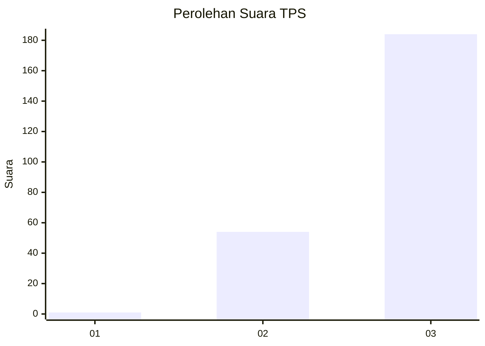
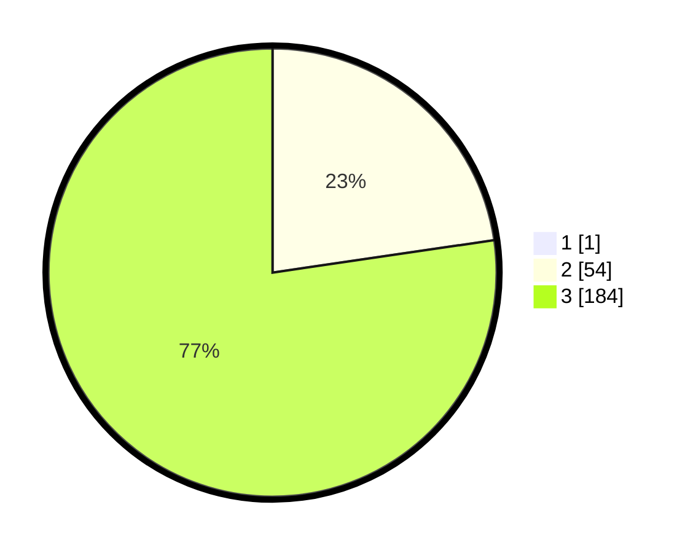

# Hasil

## Grafik

## Tabel

| No. | Nama Paslon    | Suara | Suara (raw) | Persentase |
|:--- |:-------------- | -----:| -----------:| ----------:|
| 1   | ANIES MUHAIMIN | 1     | [1][p-1]    | 0,42       |
| 2   | PRABOWO GIBRAN | 54    | [54][p-2]   | 22,59      |
| 3   | GANJAR MAHFUD  | 184   | [184][p-3]  | 76,99      |

[p-1]: https://github.com/gigit-pemilu/pemilu-2024-51-bali/blob/main/pilpres/hitung-suara/sub/51-bali/sub/02-tabanan/sub/05-tabanan/sub/2012-sesandan/sub/002-tps/sub/paslon-1.txt
[p-2]: https://github.com/gigit-pemilu/pemilu-2024-51-bali/blob/main/pilpres/hitung-suara/sub/51-bali/sub/02-tabanan/sub/05-tabanan/sub/2012-sesandan/sub/002-tps/sub/paslon-2.txt
[p-3]: https://github.com/gigit-pemilu/pemilu-2024-51-bali/blob/main/pilpres/hitung-suara/sub/51-bali/sub/02-tabanan/sub/05-tabanan/sub/2012-sesandan/sub/002-tps/sub/paslon-3.txt

## Foto C Plano

https://sirekap-obj-formc.kpu.go.id/7551/pemilu/ppwp/51/02/05/20/12/5102052012002-20240215-010025--a70da490-d812-4af4-97b3-08295ef96204.jpg

https://sirekap-obj-formc.kpu.go.id/7551/pemilu/ppwp/51/02/05/20/12/5102052012002-20240215-010110--6d2d3002-3ef9-4ac3-a1b3-3701623af7a6.jpg

https://sirekap-obj-formc.kpu.go.id/7551/pemilu/ppwp/51/02/05/20/12/5102052012002-20240215-010331--ace19330-38d6-40c7-b4ff-1d434afdf394.jpg

## Metadata

| Key        | Value               |
| ---------- | ------------------- |
| Time Stamp | 2024-02-15 22:30:27 |

