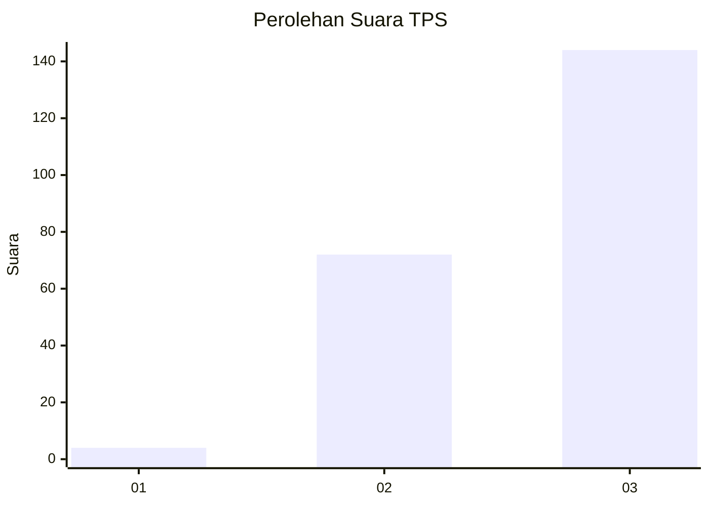
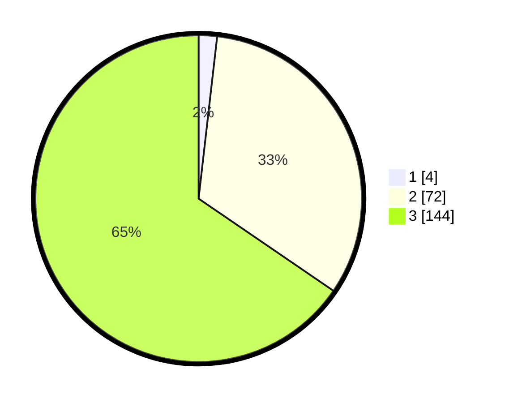

# Hasil

## Grafik

## Tabel

| No. | Nama Paslon    | Suara | Suara (raw) | Persentase |
|:--- |:-------------- | -----:| -----------:| ----------:|
| 1   | ANIES MUHAIMIN | 4     | [4][p-1]    | 1,82       |
| 2   | PRABOWO GIBRAN | 72    | [72][p-2]   | 32,73      |
| 3   | GANJAR MAHFUD  | 144   | [144][p-3]  | 65,45      |

[p-1]: https://github.com/gigit-pemilu/pemilu-2024-51-bali/blob/main/pilpres/hitung-suara/sub/51-bali/sub/02-tabanan/sub/05-tabanan/sub/2012-sesandan/sub/003-tps/sub/paslon-1.txt
[p-2]: https://github.com/gigit-pemilu/pemilu-2024-51-bali/blob/main/pilpres/hitung-suara/sub/51-bali/sub/02-tabanan/sub/05-tabanan/sub/2012-sesandan/sub/003-tps/sub/paslon-2.txt
[p-3]: https://github.com/gigit-pemilu/pemilu-2024-51-bali/blob/main/pilpres/hitung-suara/sub/51-bali/sub/02-tabanan/sub/05-tabanan/sub/2012-sesandan/sub/003-tps/sub/paslon-3.txt

## Foto C Plano

https://sirekap-obj-formc.kpu.go.id/7ec2/pemilu/ppwp/51/02/05/20/12/5102052012003-20240216-133740--1e87731a-c683-4d66-90da-a46ff7c8fd2e.jpg

https://sirekap-obj-formc.kpu.go.id/7ec2/pemilu/ppwp/51/02/05/20/12/5102052012003-20240216-133742--01fe36b2-4161-4eed-aa68-195c79197942.jpg

https://sirekap-obj-formc.kpu.go.id/7ec2/pemilu/ppwp/51/02/05/20/12/5102052012003-20240216-133741--a5c59020-b7d8-4118-a30f-e5745d932b48.jpg

## Metadata

| Key        | Value               |
| ---------- | ------------------- |
| Time Stamp | 2024-02-16 14:30:33 |

## DATA PEMILIH TETAP

Jumlah pemilih dalam DPT: **266**.
 * L: **134**.
 * P: **132**.

## DATA PENGGUNA HAK PILIH

Jumlah pengguna hak pilih dalam DPT: **223**.
 * L: **113**.
 * P: **110**.

Jumlah pengguna hak pilih dalam DPTb: **2**.
 * L: **1**.
 * P: **1**.

Jumlah pengguna hak pilih dalam DPK: **0**.
 * L: **0**.
 * P: **0**.

Jumlah pengguna hak pilih: **225**.
 * L: **114**.
 * P: **111**.

## JUMLAH SUARA SAH DAN TIDAK SAH

JUMLAH SELURUH SUARA SAH: **220**.

JUMLAH SUARA TIDAK SAH: **5**.

JUMLAH SELURUH SUARA SAH DAN SUARA TIDAK SAH: **225**.

