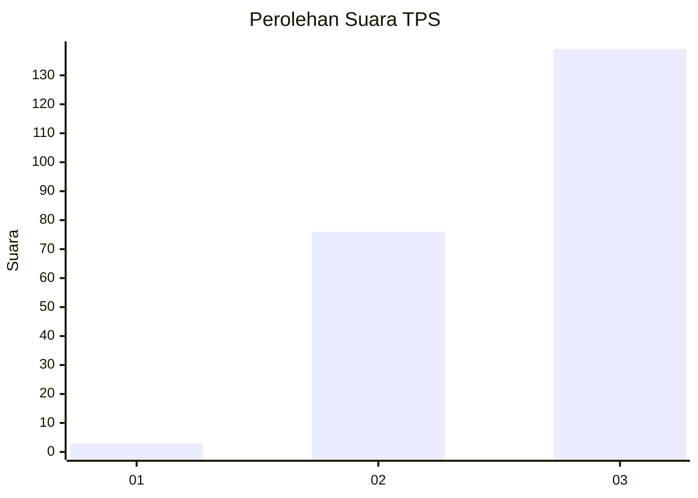
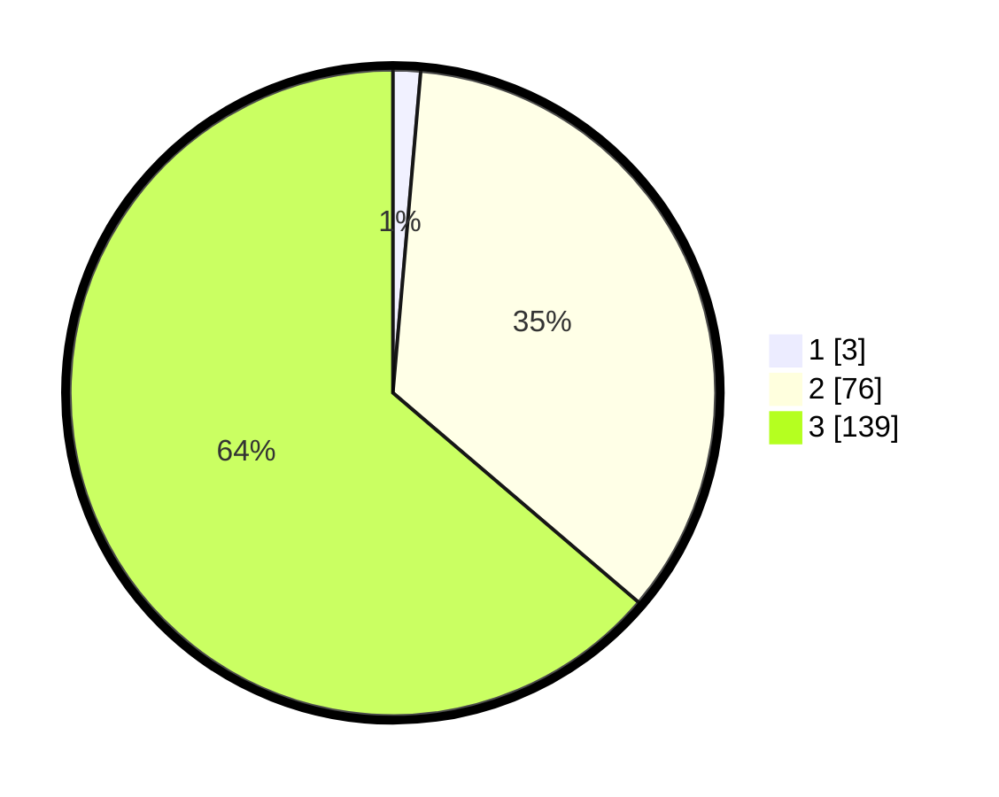

# Hasil

## Grafik

## Tabel

| No. | Nama Paslon    | Suara | Suara (raw) | Persentase |
|:--- |:-------------- | -----:| -----------:| ----------:|
| 1   | ANIES MUHAIMIN | 3     | [3][p-1]    | 1,38       |
| 2   | PRABOWO GIBRAN | 76    | [76][p-2]   | 34,86      |
| 3   | GANJAR MAHFUD  | 139   | [139][p-3]  | 63,76      |

[p-1]: https://github.com/gigit-pemilu/pemilu-2024-51-bali/blob/main/pilpres/hitung-suara/sub/51-bali/sub/02-tabanan/sub/05-tabanan/sub/2012-sesandan/sub/006-tps/sub/paslon-1.txt
[p-2]: https://github.com/gigit-pemilu/pemilu-2024-51-bali/blob/main/pilpres/hitung-suara/sub/51-bali/sub/02-tabanan/sub/05-tabanan/sub/2012-sesandan/sub/006-tps/sub/paslon-2.txt
[p-3]: https://github.com/gigit-pemilu/pemilu-2024-51-bali/blob/main/pilpres/hitung-suara/sub/51-bali/sub/02-tabanan/sub/05-tabanan/sub/2012-sesandan/sub/006-tps/sub/paslon-3.txt

## Foto C Plano

https://sirekap-obj-formc.kpu.go.id/6f25/pemilu/ppwp/51/02/05/20/12/5102052012006-20240214-193209--737ab2ce-469d-4ca6-93d9-aefe12048419.jpg

https://sirekap-obj-formc.kpu.go.id/6f25/pemilu/ppwp/51/02/05/20/12/5102052012006-20240214-141657--5563d486-679e-4afb-b981-8d45fdda27dc.jpg

https://sirekap-obj-formc.kpu.go.id/6f25/pemilu/ppwp/51/02/05/20/12/5102052012006-20240214-193228--873291dd-8a42-475c-9fe8-6ae0718bd95b.jpg

## Metadata

| Key        | Value               |
| ---------- | ------------------- |
| Time Stamp | 2024-02-14 21:46:01 |

## DATA PEMILIH TETAP

Jumlah pemilih dalam DPT: **256**.
 * L: **131**.
 * P: **125**.

## DATA PENGGUNA HAK PILIH

Jumlah pengguna hak pilih dalam DPT: **220**.
 * L: **113**.
 * P: **107**.

Jumlah pengguna hak pilih dalam DPTb: **4**.
 * L: **4**.
 * P: **0**.

Jumlah pengguna hak pilih dalam DPK: **1**.
 * L: **1**.
 * P: **0**.

Jumlah pengguna hak pilih: **225**.
 * L: **118**.
 * P: **107**.

## JUMLAH SUARA SAH DAN TIDAK SAH

JUMLAH SELURUH SUARA SAH: **218**.

JUMLAH SUARA TIDAK SAH: **7**.

JUMLAH SELURUH SUARA SAH DAN SUARA TIDAK SAH: **225**.

