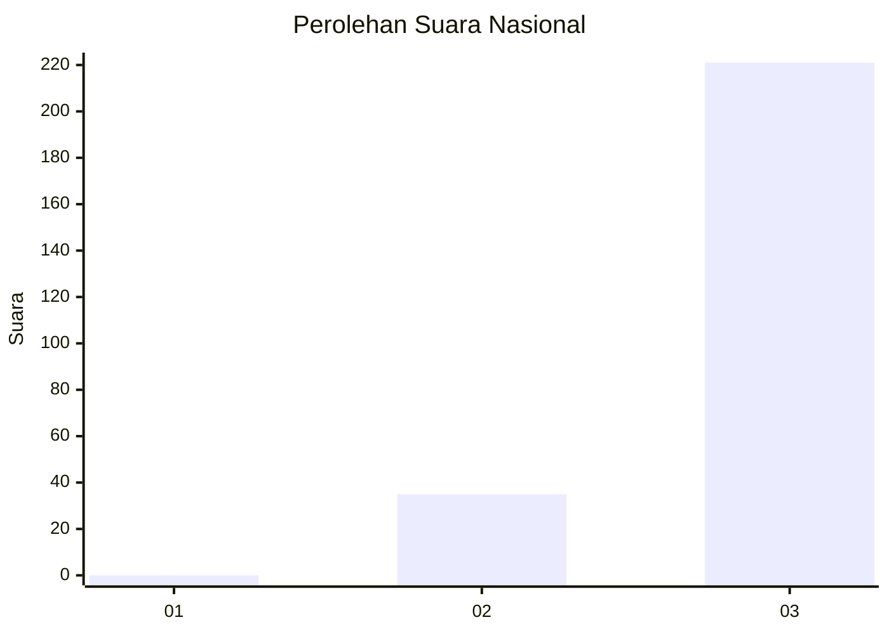
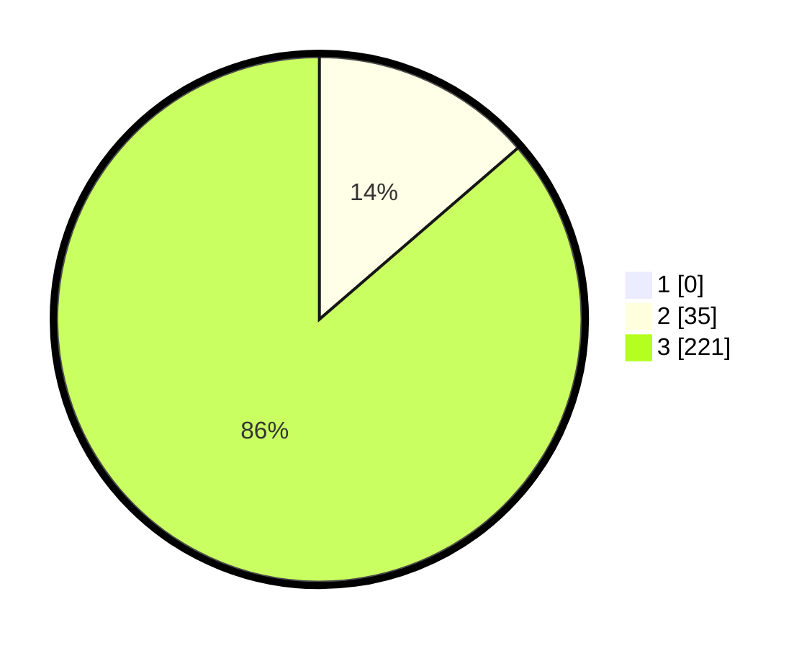

# Hasil

## Grafik

## Tabel

| No. | Nama Paslon    | Suara | Suara (raw) | Persentase |
|:--- |:-------------- | -----:| -----------:| ----------:|
| 1   | ANIES MUHAIMIN | 0     | [0][p-1]    | 0,00       |
| 2   | PRABOWO GIBRAN | 35    | [35][p-2]   | 13,67      |
| 3   | GANJAR MAHFUD  | 221   | [221][p-3]  | 86,33      |

[p-1]: https://github.com/gigit-pemilu/pemilu-2024/blob/main/pilpres/hitung-suara/sub/51-bali/sub/02-tabanan/sub/05-tabanan/sub/2012-sesandan/sub/007-tps/sub/paslon-1.txt
[p-2]: https://github.com/gigit-pemilu/pemilu-2024/blob/main/pilpres/hitung-suara/sub/51-bali/sub/02-tabanan/sub/05-tabanan/sub/2012-sesandan/sub/007-tps/sub/paslon-2.txt
[p-3]: https://github.com/gigit-pemilu/pemilu-2024/blob/main/pilpres/hitung-suara/sub/51-bali/sub/02-tabanan/sub/05-tabanan/sub/2012-sesandan/sub/007-tps/sub/paslon-3.txt

## Foto C Plano

https://sirekap-obj-formc.kpu.go.id/80cb/pemilu/ppwp/51/02/05/20/12/5102052012007-20240214-200613--c6676eb5-638e-4177-938f-d0a402b16502.jpg

https://sirekap-obj-formc.kpu.go.id/80cb/pemilu/ppwp/51/02/05/20/12/5102052012007-20240214-200959--8d2449ee-9167-479f-beb4-9c76d2a733ad.jpg

https://sirekap-obj-formc.kpu.go.id/80cb/pemilu/ppwp/51/02/05/20/12/5102052012007-20240214-200835--1e67b481-2048-4ba7-ad2e-2c28d3603687.jpg

## Metadata

| Key        | Value               |
| ---------- | ------------------- |
| Time Stamp | 2024-02-15 22:30:27 |

## DATA PEMILIH TETAP

Jumlah pemilih dalam DPT: **266**.
 * L: **125**.
 * P: **141**.

## DATA PENGGUNA HAK PILIH

Jumlah pengguna hak pilih dalam DPT: **259**.
 * L: **122**.
 * P: **137**.

Jumlah pengguna hak pilih dalam DPTb: **0**.
 * L: **0**.
 * P: **0**.

Jumlah pengguna hak pilih dalam DPK: **0**.
 * L: **0**.
 * P: **0**.

Jumlah pengguna hak pilih: **259**.
 * L: **122**.
 * P: **137**.

## JUMLAH SUARA SAH DAN TIDAK SAH

JUMLAH SELURUH SUARA SAH: **256**.

JUMLAH SUARA TIDAK SAH: **3**.

JUMLAH SELURUH SUARA SAH DAN SUARA TIDAK SAH: **259**.

