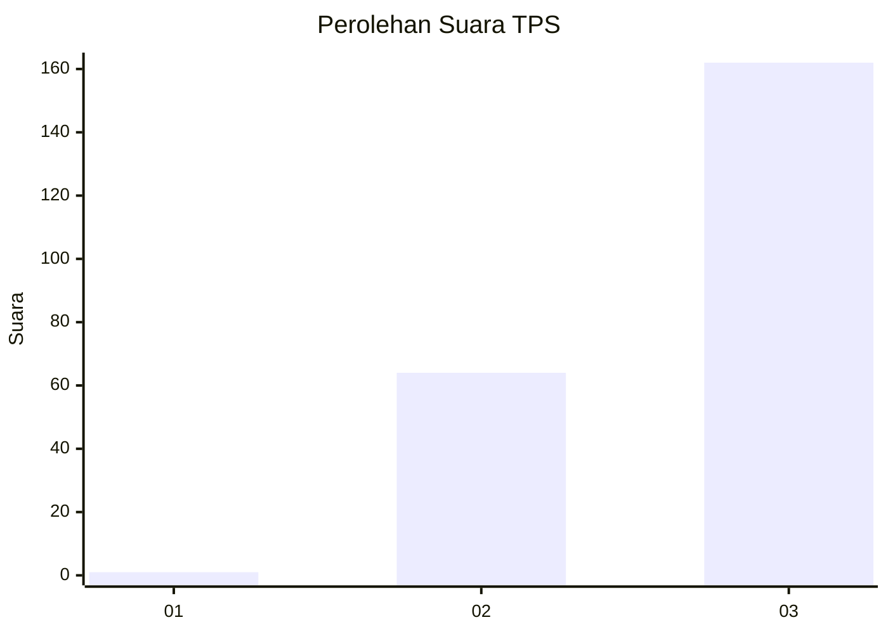
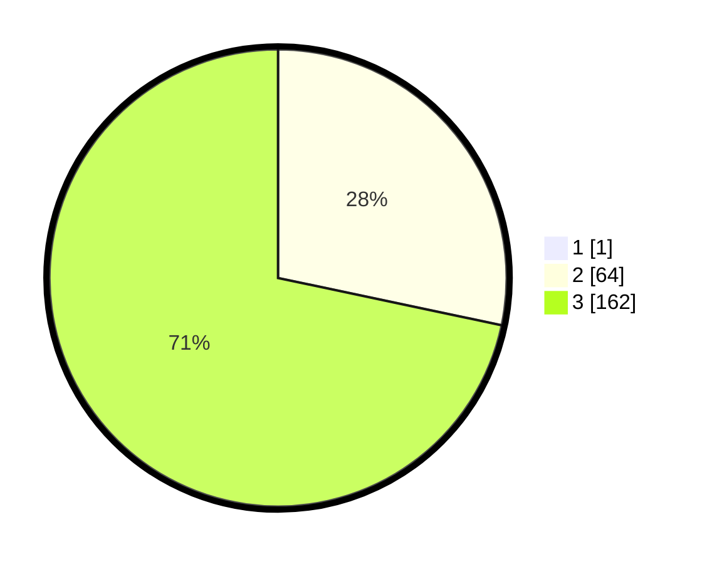

# Hasil

## Grafik

## Tabel

| No. | Nama Paslon    | Suara | Suara (raw) | Persentase |
|:--- |:-------------- | -----:| -----------:| ----------:|
| 1   | ANIES MUHAIMIN | 1     | [1][p-1]    | 0,44       |
| 2   | PRABOWO GIBRAN | 64    | [64][p-2]   | 28,19      |
| 3   | GANJAR MAHFUD  | 162   | [162][p-3]  | 71,37      |

[p-1]: https://github.com/gigit-pemilu/pemilu-2024-51-bali/blob/main/pilpres/hitung-suara/sub/51-bali/sub/02-tabanan/sub/06-kediri/sub/2001-bengkel/sub/001-tps/sub/paslon-1.txt
[p-2]: https://github.com/gigit-pemilu/pemilu-2024-51-bali/blob/main/pilpres/hitung-suara/sub/51-bali/sub/02-tabanan/sub/06-kediri/sub/2001-bengkel/sub/001-tps/sub/paslon-2.txt
[p-3]: https://github.com/gigit-pemilu/pemilu-2024-51-bali/blob/main/pilpres/hitung-suara/sub/51-bali/sub/02-tabanan/sub/06-kediri/sub/2001-bengkel/sub/001-tps/sub/paslon-3.txt

## Foto C Plano

https://sirekap-obj-formc.kpu.go.id/9855/pemilu/ppwp/51/02/06/20/01/5102062001001-20240214-163745--bab1f449-6101-4e6a-8648-9e918370d2d6.jpg

https://sirekap-obj-formc.kpu.go.id/9855/pemilu/ppwp/51/02/06/20/01/5102062001001-20240214-163745--a7378f18-d628-4cf8-a987-610c1698b44b.jpg

https://sirekap-obj-formc.kpu.go.id/9855/pemilu/ppwp/51/02/06/20/01/5102062001001-20240214-163745--065b0e38-a40d-489f-ae5a-78ade99d7562.jpg

## Metadata

| Key        | Value               |
| ---------- | ------------------- |
| Time Stamp | 2024-02-15 22:30:27 |

## DATA PEMILIH TETAP

Jumlah pemilih dalam DPT: **244**.
 * L: **118**.
 * P: **126**.

## DATA PENGGUNA HAK PILIH

Jumlah pengguna hak pilih dalam DPT: **228**.
 * L: **110**.
 * P: **118**.

Jumlah pengguna hak pilih dalam DPTb: **0**.
 * L: **0**.
 * P: **0**.

Jumlah pengguna hak pilih dalam DPK: **0**.
 * L: **0**.
 * P: **0**.

Jumlah pengguna hak pilih: **228**.
 * L: **110**.
 * P: **118**.

## JUMLAH SUARA SAH DAN TIDAK SAH

JUMLAH SELURUH SUARA SAH: **227**.

JUMLAH SUARA TIDAK SAH: **1**.

JUMLAH SELURUH SUARA SAH DAN SUARA TIDAK SAH: **228**.

