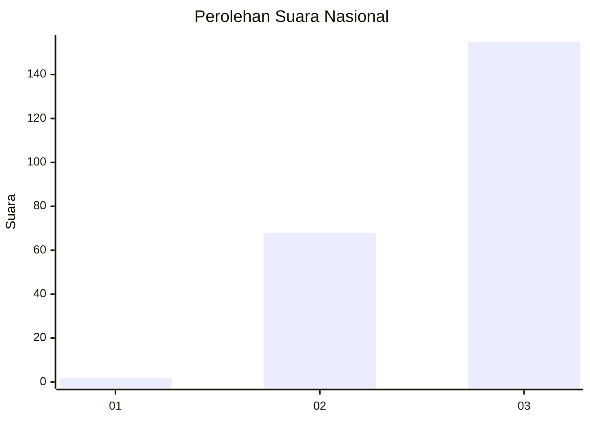
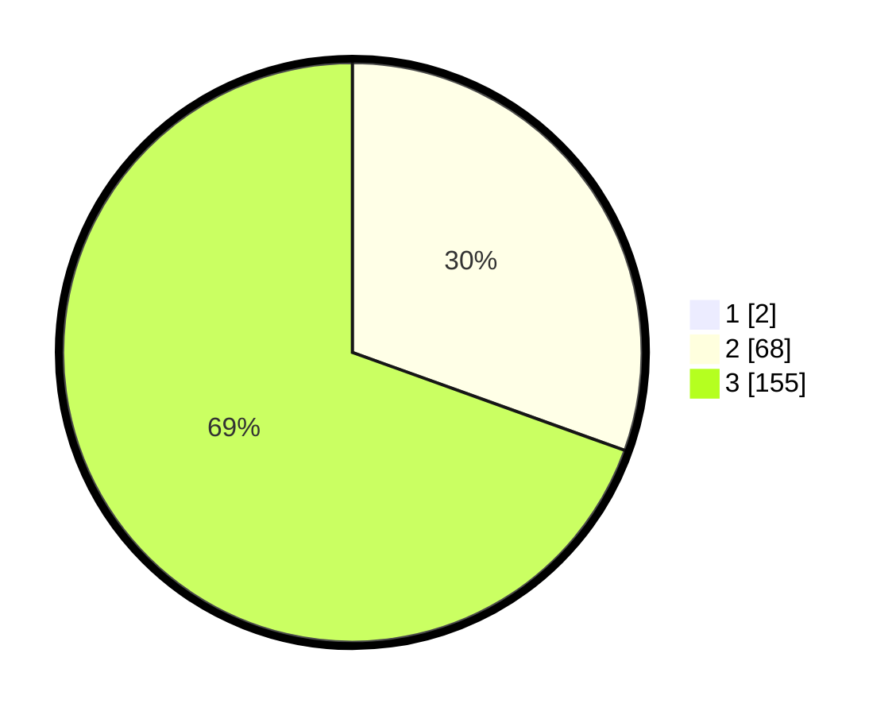

# Hasil

## Grafik

## Tabel

| No. | Nama Paslon    | Suara | Suara (raw) | Persentase |
|:--- |:-------------- | -----:| -----------:| ----------:|
| 1   | ANIES MUHAIMIN | 2     | [2][p-1]    | 0,89       |
| 2   | PRABOWO GIBRAN | 68    | [68][p-2]   | 30,22      |
| 3   | GANJAR MAHFUD  | 155   | [155][p-3]  | 68,89      |

[p-1]: https://github.com/gigit-pemilu/pemilu-2024/blob/main/pilpres/hitung-suara/sub/51-bali/sub/02-tabanan/sub/06-kediri/sub/2001-bengkel/sub/002-tps/sub/paslon-1.txt
[p-2]: https://github.com/gigit-pemilu/pemilu-2024/blob/main/pilpres/hitung-suara/sub/51-bali/sub/02-tabanan/sub/06-kediri/sub/2001-bengkel/sub/002-tps/sub/paslon-2.txt
[p-3]: https://github.com/gigit-pemilu/pemilu-2024/blob/main/pilpres/hitung-suara/sub/51-bali/sub/02-tabanan/sub/06-kediri/sub/2001-bengkel/sub/002-tps/sub/paslon-3.txt

## Foto C Plano

https://sirekap-obj-formc.kpu.go.id/1e6f/pemilu/ppwp/51/02/06/20/01/5102062001002-20240214-191627--1ee29244-c14d-48e6-8fd7-5917e4328367.jpg

https://sirekap-obj-formc.kpu.go.id/1e6f/pemilu/ppwp/51/02/06/20/01/5102062001002-20240214-191806--aebe0abb-cd40-4153-b6ce-a042fcb8ee09.jpg

https://sirekap-obj-formc.kpu.go.id/1e6f/pemilu/ppwp/51/02/06/20/01/5102062001002-20240214-191940--d337cb45-6e4f-4af1-b8f5-ce1433f3df6c.jpg

## Metadata

| Key        | Value               |
| ---------- | ------------------- |
| Time Stamp | 2024-02-15 22:30:27 |

