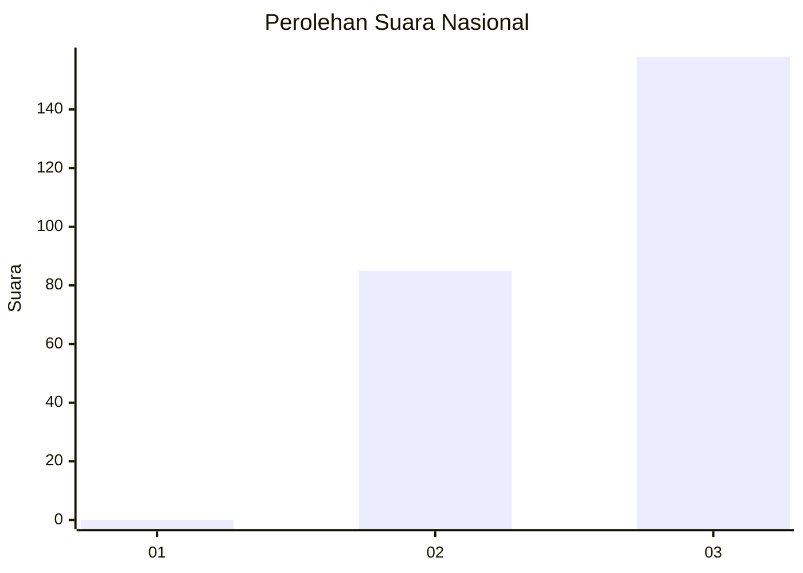
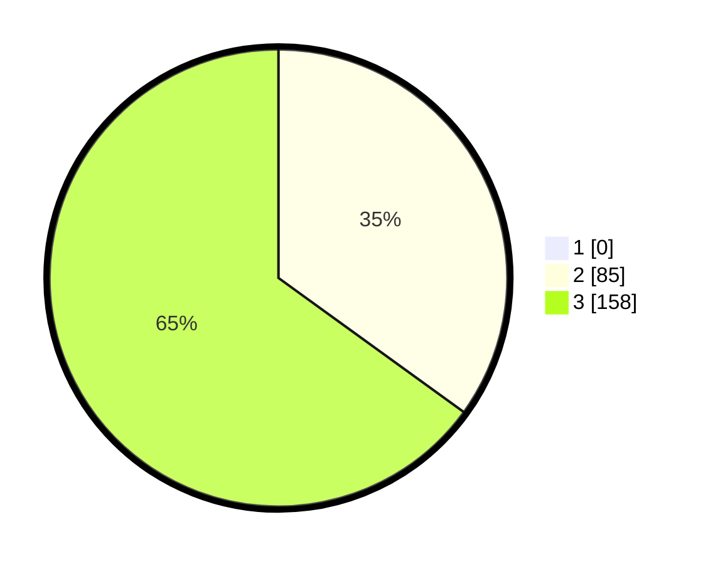

# Hasil

## Grafik

## Tabel

| No. | Nama Paslon    | Suara | Suara (raw) | Persentase |
|:--- |:-------------- | -----:| -----------:| ----------:|
| 1   | ANIES MUHAIMIN | 0     | [0][p-1]    | 0,00       |
| 2   | PRABOWO GIBRAN | 85    | [85][p-2]   | 34,98      |
| 3   | GANJAR MAHFUD  | 158   | [158][p-3]  | 65,02      |

[p-1]: https://github.com/gigit-pemilu/pemilu-2024/blob/main/pilpres/hitung-suara/sub/51-bali/sub/02-tabanan/sub/06-kediri/sub/2001-bengkel/sub/003-tps/sub/paslon-1.txt
[p-2]: https://github.com/gigit-pemilu/pemilu-2024/blob/main/pilpres/hitung-suara/sub/51-bali/sub/02-tabanan/sub/06-kediri/sub/2001-bengkel/sub/003-tps/sub/paslon-2.txt
[p-3]: https://github.com/gigit-pemilu/pemilu-2024/blob/main/pilpres/hitung-suara/sub/51-bali/sub/02-tabanan/sub/06-kediri/sub/2001-bengkel/sub/003-tps/sub/paslon-3.txt

## Foto C Plano

https://sirekap-obj-formc.kpu.go.id/a974/pemilu/ppwp/51/02/06/20/01/5102062001003-20240216-003034--35ce52c1-e839-4b30-9bc4-5bf642bcafd8.jpg

https://sirekap-obj-formc.kpu.go.id/a974/pemilu/ppwp/51/02/06/20/01/5102062001003-20240216-003035--849a91ff-3613-422f-a37b-e2ff580d65da.jpg

https://sirekap-obj-formc.kpu.go.id/a974/pemilu/ppwp/51/02/06/20/01/5102062001003-20240216-003035--5229a2c2-9f01-4dbf-9489-28e7738eaa6a.jpg

## Metadata

| Key        | Value               |
| ---------- | ------------------- |
| Time Stamp | 2024-02-16 10:30:29 |

## DATA PEMILIH TETAP

Jumlah pemilih dalam DPT: **276**.
 * L: **128**.
 * P: **148**.

## DATA PENGGUNA HAK PILIH

Jumlah pengguna hak pilih dalam DPT: **245**.
 * L: **117**.
 * P: **128**.

Jumlah pengguna hak pilih dalam DPTb: **0**.
 * L: **0**.
 * P: **0**.

Jumlah pengguna hak pilih dalam DPK: **0**.
 * L: **0**.
 * P: **0**.

Jumlah pengguna hak pilih: **245**.
 * L: **117**.
 * P: **128**.

## JUMLAH SUARA SAH DAN TIDAK SAH

JUMLAH SELURUH SUARA SAH: **243**.

JUMLAH SUARA TIDAK SAH: **2**.

JUMLAH SELURUH SUARA SAH DAN SUARA TIDAK SAH: **245**.

