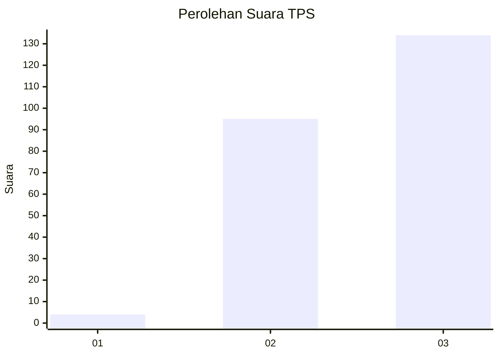
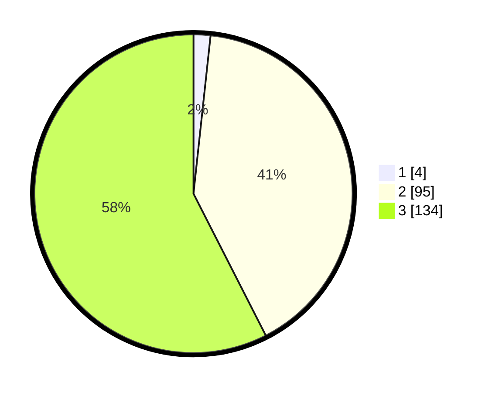

# Hasil

## Grafik

## Tabel

| No. | Nama Paslon    | Suara | Suara (raw) | Persentase |
|:--- |:-------------- | -----:| -----------:| ----------:|
| 1   | ANIES MUHAIMIN | 4     | [4][p-1]    | 1,72       |
| 2   | PRABOWO GIBRAN | 95    | [95][p-2]   | 40,77      |
| 3   | GANJAR MAHFUD  | 134   | [134][p-3]  | 57,51      |

[p-1]: https://github.com/gigit-pemilu/pemilu-2024-51-bali/blob/main/pilpres/hitung-suara/sub/51-bali/sub/02-tabanan/sub/06-kediri/sub/2001-bengkel/sub/004-tps/sub/paslon-1.txt
[p-2]: https://github.com/gigit-pemilu/pemilu-2024-51-bali/blob/main/pilpres/hitung-suara/sub/51-bali/sub/02-tabanan/sub/06-kediri/sub/2001-bengkel/sub/004-tps/sub/paslon-2.txt
[p-3]: https://github.com/gigit-pemilu/pemilu-2024-51-bali/blob/main/pilpres/hitung-suara/sub/51-bali/sub/02-tabanan/sub/06-kediri/sub/2001-bengkel/sub/004-tps/sub/paslon-3.txt

## Foto C Plano

https://sirekap-obj-formc.kpu.go.id/ef2d/pemilu/ppwp/51/02/06/20/01/5102062001004-20240216-003043--90068259-b0f6-4632-bf03-9a4350387e1c.jpg

https://sirekap-obj-formc.kpu.go.id/ef2d/pemilu/ppwp/51/02/06/20/01/5102062001004-20240216-003044--476368ec-9fee-4d90-95a8-65f71a9f8140.jpg

https://sirekap-obj-formc.kpu.go.id/ef2d/pemilu/ppwp/51/02/06/20/01/5102062001004-20240216-003044--a0c4eed7-c6a3-4ace-93f3-03a25b62a1e9.jpg

## Metadata

| Key        | Value               |
| ---------- | ------------------- |
| Time Stamp | 2024-02-16 10:30:29 |

## DATA PEMILIH TETAP

Jumlah pemilih dalam DPT: **270**.
 * L: **133**.
 * P: **137**.

## DATA PENGGUNA HAK PILIH

Jumlah pengguna hak pilih dalam DPT: **243**.
 * L: **121**.
 * P: **122**.

Jumlah pengguna hak pilih dalam DPTb: **0**.
 * L: **0**.
 * P: **0**.

Jumlah pengguna hak pilih dalam DPK: **0**.
 * L: **0**.
 * P: **0**.

Jumlah pengguna hak pilih: **243**.
 * L: **121**.
 * P: **122**.

## JUMLAH SUARA SAH DAN TIDAK SAH

JUMLAH SELURUH SUARA SAH: **233**.

JUMLAH SUARA TIDAK SAH: **10**.

JUMLAH SELURUH SUARA SAH DAN SUARA TIDAK SAH: **243**.

