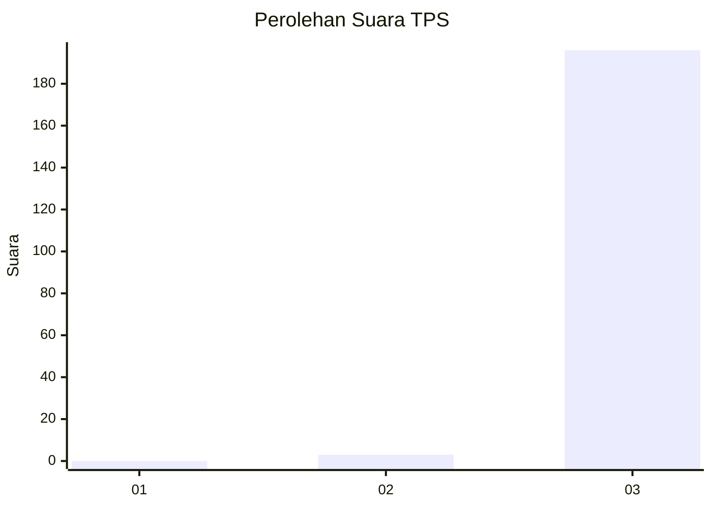
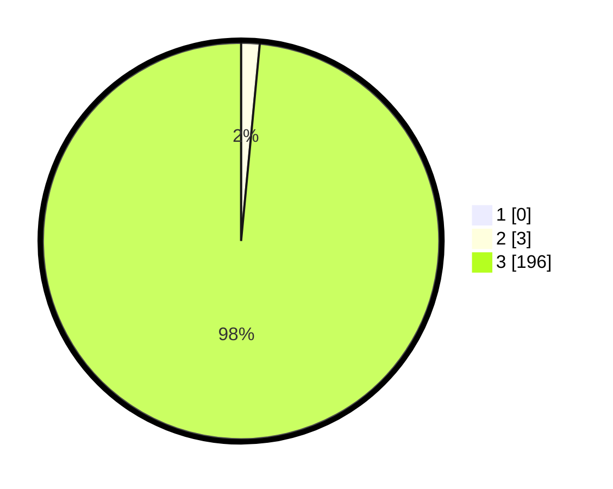

# Hasil

## Grafik

## Tabel

| No. | Nama Paslon    | Suara | Suara (raw) | Persentase |
|:--- |:-------------- | -----:| -----------:| ----------:|
| 1   | ANIES MUHAIMIN | 0     | [0][p-1]    | 0,00       |
| 2   | PRABOWO GIBRAN | 3     | [3][p-2]    | 1,51       |
| 3   | GANJAR MAHFUD  | 196   | [196][p-3]  | 98,49      |

[p-1]: https://github.com/gigit-pemilu/pemilu-2024-51-bali/blob/main/pilpres/hitung-suara/sub/51-bali/sub/02-tabanan/sub/06-kediri/sub/2001-bengkel/sub/005-tps/sub/paslon-1.txt
[p-2]: https://github.com/gigit-pemilu/pemilu-2024-51-bali/blob/main/pilpres/hitung-suara/sub/51-bali/sub/02-tabanan/sub/06-kediri/sub/2001-bengkel/sub/005-tps/sub/paslon-2.txt
[p-3]: https://github.com/gigit-pemilu/pemilu-2024-51-bali/blob/main/pilpres/hitung-suara/sub/51-bali/sub/02-tabanan/sub/06-kediri/sub/2001-bengkel/sub/005-tps/sub/paslon-3.txt

## Foto C Plano

https://sirekap-obj-formc.kpu.go.id/a3ea/pemilu/ppwp/51/02/06/20/01/5102062001005-20240215-175108--70af9321-3fe1-414d-b0f8-a2033f53188b.jpg

https://sirekap-obj-formc.kpu.go.id/a3ea/pemilu/ppwp/51/02/06/20/01/5102062001005-20240215-175129--1744f451-e608-474b-a163-4e6eecc00a44.jpg

https://sirekap-obj-formc.kpu.go.id/a3ea/pemilu/ppwp/51/02/06/20/01/5102062001005-20240215-175119--ac95a644-aab4-4fa8-8223-ef3ea2717c1a.jpg

## Metadata

| Key        | Value               |
| ---------- | ------------------- |
| Time Stamp | 2024-02-15 22:30:27 |

## DATA PEMILIH TETAP

Jumlah pemilih dalam DPT: **206**.
 * L: **105**.
 * P: **101**.

## DATA PENGGUNA HAK PILIH

Jumlah pengguna hak pilih dalam DPT: **203**.
 * L: **104**.
 * P: **99**.

Jumlah pengguna hak pilih dalam DPTb: **0**.
 * L: **0**.
 * P: **0**.

Jumlah pengguna hak pilih dalam DPK: **1**.
 * L: **0**.
 * P: **1**.

Jumlah pengguna hak pilih: **204**.
 * L: **104**.
 * P: **100**.

## JUMLAH SUARA SAH DAN TIDAK SAH

JUMLAH SELURUH SUARA SAH: **199**.

JUMLAH SUARA TIDAK SAH: **5**.

JUMLAH SELURUH SUARA SAH DAN SUARA TIDAK SAH: **204**.

