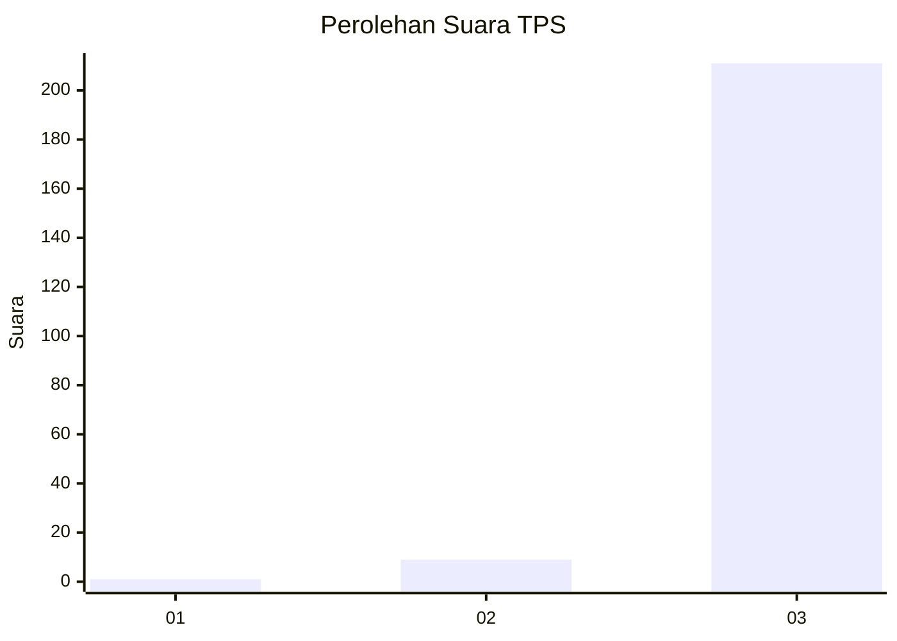
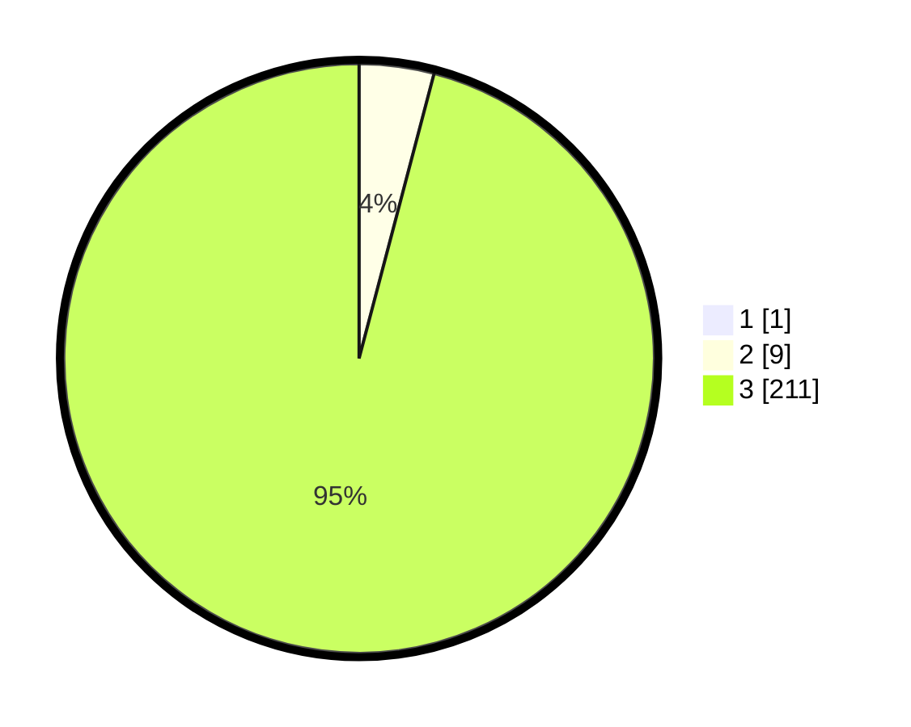

# Hasil

## Grafik

## Tabel

| No. | Nama Paslon    | Suara | Suara (raw) | Persentase |
|:--- |:-------------- | -----:| -----------:| ----------:|
| 1   | ANIES MUHAIMIN | 1     | [1][p-1]    | 0,45       |
| 2   | PRABOWO GIBRAN | 9     | [9][p-2]    | 4,07       |
| 3   | GANJAR MAHFUD  | 211   | [211][p-3]  | 95,48      |

[p-1]: https://github.com/gigit-pemilu/pemilu-2024-51-bali/blob/main/pilpres/hitung-suara/sub/51-bali/sub/02-tabanan/sub/06-kediri/sub/2001-bengkel/sub/007-tps/sub/paslon-1.txt
[p-2]: https://github.com/gigit-pemilu/pemilu-2024-51-bali/blob/main/pilpres/hitung-suara/sub/51-bali/sub/02-tabanan/sub/06-kediri/sub/2001-bengkel/sub/007-tps/sub/paslon-2.txt
[p-3]: https://github.com/gigit-pemilu/pemilu-2024-51-bali/blob/main/pilpres/hitung-suara/sub/51-bali/sub/02-tabanan/sub/06-kediri/sub/2001-bengkel/sub/007-tps/sub/paslon-3.txt

## Foto C Plano

https://sirekap-obj-formc.kpu.go.id/c717/pemilu/ppwp/51/02/06/20/01/5102062001007-20240214-235944--0d13f5ce-de80-446c-8d81-24aefe7af726.jpg

https://sirekap-obj-formc.kpu.go.id/c717/pemilu/ppwp/51/02/06/20/01/5102062001007-20240214-235821--80d4ff28-b638-41a3-bc0d-e5639259d973.jpg

https://sirekap-obj-formc.kpu.go.id/c717/pemilu/ppwp/51/02/06/20/01/5102062001007-20240214-235951--5ec7ea6c-8fe1-48bb-829f-58215e1e1c6c.jpg

## Metadata

| Key        | Value               |
| ---------- | ------------------- |
| Time Stamp | 2024-02-15 22:40:13 |

