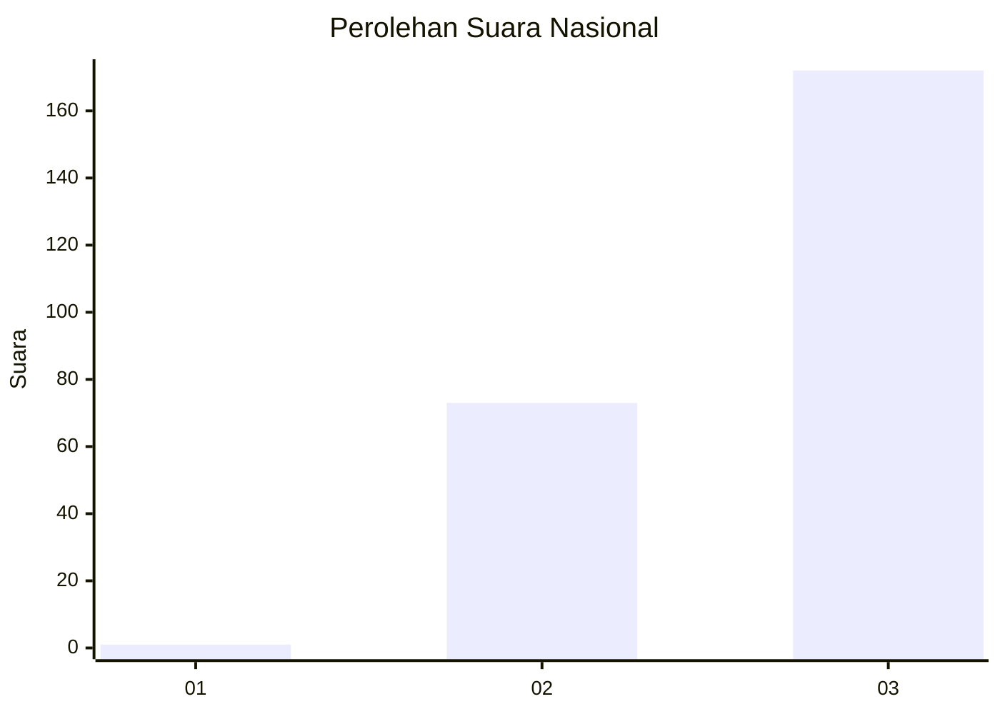
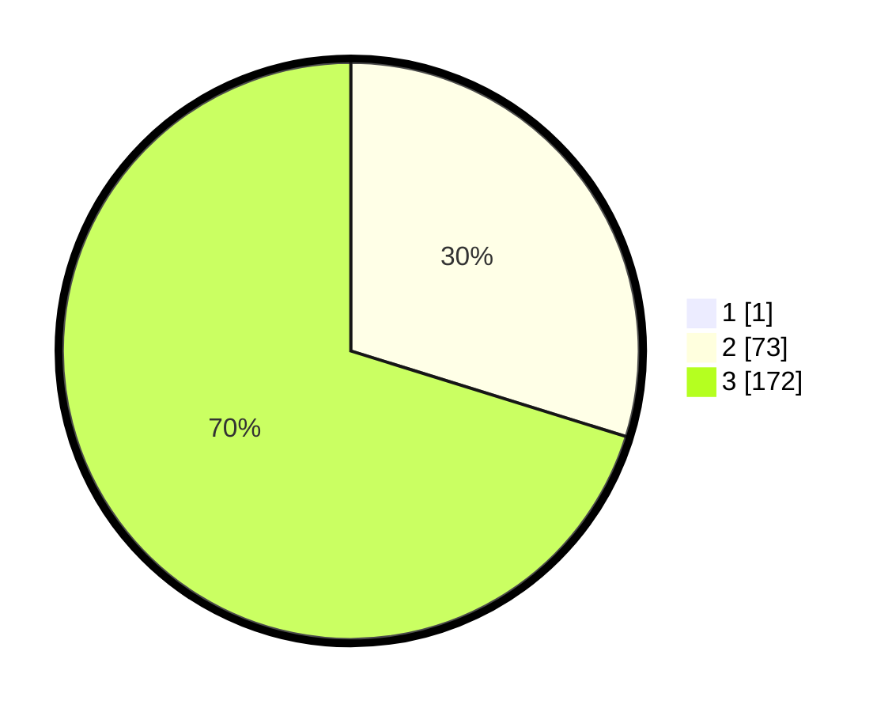

# Hasil

## Grafik

## Tabel

| No. | Nama Paslon    | Suara | Suara (raw) | Persentase |
|:--- |:-------------- | -----:| -----------:| ----------:|
| 1   | ANIES MUHAIMIN | 1     | [1][p-1]    | 0,41       |
| 2   | PRABOWO GIBRAN | 73    | [73][p-2]   | 29,67      |
| 3   | GANJAR MAHFUD  | 172   | [172][p-3]  | 69,92      |

[p-1]: https://github.com/gigit-pemilu/pemilu-2024/blob/main/pilpres/hitung-suara/sub/51-bali/sub/02-tabanan/sub/06-kediri/sub/2002-pangkung-tibah/sub/002-tps/sub/paslon-1.txt
[p-2]: https://github.com/gigit-pemilu/pemilu-2024/blob/main/pilpres/hitung-suara/sub/51-bali/sub/02-tabanan/sub/06-kediri/sub/2002-pangkung-tibah/sub/002-tps/sub/paslon-2.txt
[p-3]: https://github.com/gigit-pemilu/pemilu-2024/blob/main/pilpres/hitung-suara/sub/51-bali/sub/02-tabanan/sub/06-kediri/sub/2002-pangkung-tibah/sub/002-tps/sub/paslon-3.txt

## Foto C Plano

https://sirekap-obj-formc.kpu.go.id/5173/pemilu/ppwp/51/02/06/20/02/5102062002002-20240215-010955--9bbc1d1a-0875-4583-ae3c-e994bf72f103.jpg

https://sirekap-obj-formc.kpu.go.id/5173/pemilu/ppwp/51/02/06/20/02/5102062002002-20240215-011025--3c73870e-a50b-4ada-b050-4b8b9a876537.jpg

https://sirekap-obj-formc.kpu.go.id/5173/pemilu/ppwp/51/02/06/20/02/5102062002002-20240215-011043--4adf1639-de92-4160-9cf7-aa764fa839e6.jpg

## Metadata

| Key        | Value               |
| ---------- | ------------------- |
| Time Stamp | 2024-02-15 22:40:13 |

## DATA PEMILIH TETAP

Jumlah pemilih dalam DPT: **281**.
 * L: **136**.
 * P: **145**.

## DATA PENGGUNA HAK PILIH

Jumlah pengguna hak pilih dalam DPT: **249**.
 * L: **119**.
 * P: **130**.

Jumlah pengguna hak pilih dalam DPTb: **0**.
 * L: **0**.
 * P: **0**.

Jumlah pengguna hak pilih dalam DPK: **0**.
 * L: **0**.
 * P: **0**.

Jumlah pengguna hak pilih: **249**.
 * L: **119**.
 * P: **130**.

## JUMLAH SUARA SAH DAN TIDAK SAH

JUMLAH SELURUH SUARA SAH: **246**.

JUMLAH SUARA TIDAK SAH: **3**.

JUMLAH SELURUH SUARA SAH DAN SUARA TIDAK SAH: **249**.

