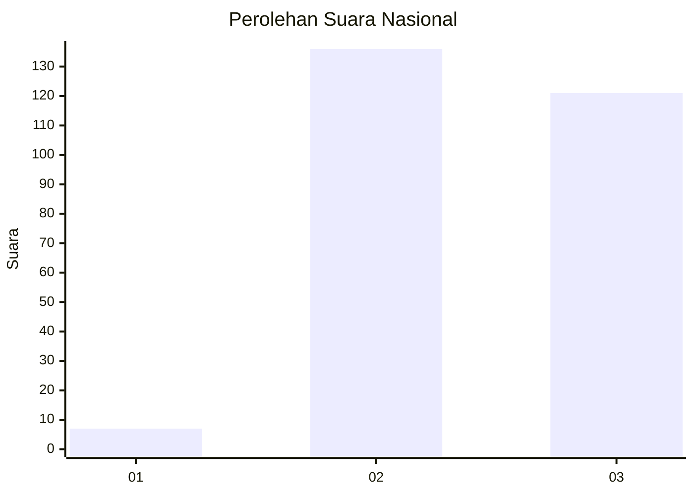
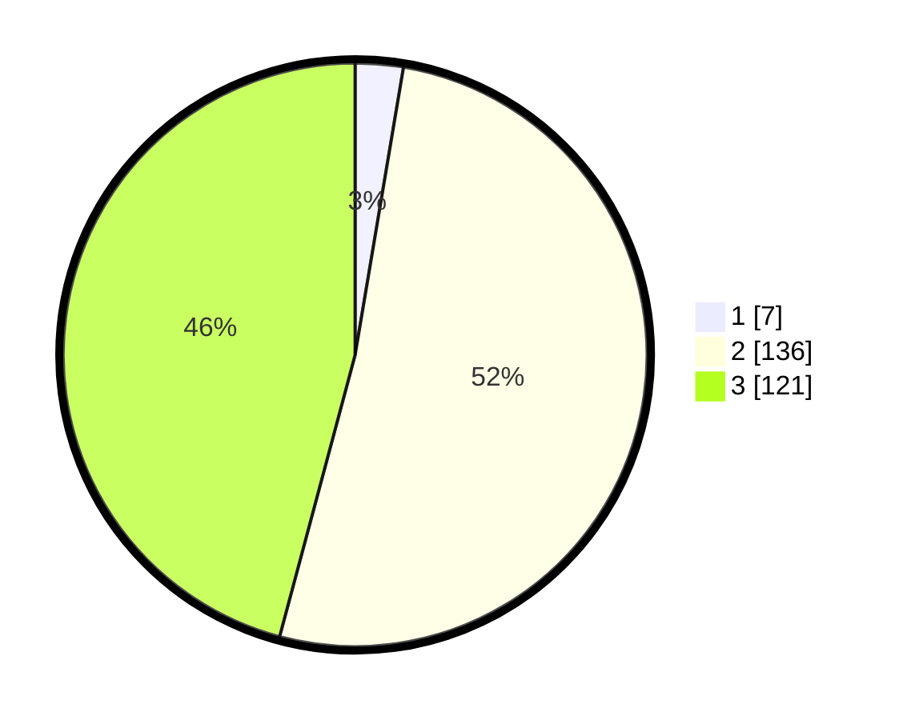

# Hasil

## Grafik

## Tabel

| No. | Nama Paslon    | Suara | Suara (raw) | Persentase |
|:--- |:-------------- | -----:| -----------:| ----------:|
| 1   | ANIES MUHAIMIN | 7     | [7][p-1]    | 2,65       |
| 2   | PRABOWO GIBRAN | 136   | [136][p-2]  | 51,52      |
| 3   | GANJAR MAHFUD  | 121   | [121][p-3]  | 45,83      |

[p-1]: https://github.com/gigit-pemilu/pemilu-2024/blob/main/pilpres/hitung-suara/sub/51-bali/sub/02-tabanan/sub/06-kediri/sub/2003-belalang/sub/001-tps/sub/paslon-1.txt
[p-2]: https://github.com/gigit-pemilu/pemilu-2024/blob/main/pilpres/hitung-suara/sub/51-bali/sub/02-tabanan/sub/06-kediri/sub/2003-belalang/sub/001-tps/sub/paslon-2.txt
[p-3]: https://github.com/gigit-pemilu/pemilu-2024/blob/main/pilpres/hitung-suara/sub/51-bali/sub/02-tabanan/sub/06-kediri/sub/2003-belalang/sub/001-tps/sub/paslon-3.txt

## Foto C Plano

https://sirekap-obj-formc.kpu.go.id/4592/pemilu/ppwp/51/02/06/20/03/5102062003001-20240214-141033--f385a67d-9d7f-420a-8828-6fb5ce7add64.jpg

https://sirekap-obj-formc.kpu.go.id/4592/pemilu/ppwp/51/02/06/20/03/5102062003001-20240214-141419--71fd843e-eeec-402d-9aef-81f30111fcda.jpg

https://sirekap-obj-formc.kpu.go.id/4592/pemilu/ppwp/51/02/06/20/03/5102062003001-20240214-141718--1df8e779-0a00-403f-968a-1ac36dbf11ab.jpg

## Metadata

| Key        | Value               |
| ---------- | ------------------- |
| Time Stamp | 2024-02-15 21:30:27 |

## DATA PEMILIH TETAP

Jumlah pemilih dalam DPT: **287**.
 * L: **142**.
 * P: **145**.

## DATA PENGGUNA HAK PILIH

Jumlah pengguna hak pilih dalam DPT: **258**.
 * L: **128**.
 * P: **130**.

Jumlah pengguna hak pilih dalam DPTb: **3**.
 * L: **2**.
 * P: **1**.

Jumlah pengguna hak pilih dalam DPK: **5**.
 * L: **3**.
 * P: **2**.

Jumlah pengguna hak pilih: **266**.
 * L: **133**.
 * P: **133**.

## JUMLAH SUARA SAH DAN TIDAK SAH

JUMLAH SELURUH SUARA SAH: **264**.

JUMLAH SUARA TIDAK SAH: **2**.

JUMLAH SELURUH SUARA SAH DAN SUARA TIDAK SAH: **266**.

