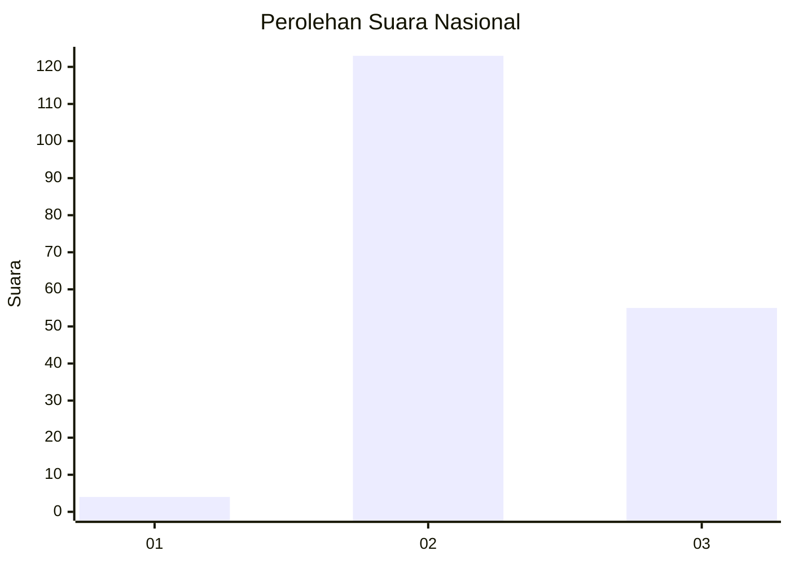

# Hasil

## Grafik

## Tabel

| No. | Nama Paslon    | Suara | Suara (raw) | Persentase |
|:--- |:-------------- | -----:| -----------:| ----------:|
| 1   | ANIES MUHAIMIN | 4     | [4][p-1]    | 2,20       |
| 2   | PRABOWO GIBRAN | 123   | [123][p-2]  | 67,58      |
| 3   | GANJAR MAHFUD  | 55    | [55][p-3]   | 30,22      |

[p-1]: https://github.com/gigit-pemilu/pemilu-2024/blob/main/pilpres/hitung-suara/sub/51-bali/sub/02-tabanan/sub/06-kediri/sub/2003-belalang/sub/003-tps/sub/paslon-1.txt
[p-2]: https://github.com/gigit-pemilu/pemilu-2024/blob/main/pilpres/hitung-suara/sub/51-bali/sub/02-tabanan/sub/06-kediri/sub/2003-belalang/sub/003-tps/sub/paslon-2.txt
[p-3]: https://github.com/gigit-pemilu/pemilu-2024/blob/main/pilpres/hitung-suara/sub/51-bali/sub/02-tabanan/sub/06-kediri/sub/2003-belalang/sub/003-tps/sub/paslon-3.txt

## Foto C Plano

https://sirekap-obj-formc.kpu.go.id/b101/pemilu/ppwp/51/02/06/20/03/5102062003003-20240214-220647--317750ab-0822-4b65-8eaa-24a16f8bfb6f.jpg

https://sirekap-obj-formc.kpu.go.id/b101/pemilu/ppwp/51/02/06/20/03/5102062003003-20240214-220755--99b00f4e-e297-4e27-aa83-efbf63e86d9c.jpg

https://sirekap-obj-formc.kpu.go.id/b101/pemilu/ppwp/51/02/06/20/03/5102062003003-20240214-220844--d3a1bd03-42a3-4d1f-89d9-954b19c266c5.jpg

## Metadata

| Key        | Value               |
| ---------- | ------------------- |
| Time Stamp | 2024-02-15 22:40:13 |

## DATA PEMILIH TETAP

Jumlah pemilih dalam DPT: **213**.
 * L: **101**.
 * P: **112**.

## DATA PENGGUNA HAK PILIH

Jumlah pengguna hak pilih dalam DPT: **186**.
 * L: **91**.
 * P: **95**.

Jumlah pengguna hak pilih dalam DPTb: **1**.
 * L: **0**.
 * P: **1**.

Jumlah pengguna hak pilih dalam DPK: **0**.
 * L: **0**.
 * P: **0**.

Jumlah pengguna hak pilih: **187**.
 * L: **91**.
 * P: **96**.

## JUMLAH SUARA SAH DAN TIDAK SAH

JUMLAH SELURUH SUARA SAH: **182**.

JUMLAH SUARA TIDAK SAH: **5**.

JUMLAH SELURUH SUARA SAH DAN SUARA TIDAK SAH: **187**.

