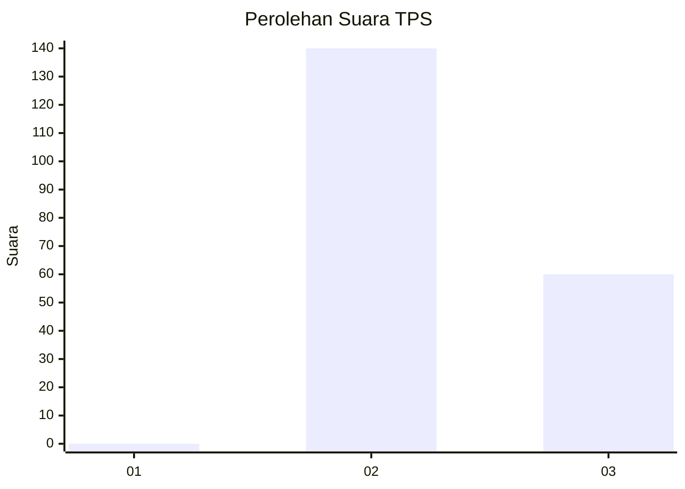
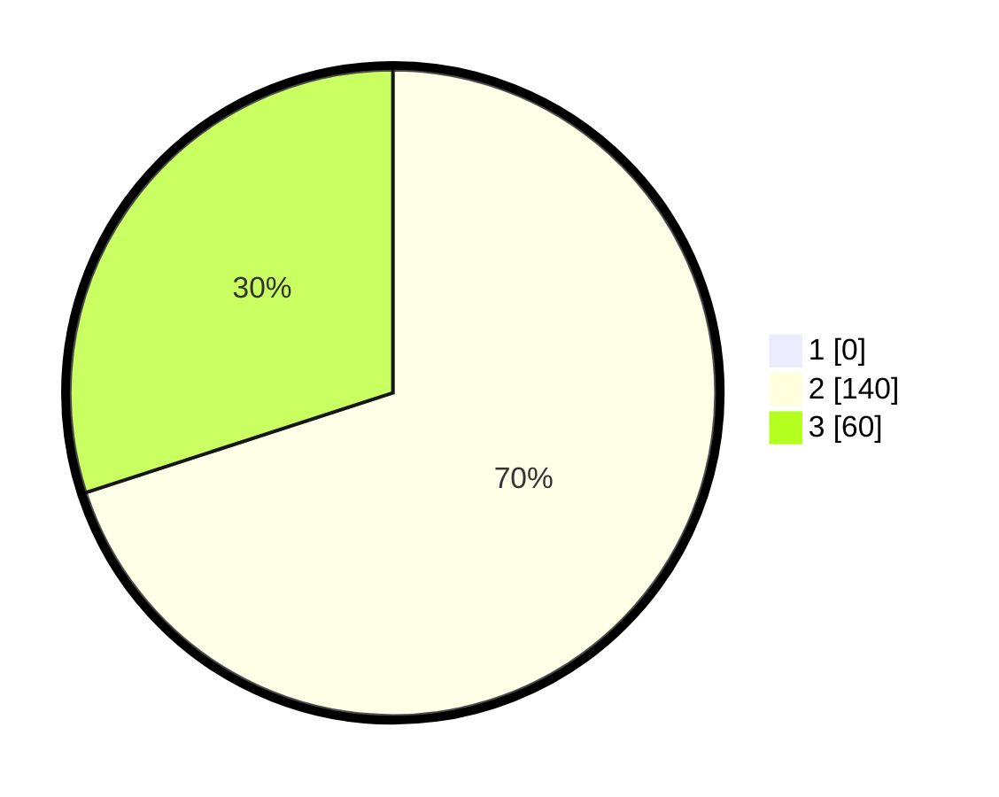

# Hasil

## Grafik

## Tabel

| No. | Nama Paslon    | Suara | Suara (raw) | Persentase |
|:--- |:-------------- | -----:| -----------:| ----------:|
| 1   | ANIES MUHAIMIN | 0     | [0][p-1]    | 0,00       |
| 2   | PRABOWO GIBRAN | 140   | [140][p-2]  | 70,00      |
| 3   | GANJAR MAHFUD  | 60    | [60][p-3]   | 30,00      |

[p-1]: https://github.com/gigit-pemilu/pemilu-2024-51-bali/blob/main/pilpres/hitung-suara/sub/51-bali/sub/02-tabanan/sub/06-kediri/sub/2003-belalang/sub/004-tps/sub/paslon-1.txt
[p-2]: https://github.com/gigit-pemilu/pemilu-2024-51-bali/blob/main/pilpres/hitung-suara/sub/51-bali/sub/02-tabanan/sub/06-kediri/sub/2003-belalang/sub/004-tps/sub/paslon-2.txt
[p-3]: https://github.com/gigit-pemilu/pemilu-2024-51-bali/blob/main/pilpres/hitung-suara/sub/51-bali/sub/02-tabanan/sub/06-kediri/sub/2003-belalang/sub/004-tps/sub/paslon-3.txt

## Foto C Plano

https://sirekap-obj-formc.kpu.go.id/f1b1/pemilu/ppwp/51/02/06/20/03/5102062003004-20240214-234255--e73525e4-c87b-42cc-b797-4e54dfee3bd1.jpg

https://sirekap-obj-formc.kpu.go.id/f1b1/pemilu/ppwp/51/02/06/20/03/5102062003004-20240214-234323--bd7ae9af-6189-4c63-a7cb-0f4fa5b56816.jpg

https://sirekap-obj-formc.kpu.go.id/f1b1/pemilu/ppwp/51/02/06/20/03/5102062003004-20240214-234358--332cfdd2-4247-4d11-9198-e4030a3a1d25.jpg

## Metadata

| Key        | Value               |
| ---------- | ------------------- |
| Time Stamp | 2024-02-15 22:40:13 |

