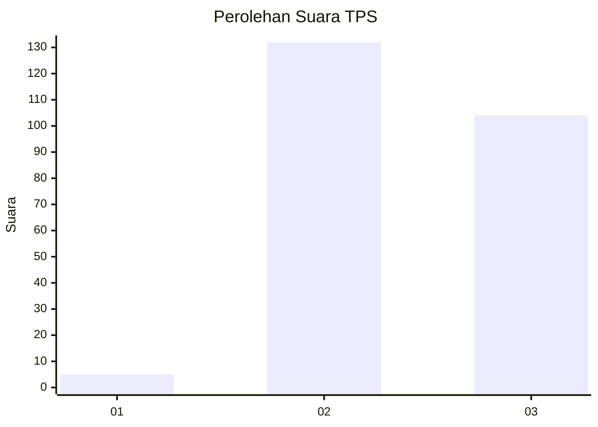
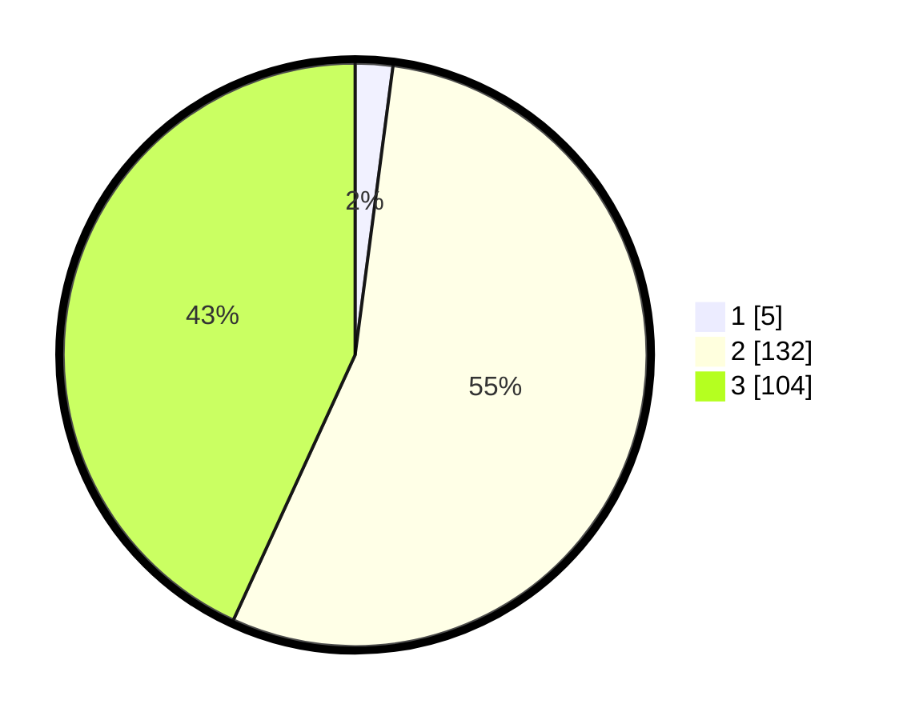

# Hasil

## Grafik

## Tabel

| No. | Nama Paslon    | Suara | Suara (raw) | Persentase |
|:--- |:-------------- | -----:| -----------:| ----------:|
| 1   | ANIES MUHAIMIN | 5     | [5][p-1]    | 2,07       |
| 2   | PRABOWO GIBRAN | 132   | [132][p-2]  | 54,77      |
| 3   | GANJAR MAHFUD  | 104   | [104][p-3]  | 43,15      |

[p-1]: https://github.com/gigit-pemilu/pemilu-2024-51-bali/blob/main/pilpres/hitung-suara/sub/51-bali/sub/02-tabanan/sub/06-kediri/sub/2003-belalang/sub/006-tps/sub/paslon-1.txt
[p-2]: https://github.com/gigit-pemilu/pemilu-2024-51-bali/blob/main/pilpres/hitung-suara/sub/51-bali/sub/02-tabanan/sub/06-kediri/sub/2003-belalang/sub/006-tps/sub/paslon-2.txt
[p-3]: https://github.com/gigit-pemilu/pemilu-2024-51-bali/blob/main/pilpres/hitung-suara/sub/51-bali/sub/02-tabanan/sub/06-kediri/sub/2003-belalang/sub/006-tps/sub/paslon-3.txt

## Foto C Plano

https://sirekap-obj-formc.kpu.go.id/6623/pemilu/ppwp/51/02/06/20/03/5102062003006-20240214-131505--d6a9b875-4d86-4944-83f1-e7fabd329f75.jpg

https://sirekap-obj-formc.kpu.go.id/6623/pemilu/ppwp/51/02/06/20/03/5102062003006-20240214-132739--4b0f590c-f742-4e7d-8d7a-f5083de8b067.jpg

https://sirekap-obj-formc.kpu.go.id/6623/pemilu/ppwp/51/02/06/20/03/5102062003006-20240214-132944--97bbe14a-6074-4a56-b258-fdf2e7473788.jpg

## Metadata

| Key        | Value               |
| ---------- | ------------------- |
| Time Stamp | 2024-02-14 21:46:01 |

## DATA PEMILIH TETAP

Jumlah pemilih dalam DPT: **262**.
 * L: **137**.
 * P: **125**.

## DATA PENGGUNA HAK PILIH

Jumlah pengguna hak pilih dalam DPT: **239**.
 * L: **121**.
 * P: **118**.

Jumlah pengguna hak pilih dalam DPTb: **0**.
 * L: **0**.
 * P: **0**.

Jumlah pengguna hak pilih dalam DPK: **2**.
 * L: **1**.
 * P: **1**.

Jumlah pengguna hak pilih: **241**.
 * L: **122**.
 * P: **119**.

## JUMLAH SUARA SAH DAN TIDAK SAH

JUMLAH SELURUH SUARA SAH: **241**.

JUMLAH SUARA TIDAK SAH: **0**.

JUMLAH SELURUH SUARA SAH DAN SUARA TIDAK SAH: **241**.

