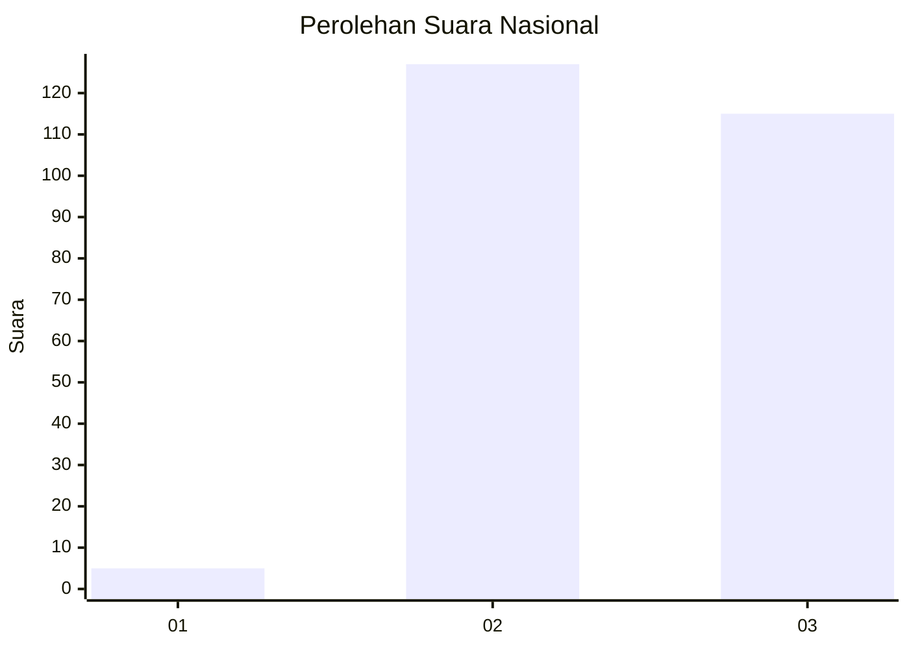
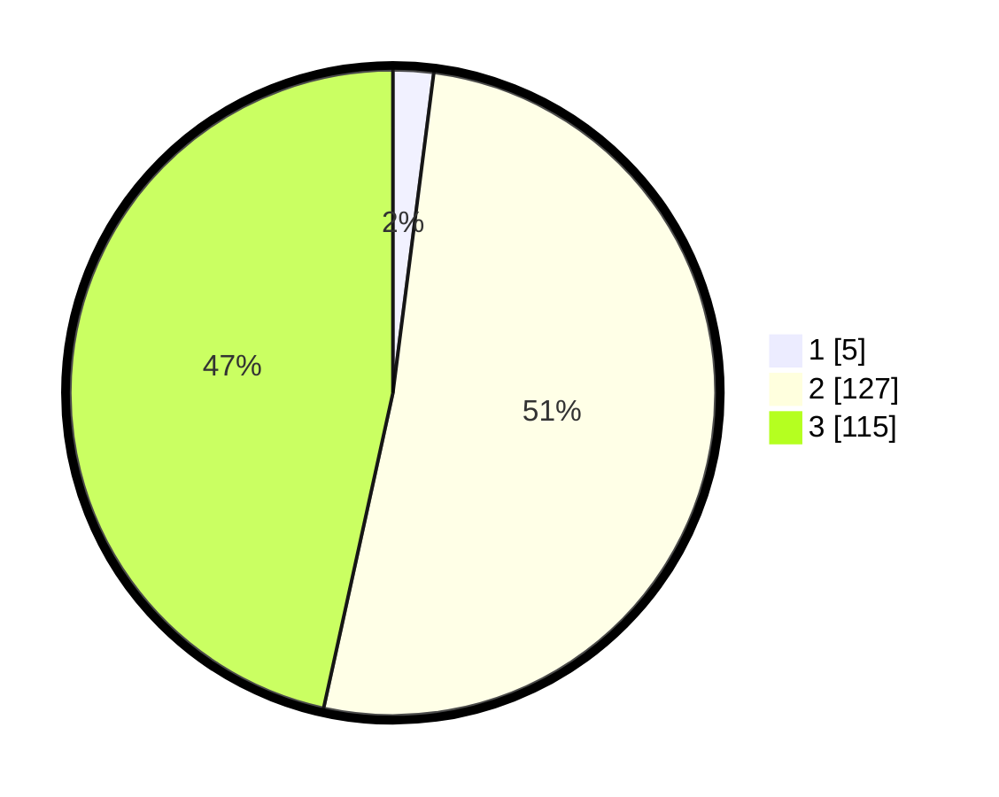

# Hasil

## Grafik

## Tabel

| No. | Nama Paslon    | Suara | Suara (raw) | Persentase |
|:--- |:-------------- | -----:| -----------:| ----------:|
| 1   | ANIES MUHAIMIN | 5     | [5][p-1]    | 2,02       |
| 2   | PRABOWO GIBRAN | 127   | [127][p-2]  | 51,42      |
| 3   | GANJAR MAHFUD  | 115   | [115][p-3]  | 46,56      |

[p-1]: https://github.com/gigit-pemilu/pemilu-2024/blob/main/pilpres/hitung-suara/sub/51-bali/sub/02-tabanan/sub/06-kediri/sub/2003-belalang/sub/007-tps/sub/paslon-1.txt
[p-2]: https://github.com/gigit-pemilu/pemilu-2024/blob/main/pilpres/hitung-suara/sub/51-bali/sub/02-tabanan/sub/06-kediri/sub/2003-belalang/sub/007-tps/sub/paslon-2.txt
[p-3]: https://github.com/gigit-pemilu/pemilu-2024/blob/main/pilpres/hitung-suara/sub/51-bali/sub/02-tabanan/sub/06-kediri/sub/2003-belalang/sub/007-tps/sub/paslon-3.txt

## Foto C Plano

https://sirekap-obj-formc.kpu.go.id/9783/pemilu/ppwp/51/02/06/20/03/5102062003007-20240214-184512--f42ef144-a565-4935-8b69-64687b0ca39a.jpg

https://sirekap-obj-formc.kpu.go.id/9783/pemilu/ppwp/51/02/06/20/03/5102062003007-20240214-184708--d6d4e92d-ade3-40b9-8c00-95bc5ef5b9aa.jpg

https://sirekap-obj-formc.kpu.go.id/9783/pemilu/ppwp/51/02/06/20/03/5102062003007-20240214-184717--a8e887f7-9f0b-411a-95c1-3e4f7a67f9d6.jpg

## Metadata

| Key        | Value               |
| ---------- | ------------------- |
| Time Stamp | 2024-02-14 21:46:01 |

## DATA PEMILIH TETAP

Jumlah pemilih dalam DPT: **271**.
 * L: **138**.
 * P: **133**.

## DATA PENGGUNA HAK PILIH

Jumlah pengguna hak pilih dalam DPT: **247**.
 * L: **127**.
 * P: **120**.

Jumlah pengguna hak pilih dalam DPTb: **4**.
 * L: **2**.
 * P: **2**.

Jumlah pengguna hak pilih dalam DPK: **0**.
 * L: **0**.
 * P: **0**.

Jumlah pengguna hak pilih: **251**.
 * L: **129**.
 * P: **122**.

## JUMLAH SUARA SAH DAN TIDAK SAH

JUMLAH SELURUH SUARA SAH: **247**.

JUMLAH SUARA TIDAK SAH: **4**.

JUMLAH SELURUH SUARA SAH DAN SUARA TIDAK SAH: **251**.

