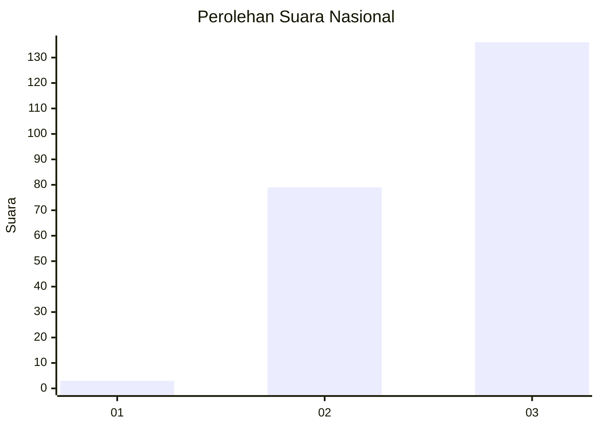
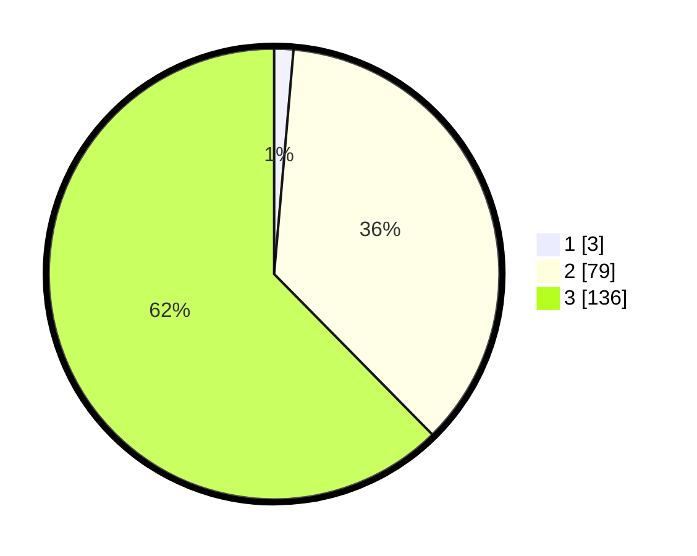

# Hasil

## Grafik

## Tabel

| No. | Nama Paslon    | Suara | Suara (raw) | Persentase |
|:--- |:-------------- | -----:| -----------:| ----------:|
| 1   | ANIES MUHAIMIN | 3     | [3][p-1]    | 1,38       |
| 2   | PRABOWO GIBRAN | 79    | [79][p-2]   | 36,24      |
| 3   | GANJAR MAHFUD  | 136   | [136][p-3]  | 62,39      |

[p-1]: https://github.com/gigit-pemilu/pemilu-2024/blob/main/pilpres/hitung-suara/sub/51-bali/sub/02-tabanan/sub/06-kediri/sub/2003-belalang/sub/008-tps/sub/paslon-1.txt
[p-2]: https://github.com/gigit-pemilu/pemilu-2024/blob/main/pilpres/hitung-suara/sub/51-bali/sub/02-tabanan/sub/06-kediri/sub/2003-belalang/sub/008-tps/sub/paslon-2.txt
[p-3]: https://github.com/gigit-pemilu/pemilu-2024/blob/main/pilpres/hitung-suara/sub/51-bali/sub/02-tabanan/sub/06-kediri/sub/2003-belalang/sub/008-tps/sub/paslon-3.txt

## Foto C Plano

https://sirekap-obj-formc.kpu.go.id/16fa/pemilu/ppwp/51/02/06/20/03/5102062003008-20240214-231516--24100618-313c-4b28-b3e0-7fdc66a78c58.jpg

https://sirekap-obj-formc.kpu.go.id/16fa/pemilu/ppwp/51/02/06/20/03/5102062003008-20240214-231234--5129415a-530a-4b14-a73b-384bf952cc84.jpg

https://sirekap-obj-formc.kpu.go.id/16fa/pemilu/ppwp/51/02/06/20/03/5102062003008-20240214-231350--45f86a8d-be57-4658-81ea-b9c50edb9eda.jpg

## Metadata

| Key        | Value               |
| ---------- | ------------------- |
| Time Stamp | 2024-02-15 22:40:13 |

