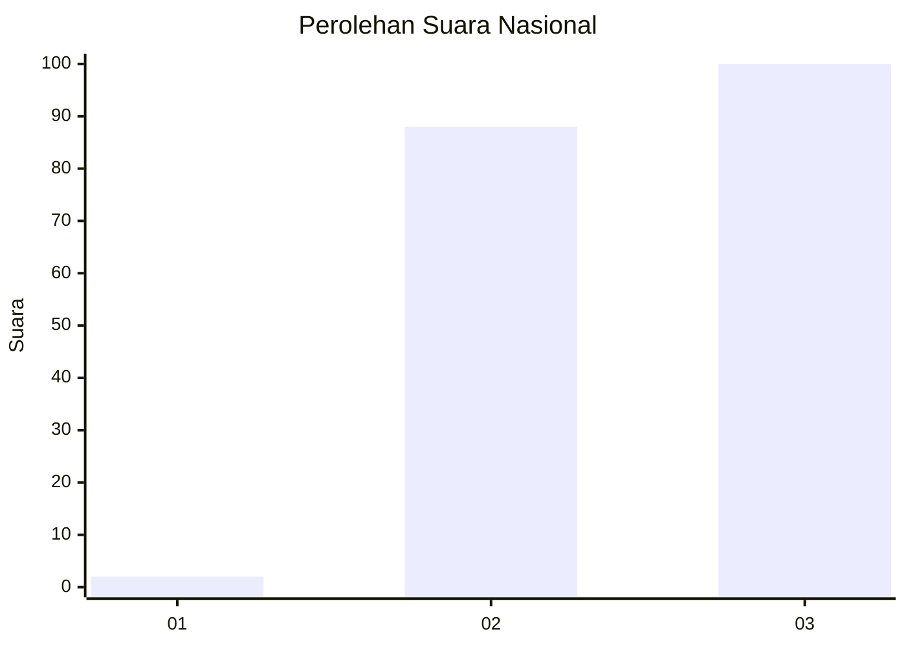
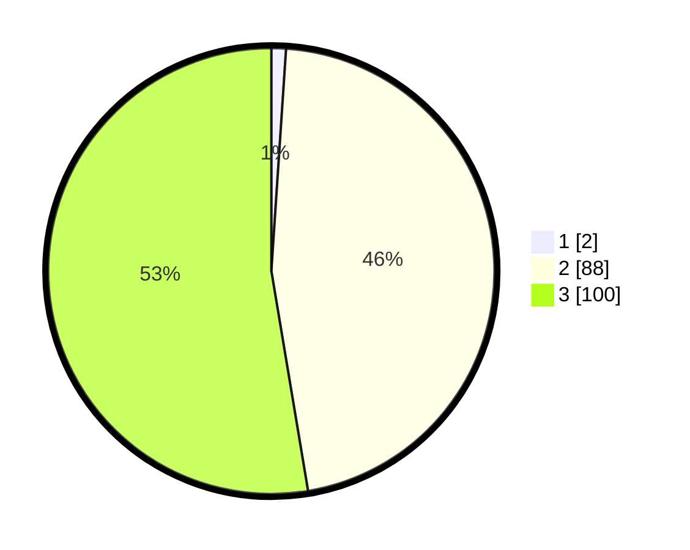

# Hasil

## Grafik

## Tabel

| No. | Nama Paslon    | Suara | Suara (raw) | Persentase |
|:--- |:-------------- | -----:| -----------:| ----------:|
| 1   | ANIES MUHAIMIN | 2     | [2][p-1]    | 1,05       |
| 2   | PRABOWO GIBRAN | 88    | [88][p-2]   | 46,32      |
| 3   | GANJAR MAHFUD  | 100   | [100][p-3]  | 52,63      |

[p-1]: https://github.com/gigit-pemilu/pemilu-2024/blob/main/pilpres/hitung-suara/sub/51-bali/sub/02-tabanan/sub/06-kediri/sub/2003-belalang/sub/009-tps/sub/paslon-1.txt
[p-2]: https://github.com/gigit-pemilu/pemilu-2024/blob/main/pilpres/hitung-suara/sub/51-bali/sub/02-tabanan/sub/06-kediri/sub/2003-belalang/sub/009-tps/sub/paslon-2.txt
[p-3]: https://github.com/gigit-pemilu/pemilu-2024/blob/main/pilpres/hitung-suara/sub/51-bali/sub/02-tabanan/sub/06-kediri/sub/2003-belalang/sub/009-tps/sub/paslon-3.txt

## Foto C Plano

https://sirekap-obj-formc.kpu.go.id/3c15/pemilu/ppwp/51/02/06/20/03/5102062003009-20240215-000109--2b7a695f-7427-4472-a9b7-7e33ed27cd79.jpg

https://sirekap-obj-formc.kpu.go.id/3c15/pemilu/ppwp/51/02/06/20/03/5102062003009-20240214-234618--8f7e407f-ec03-45a4-94d6-6bc091f79bcd.jpg

https://sirekap-obj-formc.kpu.go.id/3c15/pemilu/ppwp/51/02/06/20/03/5102062003009-20240214-234717--fa14dad6-f03e-4497-a062-d97af8e5d9ef.jpg

## Metadata

| Key        | Value               |
| ---------- | ------------------- |
| Time Stamp | 2024-02-24 22:31:28 |

