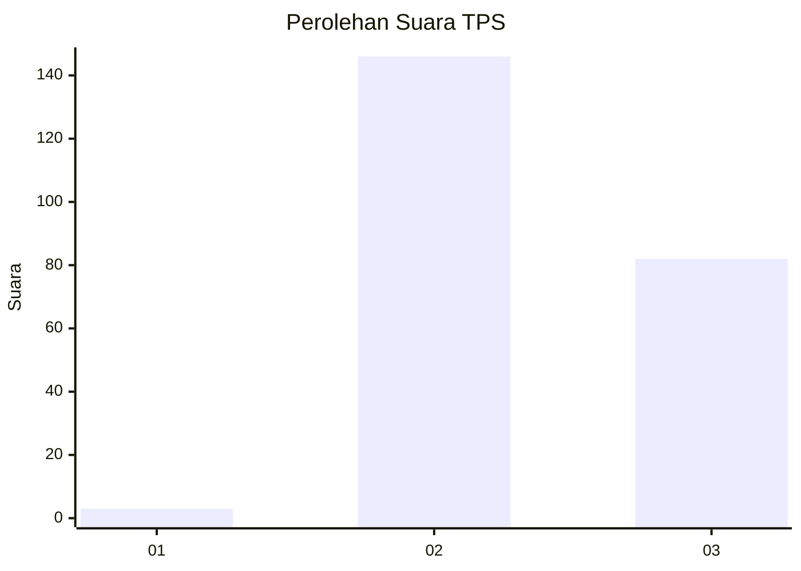
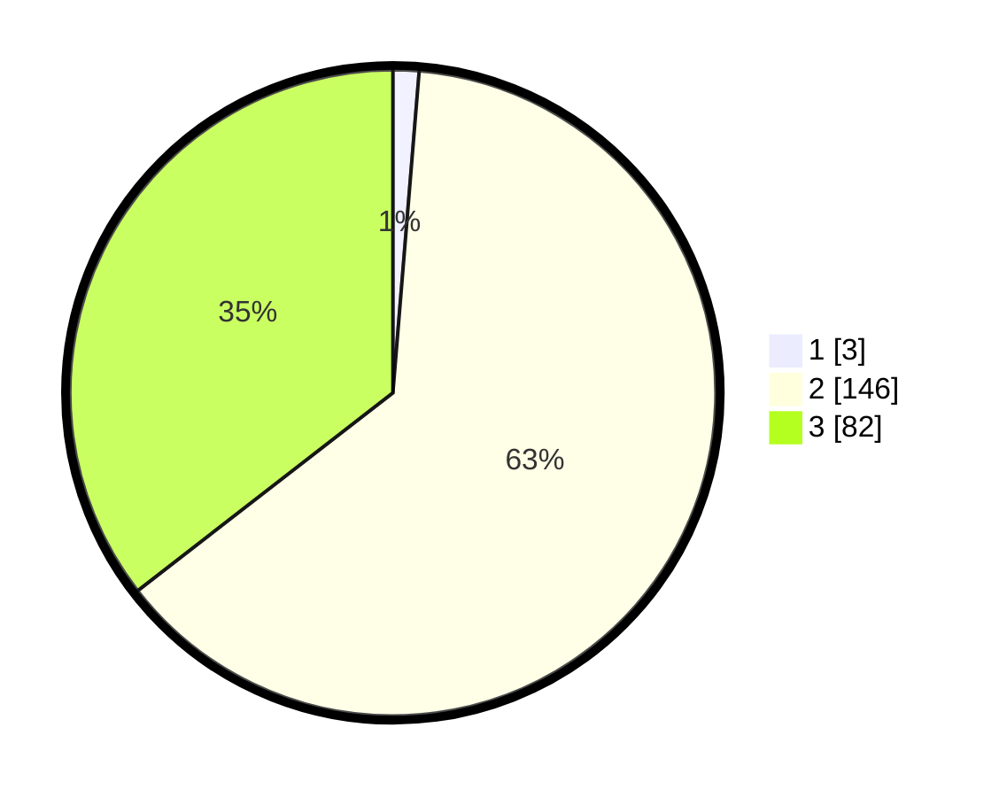

# Hasil

## Grafik

## Tabel

| No. | Nama Paslon    | Suara | Suara (raw) | Persentase |
|:--- |:-------------- | -----:| -----------:| ----------:|
| 1   | ANIES MUHAIMIN | 3     | [3][p-1]    | 1,30       |
| 2   | PRABOWO GIBRAN | 146   | [146][p-2]  | 63,20      |
| 3   | GANJAR MAHFUD  | 82    | [82][p-3]   | 35,50      |

[p-1]: https://github.com/gigit-pemilu/pemilu-2024-51-bali/blob/main/pilpres/hitung-suara/sub/51-bali/sub/02-tabanan/sub/06-kediri/sub/2004-beraban/sub/003-tps/sub/paslon-1.txt
[p-2]: https://github.com/gigit-pemilu/pemilu-2024-51-bali/blob/main/pilpres/hitung-suara/sub/51-bali/sub/02-tabanan/sub/06-kediri/sub/2004-beraban/sub/003-tps/sub/paslon-2.txt
[p-3]: https://github.com/gigit-pemilu/pemilu-2024-51-bali/blob/main/pilpres/hitung-suara/sub/51-bali/sub/02-tabanan/sub/06-kediri/sub/2004-beraban/sub/003-tps/sub/paslon-3.txt

## Foto C Plano

https://sirekap-obj-formc.kpu.go.id/e5e0/pemilu/ppwp/51/02/06/20/04/5102062004003-20240215-002722--6084ba2a-ba7e-4376-a6c0-14ed891800ee.jpg

https://sirekap-obj-formc.kpu.go.id/e5e0/pemilu/ppwp/51/02/06/20/04/5102062004003-20240215-002919--8d8e0e71-7143-493e-8ce9-1c052d2b8a23.jpg

https://sirekap-obj-formc.kpu.go.id/e5e0/pemilu/ppwp/51/02/06/20/04/5102062004003-20240215-003051--03ae90e9-2097-4364-aeb2-e6fc619cce08.jpg

## Metadata

| Key        | Value               |
| ---------- | ------------------- |
| Time Stamp | 2024-02-15 22:40:13 |

