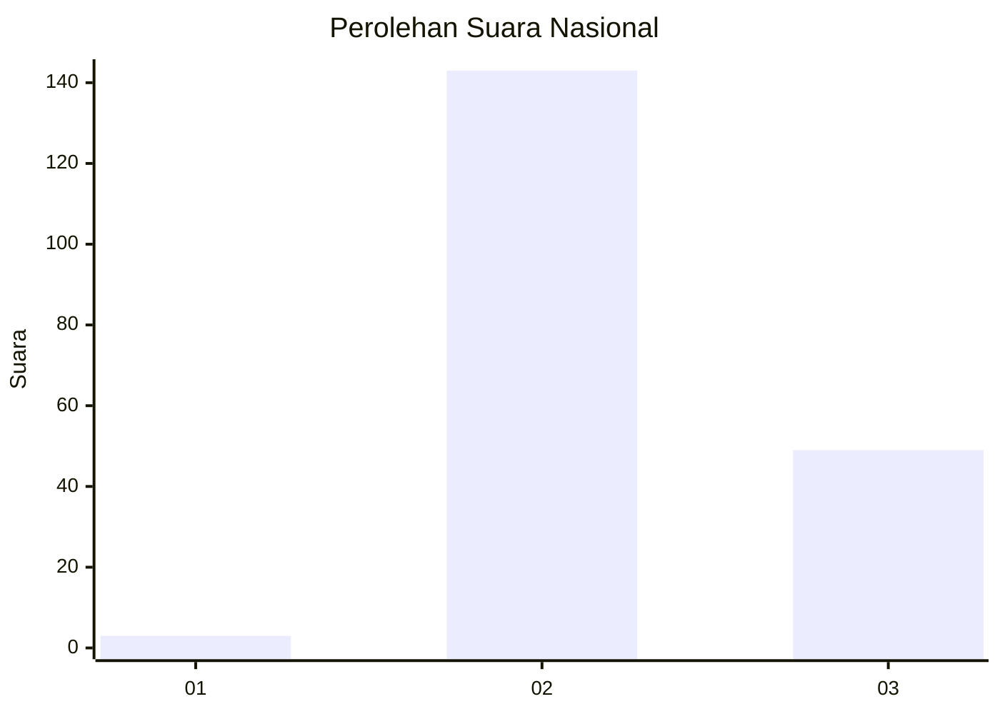
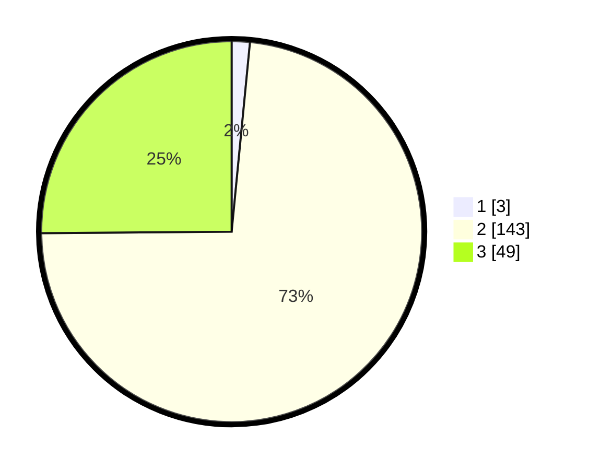

# Hasil

## Grafik

## Tabel

| No. | Nama Paslon    | Suara | Suara (raw) | Persentase |
|:--- |:-------------- | -----:| -----------:| ----------:|
| 1   | ANIES MUHAIMIN | 3     | [3][p-1]    | 1,54       |
| 2   | PRABOWO GIBRAN | 143   | [143][p-2]  | 73,33      |
| 3   | GANJAR MAHFUD  | 49    | [49][p-3]   | 25,13      |

[p-1]: https://github.com/gigit-pemilu/pemilu-2024/blob/main/pilpres/hitung-suara/sub/51-bali/sub/02-tabanan/sub/06-kediri/sub/2004-beraban/sub/006-tps/sub/paslon-1.txt
[p-2]: https://github.com/gigit-pemilu/pemilu-2024/blob/main/pilpres/hitung-suara/sub/51-bali/sub/02-tabanan/sub/06-kediri/sub/2004-beraban/sub/006-tps/sub/paslon-2.txt
[p-3]: https://github.com/gigit-pemilu/pemilu-2024/blob/main/pilpres/hitung-suara/sub/51-bali/sub/02-tabanan/sub/06-kediri/sub/2004-beraban/sub/006-tps/sub/paslon-3.txt

## Foto C Plano

https://sirekap-obj-formc.kpu.go.id/cfe9/pemilu/ppwp/51/02/06/20/04/5102062004006-20240216-064655--32d6c226-27ad-438b-a027-c5f07a764da3.jpg

https://sirekap-obj-formc.kpu.go.id/cfe9/pemilu/ppwp/51/02/06/20/04/5102062004006-20240216-064658--bf2e9822-c656-4587-ac1d-0879e552e509.jpg

https://sirekap-obj-formc.kpu.go.id/cfe9/pemilu/ppwp/51/02/06/20/04/5102062004006-20240216-064656--9b6f4c1f-94fb-48ed-a17c-7713df304b98.jpg

## Metadata

| Key        | Value               |
| ---------- | ------------------- |
| Time Stamp | 2024-02-16 11:00:29 |

## DATA PEMILIH TETAP

Jumlah pemilih dalam DPT: **215**.
 * L: **107**.
 * P: **108**.

## DATA PENGGUNA HAK PILIH

Jumlah pengguna hak pilih dalam DPT: **194**.
 * L: **99**.
 * P: **95**.

Jumlah pengguna hak pilih dalam DPTb: **0**.
 * L: **0**.
 * P: **0**.

Jumlah pengguna hak pilih dalam DPK: **3**.
 * L: **1**.
 * P: **2**.

Jumlah pengguna hak pilih: **197**.
 * L: **100**.
 * P: **97**.

## JUMLAH SUARA SAH DAN TIDAK SAH

JUMLAH SELURUH SUARA SAH: **195**.

JUMLAH SUARA TIDAK SAH: **2**.

JUMLAH SELURUH SUARA SAH DAN SUARA TIDAK SAH: **197**.

