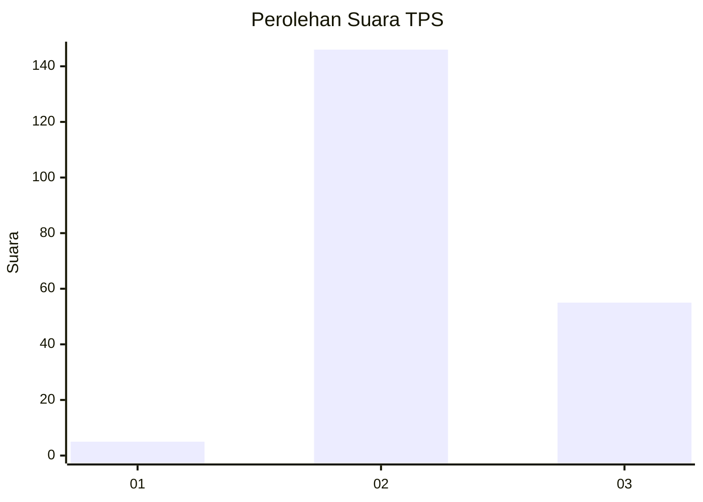
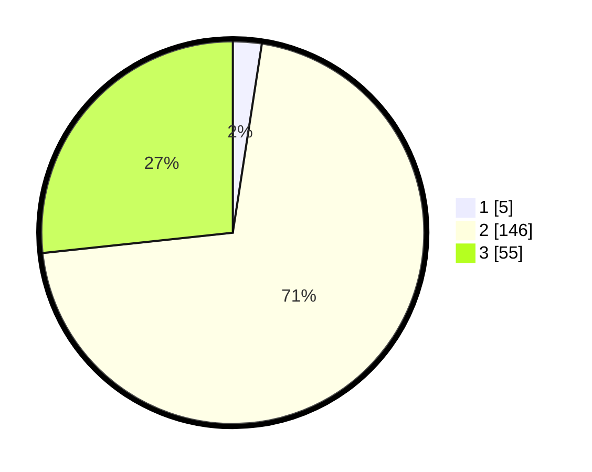

# Hasil

## Grafik

## Tabel

| No. | Nama Paslon    | Suara | Suara (raw) | Persentase |
|:--- |:-------------- | -----:| -----------:| ----------:|
| 1   | ANIES MUHAIMIN | 5     | [5][p-1]    | 2,43       |
| 2   | PRABOWO GIBRAN | 146   | [146][p-2]  | 70,87      |
| 3   | GANJAR MAHFUD  | 55    | [55][p-3]   | 26,70      |

[p-1]: https://github.com/gigit-pemilu/pemilu-2024-51-bali/blob/main/pilpres/hitung-suara/sub/51-bali/sub/02-tabanan/sub/06-kediri/sub/2004-beraban/sub/007-tps/sub/paslon-1.txt
[p-2]: https://github.com/gigit-pemilu/pemilu-2024-51-bali/blob/main/pilpres/hitung-suara/sub/51-bali/sub/02-tabanan/sub/06-kediri/sub/2004-beraban/sub/007-tps/sub/paslon-2.txt
[p-3]: https://github.com/gigit-pemilu/pemilu-2024-51-bali/blob/main/pilpres/hitung-suara/sub/51-bali/sub/02-tabanan/sub/06-kediri/sub/2004-beraban/sub/007-tps/sub/paslon-3.txt

## Foto C Plano

https://sirekap-obj-formc.kpu.go.id/102c/pemilu/ppwp/51/02/06/20/04/5102062004007-20240216-000408--e83ef826-ea85-4193-bd48-cfef5408c48c.jpg

https://sirekap-obj-formc.kpu.go.id/102c/pemilu/ppwp/51/02/06/20/04/5102062004007-20240216-000411--5992adeb-5655-4f2e-88e6-ffbcf2898eb2.jpg

https://sirekap-obj-formc.kpu.go.id/102c/pemilu/ppwp/51/02/06/20/04/5102062004007-20240216-000409--4a9634af-cb60-40f8-b3f2-de3245e7fcf9.jpg

## Metadata

| Key        | Value               |
| ---------- | ------------------- |
| Time Stamp | 2024-02-16 11:00:29 |

## DATA PEMILIH TETAP

Jumlah pemilih dalam DPT: **218**.
 * L: **95**.
 * P: **123**.

## DATA PENGGUNA HAK PILIH

Jumlah pengguna hak pilih dalam DPT: **208**.
 * L: **92**.
 * P: **116**.

Jumlah pengguna hak pilih dalam DPTb: **0**.
 * L: **0**.
 * P: **0**.

Jumlah pengguna hak pilih dalam DPK: **2**.
 * L: **1**.
 * P: **1**.

Jumlah pengguna hak pilih: **210**.
 * L: **93**.
 * P: **117**.

## JUMLAH SUARA SAH DAN TIDAK SAH

JUMLAH SELURUH SUARA SAH: **206**.

JUMLAH SUARA TIDAK SAH: **4**.

JUMLAH SELURUH SUARA SAH DAN SUARA TIDAK SAH: **210**.

