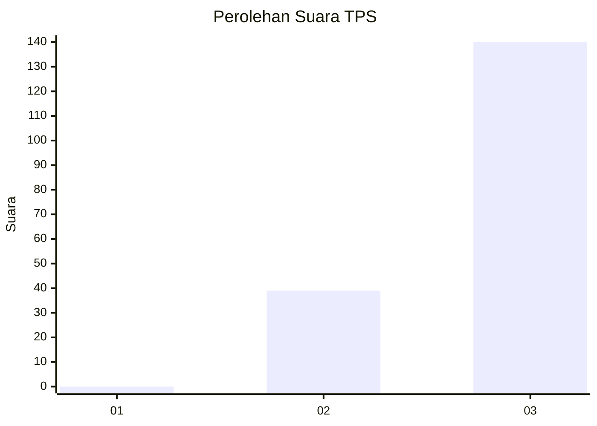
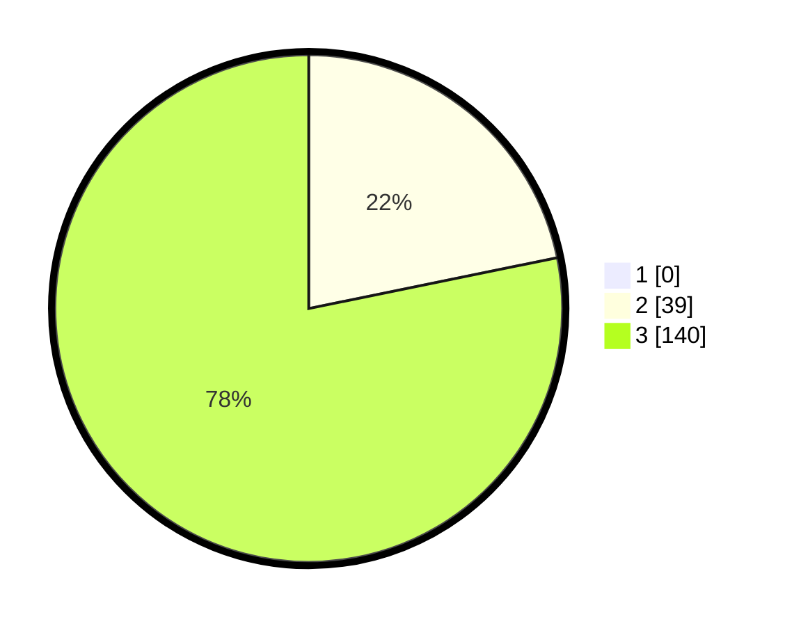

# Hasil

## Grafik

## Tabel

| No. | Nama Paslon    | Suara | Suara (raw) | Persentase |
|:--- |:-------------- | -----:| -----------:| ----------:|
| 1   | ANIES MUHAIMIN | 0     | [0][p-1]    | 0,00       |
| 2   | PRABOWO GIBRAN | 39    | [39][p-2]   | 21,79      |
| 3   | GANJAR MAHFUD  | 140   | [140][p-3]  | 78,21      |

[p-1]: https://github.com/gigit-pemilu/pemilu-2024-51-bali/blob/main/pilpres/hitung-suara/sub/51-bali/sub/02-tabanan/sub/06-kediri/sub/2004-beraban/sub/015-tps/sub/paslon-1.txt
[p-2]: https://github.com/gigit-pemilu/pemilu-2024-51-bali/blob/main/pilpres/hitung-suara/sub/51-bali/sub/02-tabanan/sub/06-kediri/sub/2004-beraban/sub/015-tps/sub/paslon-2.txt
[p-3]: https://github.com/gigit-pemilu/pemilu-2024-51-bali/blob/main/pilpres/hitung-suara/sub/51-bali/sub/02-tabanan/sub/06-kediri/sub/2004-beraban/sub/015-tps/sub/paslon-3.txt

## Foto C Plano

https://sirekap-obj-formc.kpu.go.id/be8b/pemilu/ppwp/51/02/06/20/04/5102062004015-20240214-141232--11c76683-d72c-44e8-b232-2c57d02b45dd.jpg

https://sirekap-obj-formc.kpu.go.id/be8b/pemilu/ppwp/51/02/06/20/04/5102062004015-20240214-141547--74ac31cc-b948-4bfb-b044-0f08a911083b.jpg

https://sirekap-obj-formc.kpu.go.id/be8b/pemilu/ppwp/51/02/06/20/04/5102062004015-20240214-141702--f352e634-dd27-43c5-80f3-4747597f5f57.jpg

## Metadata

| Key        | Value               |
| ---------- | ------------------- |
| Time Stamp | 2024-02-15 22:30:27 |

## DATA PEMILIH TETAP

Jumlah pemilih dalam DPT: **190**.
 * L: **100**.
 * P: **90**.

## DATA PENGGUNA HAK PILIH

Jumlah pengguna hak pilih dalam DPT: **177**.
 * L: **91**.
 * P: **86**.

Jumlah pengguna hak pilih dalam DPTb: **3**.
 * L: **1**.
 * P: **2**.

Jumlah pengguna hak pilih dalam DPK: **0**.
 * L: **0**.
 * P: **0**.

Jumlah pengguna hak pilih: **180**.
 * L: **92**.
 * P: **88**.

## JUMLAH SUARA SAH DAN TIDAK SAH

JUMLAH SELURUH SUARA SAH: **179**.

JUMLAH SUARA TIDAK SAH: **1**.

JUMLAH SELURUH SUARA SAH DAN SUARA TIDAK SAH: **180**.

