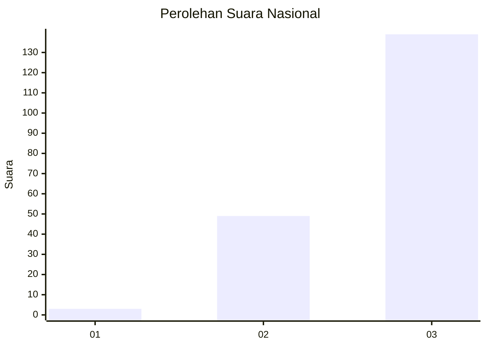
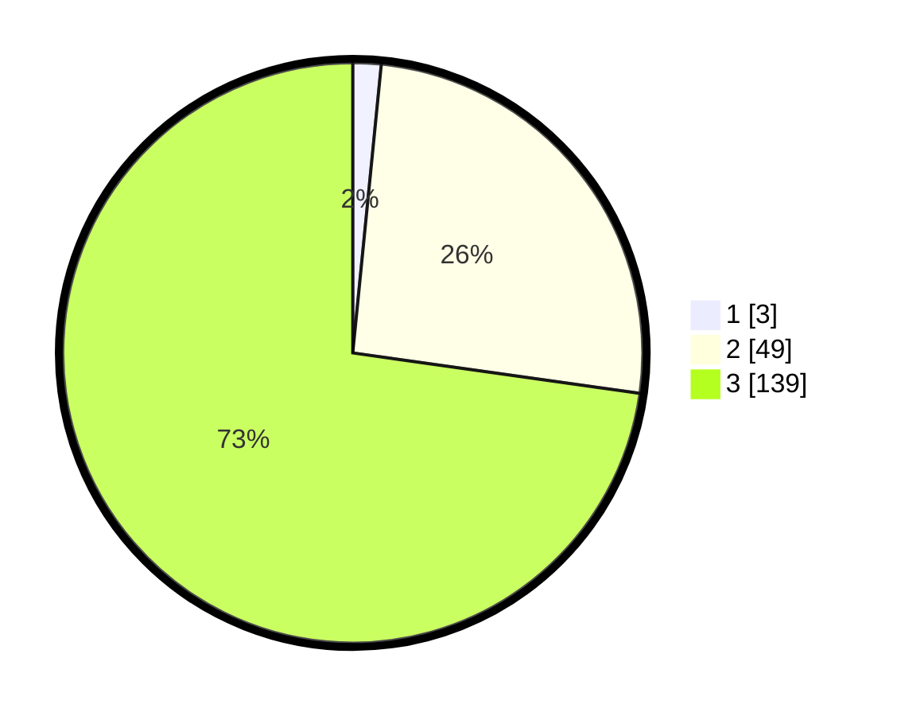

# Hasil

## Grafik

## Tabel

| No. | Nama Paslon    | Suara | Suara (raw) | Persentase |
|:--- |:-------------- | -----:| -----------:| ----------:|
| 1   | ANIES MUHAIMIN | 3     | [3][p-1]    | 1,57       |
| 2   | PRABOWO GIBRAN | 49    | [49][p-2]   | 25,65      |
| 3   | GANJAR MAHFUD  | 139   | [139][p-3]  | 72,77      |

[p-1]: https://github.com/gigit-pemilu/pemilu-2024/blob/main/pilpres/hitung-suara/sub/51-bali/sub/02-tabanan/sub/06-kediri/sub/2004-beraban/sub/017-tps/sub/paslon-1.txt
[p-2]: https://github.com/gigit-pemilu/pemilu-2024/blob/main/pilpres/hitung-suara/sub/51-bali/sub/02-tabanan/sub/06-kediri/sub/2004-beraban/sub/017-tps/sub/paslon-2.txt
[p-3]: https://github.com/gigit-pemilu/pemilu-2024/blob/main/pilpres/hitung-suara/sub/51-bali/sub/02-tabanan/sub/06-kediri/sub/2004-beraban/sub/017-tps/sub/paslon-3.txt

## Foto C Plano

https://sirekap-obj-formc.kpu.go.id/e346/pemilu/ppwp/51/02/06/20/04/5102062004017-20240214-220115--985cfe13-3d49-4b44-baab-f7e0c449e88f.jpg

https://sirekap-obj-formc.kpu.go.id/e346/pemilu/ppwp/51/02/06/20/04/5102062004017-20240214-215336--b23d4cf1-fbe9-4fd9-926f-f994ed6f82d1.jpg

https://sirekap-obj-formc.kpu.go.id/e346/pemilu/ppwp/51/02/06/20/04/5102062004017-20240214-185333--4211a742-fada-40a7-81c9-fd2e9125cbde.jpg

## Metadata

| Key        | Value               |
| ---------- | ------------------- |
| Time Stamp | 2024-02-15 22:40:13 |

