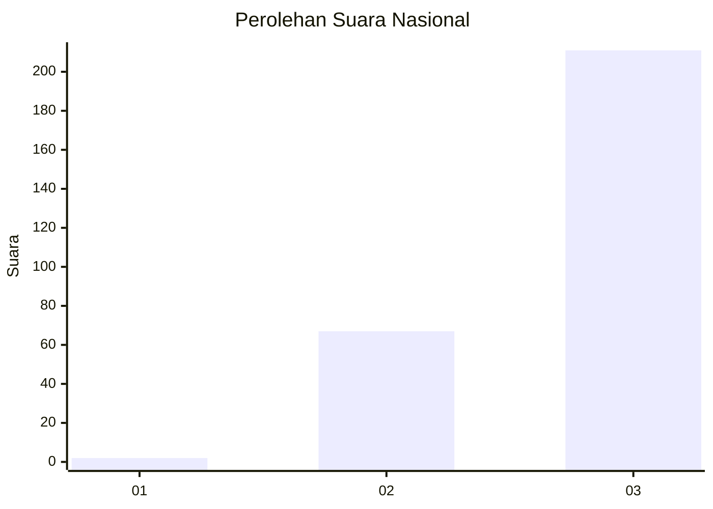
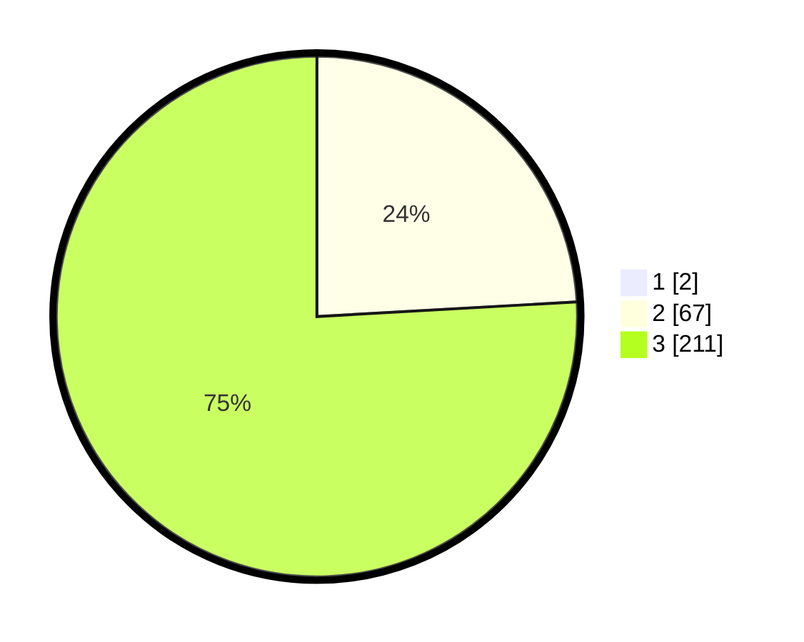

# Hasil

## Grafik

## Tabel

| No. | Nama Paslon    | Suara | Suara (raw) | Persentase |
|:--- |:-------------- | -----:| -----------:| ----------:|
| 1   | ANIES MUHAIMIN | 2     | [2][p-1]    | 0,71       |
| 2   | PRABOWO GIBRAN | 67    | [67][p-2]   | 23,93      |
| 3   | GANJAR MAHFUD  | 211   | [211][p-3]  | 75,36      |

[p-1]: https://github.com/gigit-pemilu/pemilu-2024/blob/main/pilpres/hitung-suara/sub/51-bali/sub/02-tabanan/sub/06-kediri/sub/2005-buwit/sub/001-tps/sub/paslon-1.txt
[p-2]: https://github.com/gigit-pemilu/pemilu-2024/blob/main/pilpres/hitung-suara/sub/51-bali/sub/02-tabanan/sub/06-kediri/sub/2005-buwit/sub/001-tps/sub/paslon-2.txt
[p-3]: https://github.com/gigit-pemilu/pemilu-2024/blob/main/pilpres/hitung-suara/sub/51-bali/sub/02-tabanan/sub/06-kediri/sub/2005-buwit/sub/001-tps/sub/paslon-3.txt

## Foto C Plano

https://sirekap-obj-formc.kpu.go.id/06ea/pemilu/ppwp/51/02/06/20/05/5102062005001-20240214-225224--01effea2-8663-44ab-b3f0-ae763c7cf3e3.jpg

https://sirekap-obj-formc.kpu.go.id/06ea/pemilu/ppwp/51/02/06/20/05/5102062005001-20240214-225337--2a575561-9b43-436c-a803-1e1d5441f7fc.jpg

## Metadata

| Key        | Value               |
| ---------- | ------------------- |
| Time Stamp | 2024-02-24 22:31:28 |

