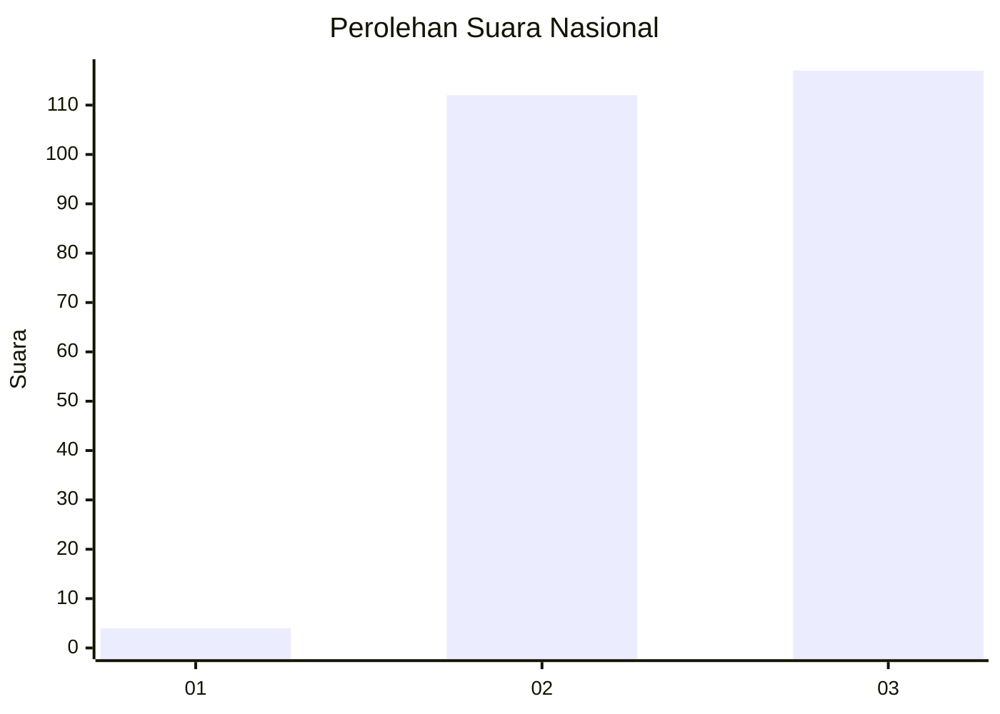
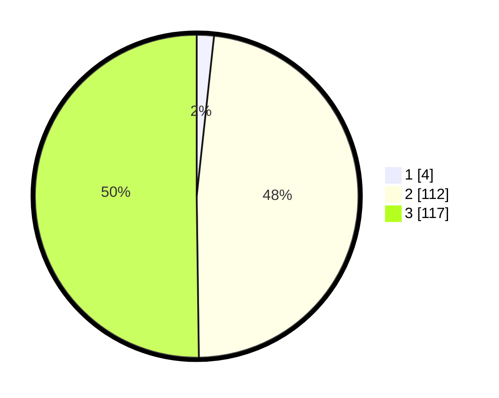

# Hasil

## Grafik

## Tabel

| No. | Nama Paslon    | Suara | Suara (raw) | Persentase |
|:--- |:-------------- | -----:| -----------:| ----------:|
| 1   | ANIES MUHAIMIN | 4     | [4][p-1]    | 1,72       |
| 2   | PRABOWO GIBRAN | 112   | [112][p-2]  | 48,07      |
| 3   | GANJAR MAHFUD  | 117   | [117][p-3]  | 50,21      |

[p-1]: https://github.com/gigit-pemilu/pemilu-2024/blob/main/pilpres/hitung-suara/sub/51-bali/sub/02-tabanan/sub/06-kediri/sub/2006-cepaka/sub/001-tps/sub/paslon-1.txt
[p-2]: https://github.com/gigit-pemilu/pemilu-2024/blob/main/pilpres/hitung-suara/sub/51-bali/sub/02-tabanan/sub/06-kediri/sub/2006-cepaka/sub/001-tps/sub/paslon-2.txt
[p-3]: https://github.com/gigit-pemilu/pemilu-2024/blob/main/pilpres/hitung-suara/sub/51-bali/sub/02-tabanan/sub/06-kediri/sub/2006-cepaka/sub/001-tps/sub/paslon-3.txt

## Foto C Plano

https://sirekap-obj-formc.kpu.go.id/8de7/pemilu/ppwp/51/02/06/20/06/5102062006001-20240214-224024--873fe1a8-0629-465b-abea-494f86e6d0be.jpg

https://sirekap-obj-formc.kpu.go.id/8de7/pemilu/ppwp/51/02/06/20/06/5102062006001-20240214-224045--eac3d3e5-42ec-4175-9249-b83f2f4c3764.jpg

https://sirekap-obj-formc.kpu.go.id/8de7/pemilu/ppwp/51/02/06/20/06/5102062006001-20240214-224055--8cd29342-e311-49df-aeeb-3dc30024b242.jpg

## Metadata

| Key        | Value               |
| ---------- | ------------------- |
| Time Stamp | 2024-02-15 22:40:13 |

