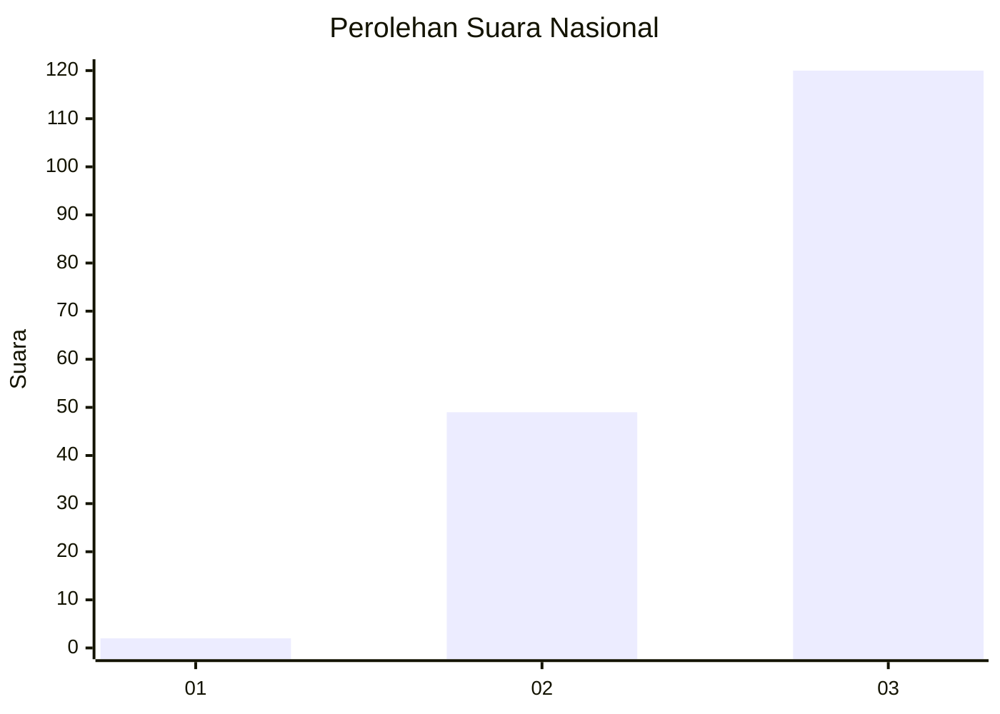
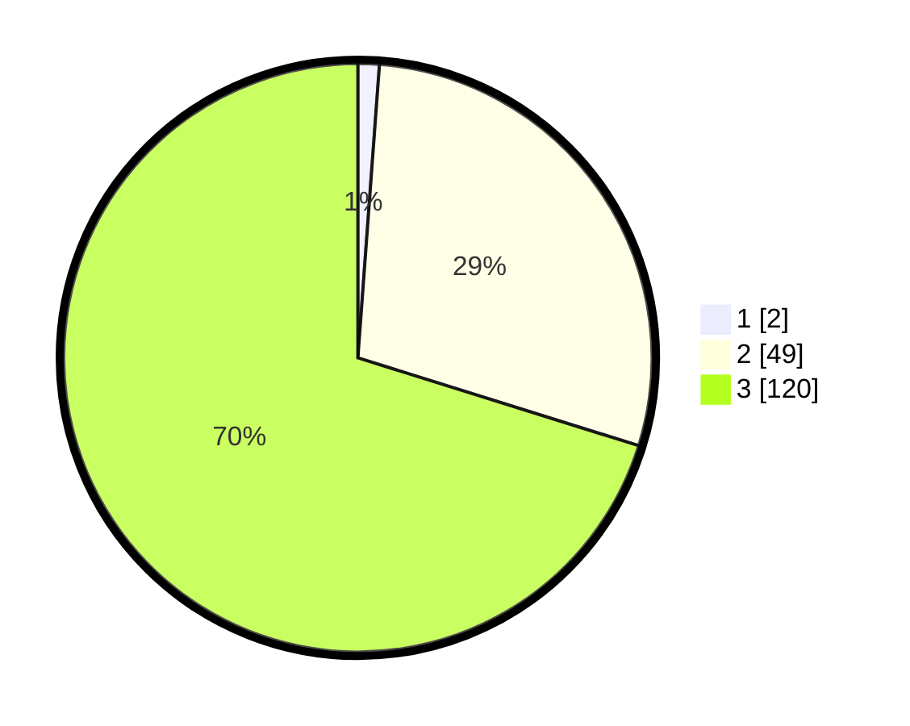

# Hasil

## Grafik

## Tabel

| No. | Nama Paslon    | Suara | Suara (raw) | Persentase |
|:--- |:-------------- | -----:| -----------:| ----------:|
| 1   | ANIES MUHAIMIN | 2     | [2][p-1]    | 1,17       |
| 2   | PRABOWO GIBRAN | 49    | [49][p-2]   | 28,65      |
| 3   | GANJAR MAHFUD  | 120   | [120][p-3]  | 70,18      |

[p-1]: https://github.com/gigit-pemilu/pemilu-2024/blob/main/pilpres/hitung-suara/sub/51-bali/sub/02-tabanan/sub/06-kediri/sub/2006-cepaka/sub/002-tps/sub/paslon-1.txt
[p-2]: https://github.com/gigit-pemilu/pemilu-2024/blob/main/pilpres/hitung-suara/sub/51-bali/sub/02-tabanan/sub/06-kediri/sub/2006-cepaka/sub/002-tps/sub/paslon-2.txt
[p-3]: https://github.com/gigit-pemilu/pemilu-2024/blob/main/pilpres/hitung-suara/sub/51-bali/sub/02-tabanan/sub/06-kediri/sub/2006-cepaka/sub/002-tps/sub/paslon-3.txt

## Foto C Plano

https://sirekap-obj-formc.kpu.go.id/9e4e/pemilu/ppwp/51/02/06/20/06/5102062006002-20240214-141013--f32ce0da-881a-4455-8484-9edc4f3f0ce6.jpg

https://sirekap-obj-formc.kpu.go.id/9e4e/pemilu/ppwp/51/02/06/20/06/5102062006002-20240214-141016--856b7694-40e7-47ac-a549-e2ea7c52a07c.jpg

https://sirekap-obj-formc.kpu.go.id/9e4e/pemilu/ppwp/51/02/06/20/06/5102062006002-20240214-141019--0fe5f307-e8ea-4f01-a261-0ace1f2563d5.jpg

## Metadata

| Key        | Value               |
| ---------- | ------------------- |
| Time Stamp | 2024-02-15 22:30:27 |

## DATA PEMILIH TETAP

Jumlah pemilih dalam DPT: **200**.
 * L: **98**.
 * P: **102**.

## DATA PENGGUNA HAK PILIH

Jumlah pengguna hak pilih dalam DPT: **172**.
 * L: **87**.
 * P: **85**.

Jumlah pengguna hak pilih dalam DPTb: **0**.
 * L: **0**.
 * P: **0**.

Jumlah pengguna hak pilih dalam DPK: **1**.
 * L: **1**.
 * P: **0**.

Jumlah pengguna hak pilih: **173**.
 * L: **88**.
 * P: **85**.

## JUMLAH SUARA SAH DAN TIDAK SAH

JUMLAH SELURUH SUARA SAH: **171**.

JUMLAH SUARA TIDAK SAH: **2**.

JUMLAH SELURUH SUARA SAH DAN SUARA TIDAK SAH: **173**.

