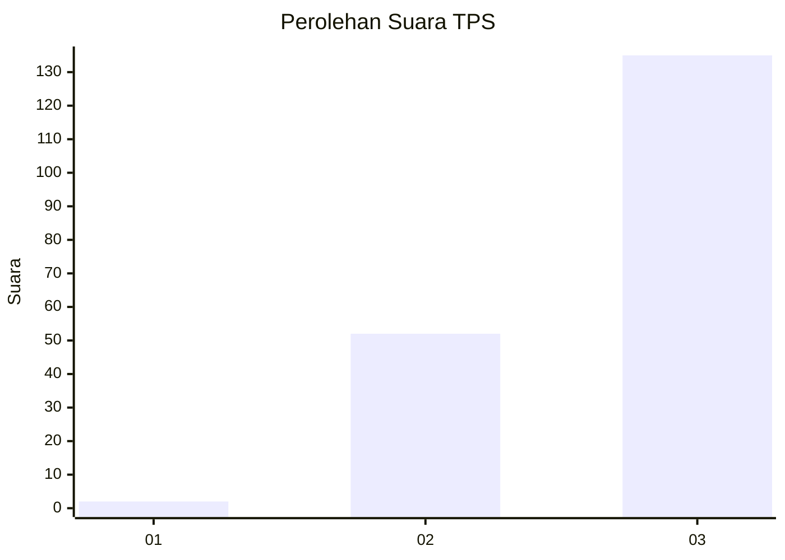
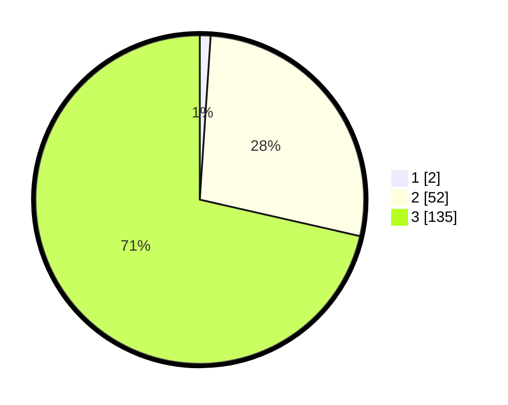

# Hasil

## Grafik

## Tabel

| No. | Nama Paslon    | Suara | Suara (raw) | Persentase |
|:--- |:-------------- | -----:| -----------:| ----------:|
| 1   | ANIES MUHAIMIN | 2     | [2][p-1]    | 1,06       |
| 2   | PRABOWO GIBRAN | 52    | [52][p-2]   | 27,51      |
| 3   | GANJAR MAHFUD  | 135   | [135][p-3]  | 71,43      |

[p-1]: https://github.com/gigit-pemilu/pemilu-2024-51-bali/blob/main/pilpres/hitung-suara/sub/51-bali/sub/02-tabanan/sub/06-kediri/sub/2006-cepaka/sub/003-tps/sub/paslon-1.txt
[p-2]: https://github.com/gigit-pemilu/pemilu-2024-51-bali/blob/main/pilpres/hitung-suara/sub/51-bali/sub/02-tabanan/sub/06-kediri/sub/2006-cepaka/sub/003-tps/sub/paslon-2.txt
[p-3]: https://github.com/gigit-pemilu/pemilu-2024-51-bali/blob/main/pilpres/hitung-suara/sub/51-bali/sub/02-tabanan/sub/06-kediri/sub/2006-cepaka/sub/003-tps/sub/paslon-3.txt

## Foto C Plano

https://sirekap-obj-formc.kpu.go.id/7b39/pemilu/ppwp/51/02/06/20/06/5102062006003-20240214-225112--9807ba23-95fa-4485-a99f-bc79518435a0.jpg

https://sirekap-obj-formc.kpu.go.id/7b39/pemilu/ppwp/51/02/06/20/06/5102062006003-20240214-224853--52774bde-0857-465d-8ae9-8acb0f5a96c0.jpg

https://sirekap-obj-formc.kpu.go.id/7b39/pemilu/ppwp/51/02/06/20/06/5102062006003-20240214-224940--95bc2d5f-ac51-47f8-aecd-0bdfc6ddea1f.jpg

## Metadata

| Key        | Value               |
| ---------- | ------------------- |
| Time Stamp | 2024-02-24 22:31:28 |

