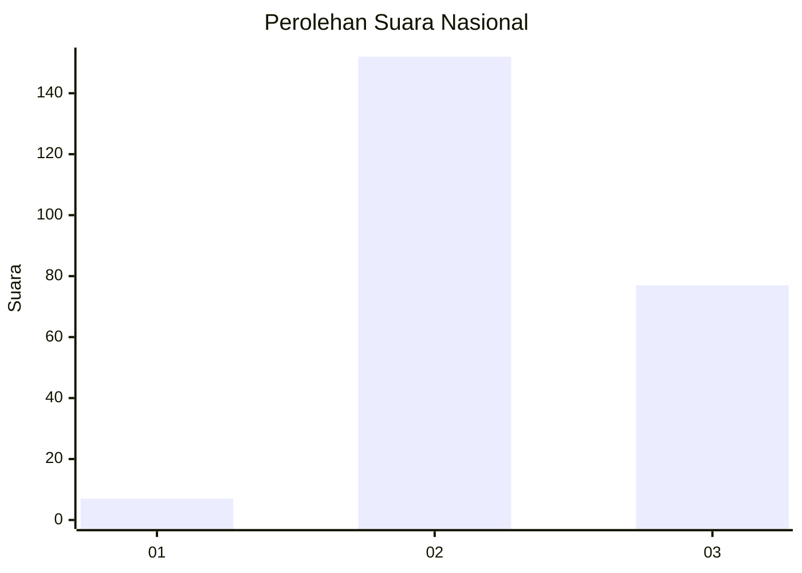
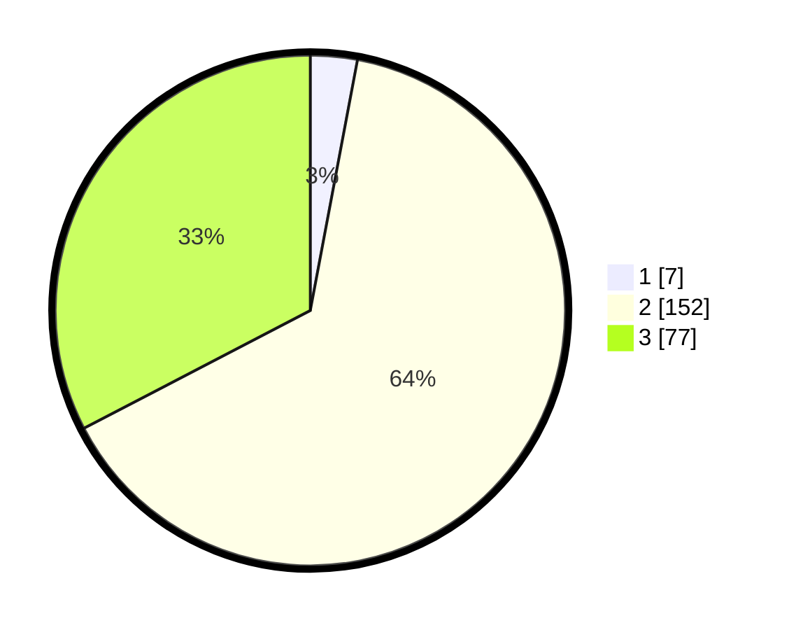

# Hasil

## Grafik

## Tabel

| No. | Nama Paslon    | Suara | Suara (raw) | Persentase |
|:--- |:-------------- | -----:| -----------:| ----------:|
| 1   | ANIES MUHAIMIN | 7     | [7][p-1]    | 2,97       |
| 2   | PRABOWO GIBRAN | 152   | [152][p-2]  | 64,41      |
| 3   | GANJAR MAHFUD  | 77    | [77][p-3]   | 32,63      |

[p-1]: https://github.com/gigit-pemilu/pemilu-2024/blob/main/pilpres/hitung-suara/sub/51-bali/sub/02-tabanan/sub/06-kediri/sub/2006-cepaka/sub/006-tps/sub/paslon-1.txt
[p-2]: https://github.com/gigit-pemilu/pemilu-2024/blob/main/pilpres/hitung-suara/sub/51-bali/sub/02-tabanan/sub/06-kediri/sub/2006-cepaka/sub/006-tps/sub/paslon-2.txt
[p-3]: https://github.com/gigit-pemilu/pemilu-2024/blob/main/pilpres/hitung-suara/sub/51-bali/sub/02-tabanan/sub/06-kediri/sub/2006-cepaka/sub/006-tps/sub/paslon-3.txt

## Foto C Plano

https://sirekap-obj-formc.kpu.go.id/6b3f/pemilu/ppwp/51/02/06/20/06/5102062006006-20240216-040710--aa296220-15ca-427e-9c7b-87846a854bf0.jpg

https://sirekap-obj-formc.kpu.go.id/6b3f/pemilu/ppwp/51/02/06/20/06/5102062006006-20240216-041817--23eabf83-5d03-4706-9c82-2e379d37fe39.jpg

https://sirekap-obj-formc.kpu.go.id/6b3f/pemilu/ppwp/51/02/06/20/06/5102062006006-20240216-040721--91da3d2a-83bc-4e11-aa9e-775ecf5b95c2.jpg

## Metadata

| Key        | Value               |
| ---------- | ------------------- |
| Time Stamp | 2024-02-16 11:00:29 |

## DATA PEMILIH TETAP

Jumlah pemilih dalam DPT: **282**.
 * L: **149**.
 * P: **133**.

## DATA PENGGUNA HAK PILIH

Jumlah pengguna hak pilih dalam DPT: **239**.
 * L: **130**.
 * P: **109**.

Jumlah pengguna hak pilih dalam DPTb: **3**.
 * L: **2**.
 * P: **1**.

Jumlah pengguna hak pilih dalam DPK: **0**.
 * L: **0**.
 * P: **0**.

Jumlah pengguna hak pilih: **242**.
 * L: **132**.
 * P: **110**.

## JUMLAH SUARA SAH DAN TIDAK SAH

JUMLAH SELURUH SUARA SAH: **236**.

JUMLAH SUARA TIDAK SAH: **6**.

JUMLAH SELURUH SUARA SAH DAN SUARA TIDAK SAH: **242**.

