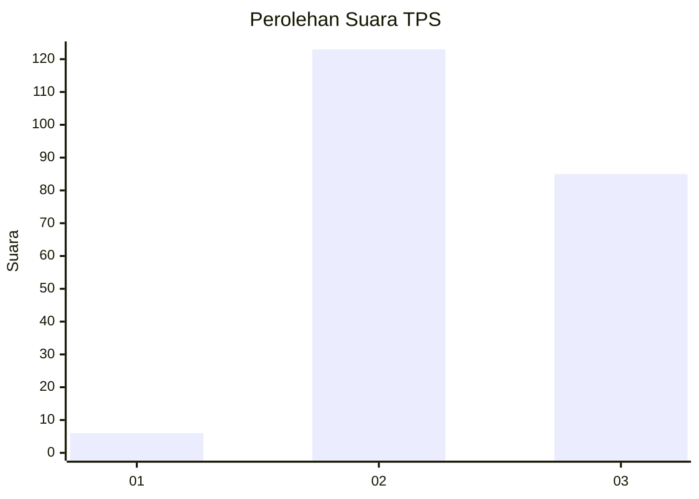
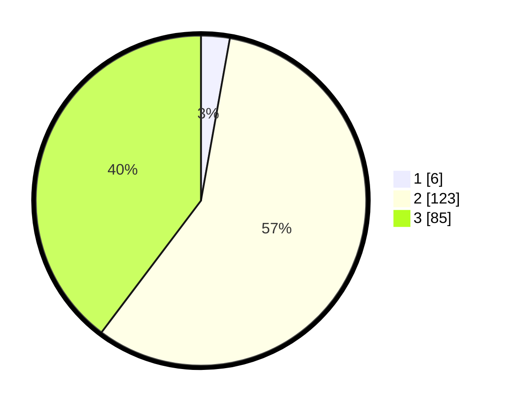

# Hasil

## Grafik

## Tabel

| No. | Nama Paslon    | Suara | Suara (raw) | Persentase |
|:--- |:-------------- | -----:| -----------:| ----------:|
| 1   | ANIES MUHAIMIN | 6     | [6][p-1]    | 2,80       |
| 2   | PRABOWO GIBRAN | 123   | [123][p-2]  | 57,48      |
| 3   | GANJAR MAHFUD  | 85    | [85][p-3]   | 39,72      |

[p-1]: https://github.com/gigit-pemilu/pemilu-2024-51-bali/blob/main/pilpres/hitung-suara/sub/51-bali/sub/02-tabanan/sub/06-kediri/sub/2006-cepaka/sub/007-tps/sub/paslon-1.txt
[p-2]: https://github.com/gigit-pemilu/pemilu-2024-51-bali/blob/main/pilpres/hitung-suara/sub/51-bali/sub/02-tabanan/sub/06-kediri/sub/2006-cepaka/sub/007-tps/sub/paslon-2.txt
[p-3]: https://github.com/gigit-pemilu/pemilu-2024-51-bali/blob/main/pilpres/hitung-suara/sub/51-bali/sub/02-tabanan/sub/06-kediri/sub/2006-cepaka/sub/007-tps/sub/paslon-3.txt

## Foto C Plano

https://sirekap-obj-formc.kpu.go.id/f1d6/pemilu/ppwp/51/02/06/20/06/5102062006007-20240214-221508--650c800b-6669-4500-8fb9-4f6f2dfbbb2d.jpg

https://sirekap-obj-formc.kpu.go.id/f1d6/pemilu/ppwp/51/02/06/20/06/5102062006007-20240214-221742--9cf9e966-6298-4c15-b097-07b65891c5c6.jpg

https://sirekap-obj-formc.kpu.go.id/f1d6/pemilu/ppwp/51/02/06/20/06/5102062006007-20240214-221911--cc5a9dd6-bf77-4745-bb1d-3fe0a09050d1.jpg

## Metadata

| Key        | Value               |
| ---------- | ------------------- |
| Time Stamp | 2024-02-15 22:40:13 |

