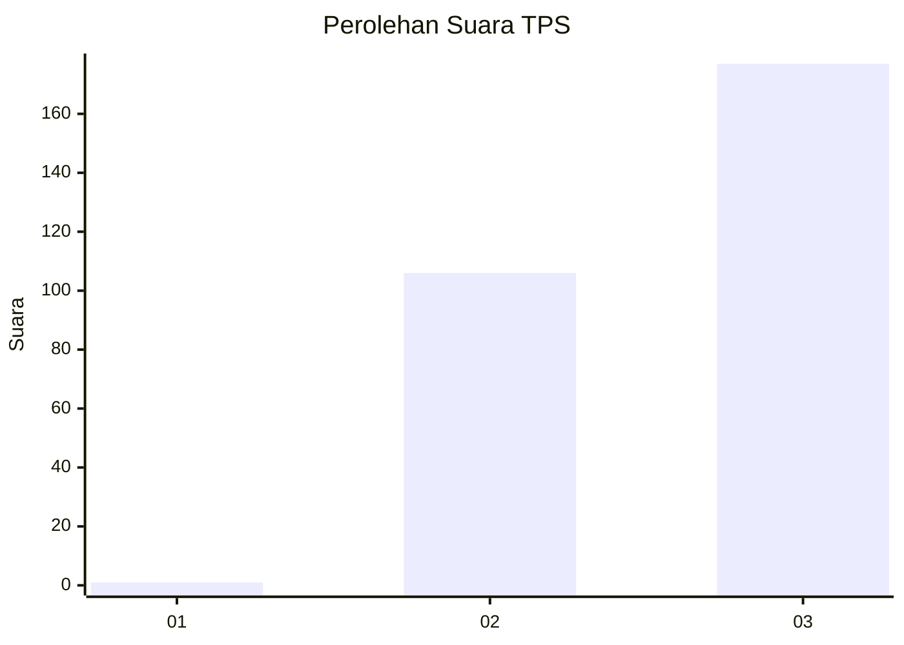
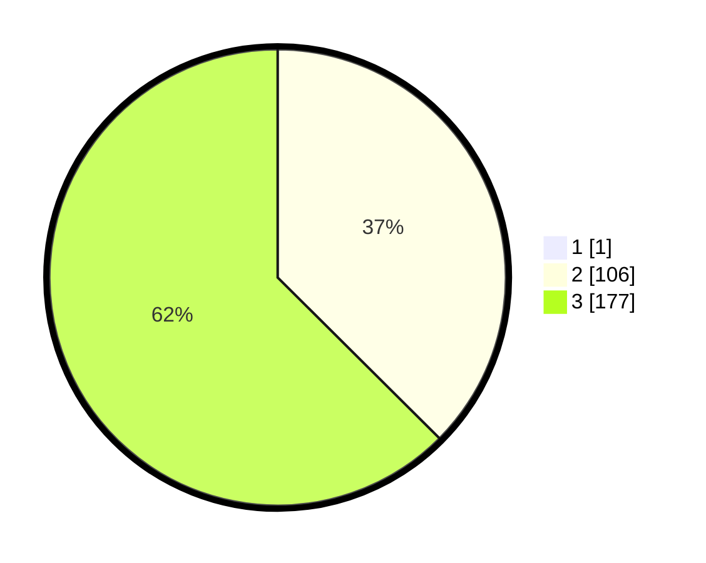

# Hasil

## Grafik

## Tabel

| No. | Nama Paslon    | Suara | Suara (raw) | Persentase |
|:--- |:-------------- | -----:| -----------:| ----------:|
| 1   | ANIES MUHAIMIN | 1     | [1][p-1]    | 0,35       |
| 2   | PRABOWO GIBRAN | 106   | [106][p-2]  | 37,32      |
| 3   | GANJAR MAHFUD  | 177   | [177][p-3]  | 62,32      |

[p-1]: https://github.com/gigit-pemilu/pemilu-2024-51-bali/blob/main/pilpres/hitung-suara/sub/51-bali/sub/02-tabanan/sub/06-kediri/sub/2007-kaba-kaba/sub/001-tps/sub/paslon-1.txt
[p-2]: https://github.com/gigit-pemilu/pemilu-2024-51-bali/blob/main/pilpres/hitung-suara/sub/51-bali/sub/02-tabanan/sub/06-kediri/sub/2007-kaba-kaba/sub/001-tps/sub/paslon-2.txt
[p-3]: https://github.com/gigit-pemilu/pemilu-2024-51-bali/blob/main/pilpres/hitung-suara/sub/51-bali/sub/02-tabanan/sub/06-kediri/sub/2007-kaba-kaba/sub/001-tps/sub/paslon-3.txt

## Foto C Plano

https://sirekap-obj-formc.kpu.go.id/d64c/pemilu/ppwp/51/02/06/20/07/5102062007001-20240227-093948--e7058cbc-336d-4c28-afb4-a6e7880b0cbc.jpg

https://sirekap-obj-formc.kpu.go.id/d64c/pemilu/ppwp/51/02/06/20/07/5102062007001-20240216-120001--f43d0be2-f921-4dd3-b544-4714071e16c2.jpg

https://sirekap-obj-formc.kpu.go.id/d64c/pemilu/ppwp/51/02/06/20/07/5102062007001-20240216-120153--9d307f90-95c5-4f8b-a538-0685a23ed1b1.jpg

## Metadata

| Key        | Value               |
| ---------- | ------------------- |
| Time Stamp | 2024-02-27 10:00:00 |

