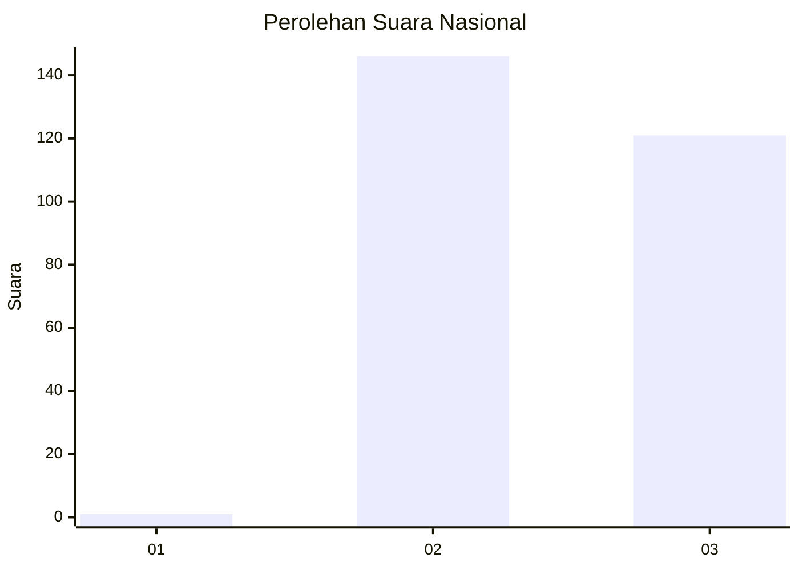
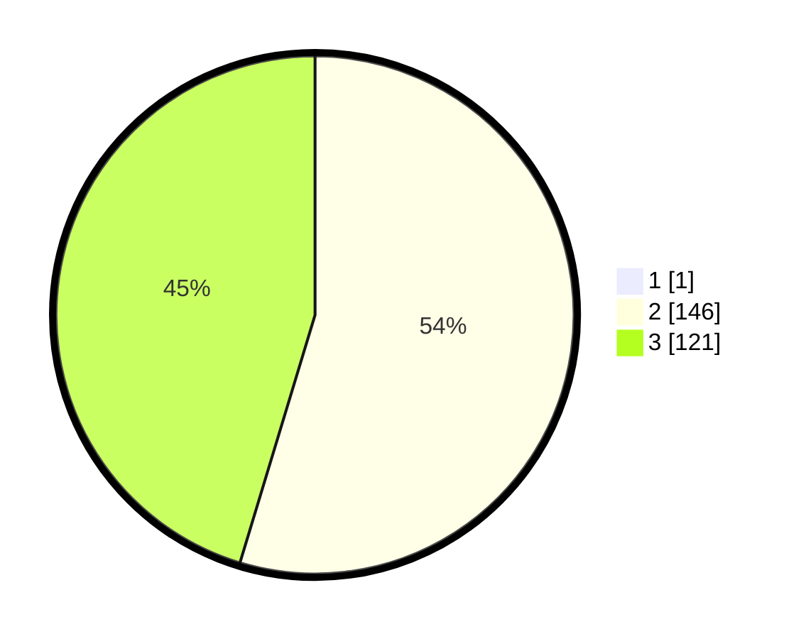

# Hasil

## Grafik

## Tabel

| No. | Nama Paslon    | Suara | Suara (raw) | Persentase |
|:--- |:-------------- | -----:| -----------:| ----------:|
| 1   | ANIES MUHAIMIN | 1     | [1][p-1]    | 0,37       |
| 2   | PRABOWO GIBRAN | 146   | [146][p-2]  | 54,48      |
| 3   | GANJAR MAHFUD  | 121   | [121][p-3]  | 45,15      |

[p-1]: https://github.com/gigit-pemilu/pemilu-2024/blob/main/pilpres/hitung-suara/sub/51-bali/sub/02-tabanan/sub/06-kediri/sub/2007-kaba-kaba/sub/002-tps/sub/paslon-1.txt
[p-2]: https://github.com/gigit-pemilu/pemilu-2024/blob/main/pilpres/hitung-suara/sub/51-bali/sub/02-tabanan/sub/06-kediri/sub/2007-kaba-kaba/sub/002-tps/sub/paslon-2.txt
[p-3]: https://github.com/gigit-pemilu/pemilu-2024/blob/main/pilpres/hitung-suara/sub/51-bali/sub/02-tabanan/sub/06-kediri/sub/2007-kaba-kaba/sub/002-tps/sub/paslon-3.txt

## Foto C Plano

https://sirekap-obj-formc.kpu.go.id/5431/pemilu/ppwp/51/02/06/20/07/5102062007002-20240214-215157--b34a75a2-601a-4756-b6c2-9f82729445c1.jpg

https://sirekap-obj-formc.kpu.go.id/5431/pemilu/ppwp/51/02/06/20/07/5102062007002-20240214-215318--8379bae2-2e4b-44ef-9076-67a7a8427488.jpg

https://sirekap-obj-formc.kpu.go.id/5431/pemilu/ppwp/51/02/06/20/07/5102062007002-20240214-215437--b3a2c682-c736-4a0b-9d9a-8e022a13fe18.jpg

## Metadata

| Key        | Value               |
| ---------- | ------------------- |
| Time Stamp | 2024-02-24 22:31:28 |

