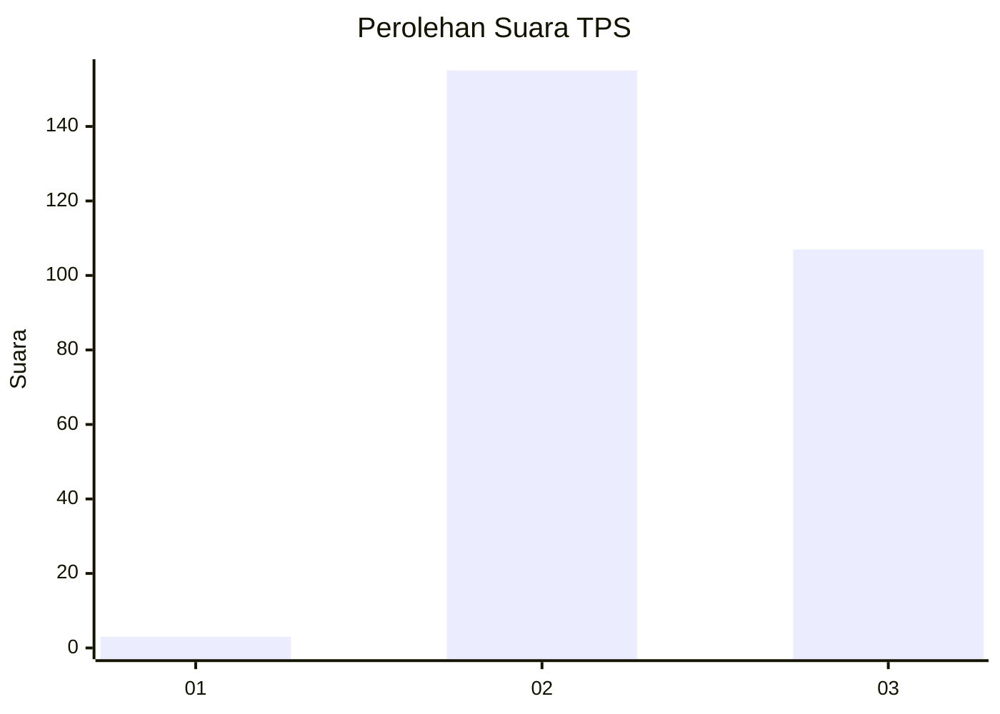
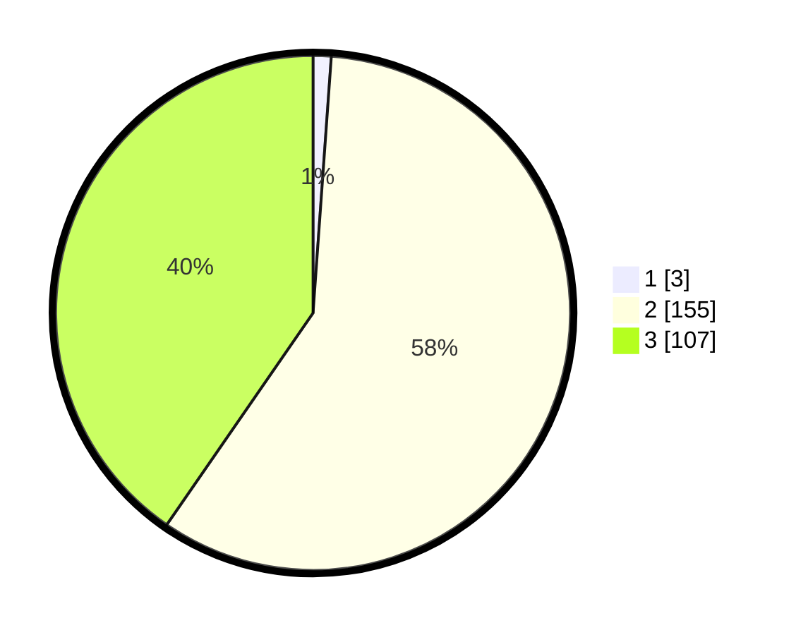

# Hasil

## Grafik

## Tabel

| No. | Nama Paslon    | Suara | Suara (raw) | Persentase |
|:--- |:-------------- | -----:| -----------:| ----------:|
| 1   | ANIES MUHAIMIN | 3     | [3][p-1]    | 1,13       |
| 2   | PRABOWO GIBRAN | 155   | [155][p-2]  | 58,49      |
| 3   | GANJAR MAHFUD  | 107   | [107][p-3]  | 40,38      |

[p-1]: https://github.com/gigit-pemilu/pemilu-2024-51-bali/blob/main/pilpres/hitung-suara/sub/51-bali/sub/02-tabanan/sub/06-kediri/sub/2007-kaba-kaba/sub/003-tps/sub/paslon-1.txt
[p-2]: https://github.com/gigit-pemilu/pemilu-2024-51-bali/blob/main/pilpres/hitung-suara/sub/51-bali/sub/02-tabanan/sub/06-kediri/sub/2007-kaba-kaba/sub/003-tps/sub/paslon-2.txt
[p-3]: https://github.com/gigit-pemilu/pemilu-2024-51-bali/blob/main/pilpres/hitung-suara/sub/51-bali/sub/02-tabanan/sub/06-kediri/sub/2007-kaba-kaba/sub/003-tps/sub/paslon-3.txt

## Foto C Plano

https://sirekap-obj-formc.kpu.go.id/bb1c/pemilu/ppwp/51/02/06/20/07/5102062007003-20240214-141104--a8a2b2d8-1d3c-4bbf-bdd5-c14ca7753c36.jpg

https://sirekap-obj-formc.kpu.go.id/bb1c/pemilu/ppwp/51/02/06/20/07/5102062007003-20240214-141233--99a569ac-2c3e-4be9-8390-05189a470323.jpg

https://sirekap-obj-formc.kpu.go.id/bb1c/pemilu/ppwp/51/02/06/20/07/5102062007003-20240214-141854--cecfb0ad-52df-4d38-b61a-10a5baffb289.jpg

## Metadata

| Key        | Value               |
| ---------- | ------------------- |
| Time Stamp | 2024-02-14 21:46:01 |

