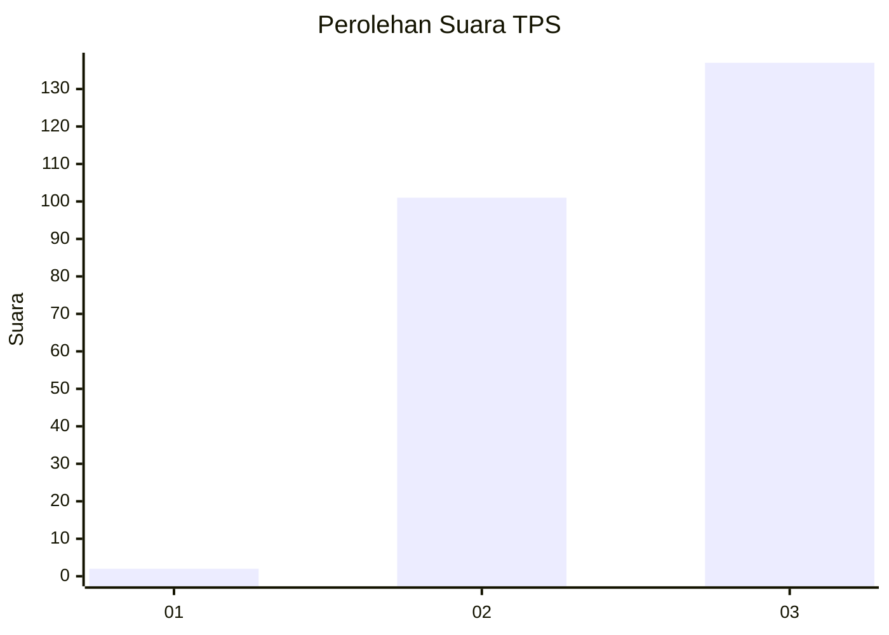
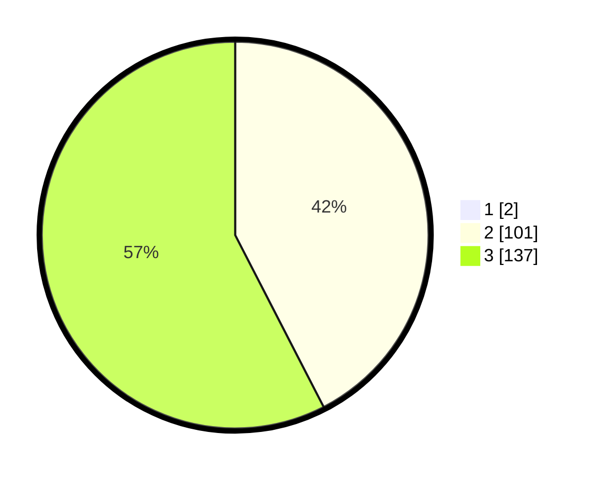

# Hasil

## Grafik

## Tabel

| No. | Nama Paslon    | Suara | Suara (raw) | Persentase |
|:--- |:-------------- | -----:| -----------:| ----------:|
| 1   | ANIES MUHAIMIN | 2     | [2][p-1]    | 0,83       |
| 2   | PRABOWO GIBRAN | 101   | [101][p-2]  | 42,08      |
| 3   | GANJAR MAHFUD  | 137   | [137][p-3]  | 57,08      |

[p-1]: https://github.com/gigit-pemilu/pemilu-2024-51-bali/blob/main/pilpres/hitung-suara/sub/51-bali/sub/02-tabanan/sub/06-kediri/sub/2007-kaba-kaba/sub/006-tps/sub/paslon-1.txt
[p-2]: https://github.com/gigit-pemilu/pemilu-2024-51-bali/blob/main/pilpres/hitung-suara/sub/51-bali/sub/02-tabanan/sub/06-kediri/sub/2007-kaba-kaba/sub/006-tps/sub/paslon-2.txt
[p-3]: https://github.com/gigit-pemilu/pemilu-2024-51-bali/blob/main/pilpres/hitung-suara/sub/51-bali/sub/02-tabanan/sub/06-kediri/sub/2007-kaba-kaba/sub/006-tps/sub/paslon-3.txt

## Foto C Plano

https://sirekap-obj-formc.kpu.go.id/8308/pemilu/ppwp/51/02/06/20/07/5102062007006-20240214-224654--36418661-8c9f-4423-b9a3-be58daf7b04d.jpg

https://sirekap-obj-formc.kpu.go.id/8308/pemilu/ppwp/51/02/06/20/07/5102062007006-20240214-225006--18b66fb5-8f7c-43f5-993c-f75270a33859.jpg

https://sirekap-obj-formc.kpu.go.id/8308/pemilu/ppwp/51/02/06/20/07/5102062007006-20240214-225154--d4c304d0-d6af-43ac-a538-f975ae0e6e91.jpg

## Metadata

| Key        | Value               |
| ---------- | ------------------- |
| Time Stamp | 2024-02-15 22:40:13 |

