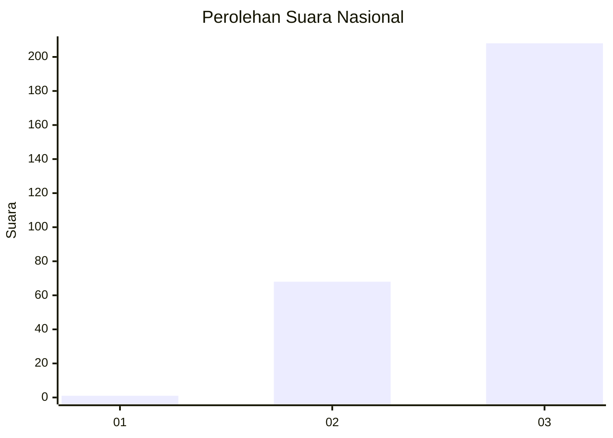
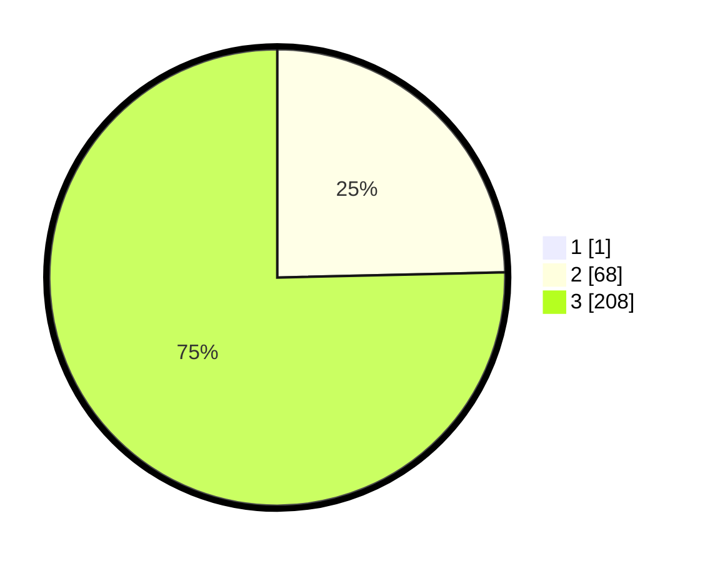

# Hasil

## Grafik

## Tabel

| No. | Nama Paslon    | Suara | Suara (raw) | Persentase |
|:--- |:-------------- | -----:| -----------:| ----------:|
| 1   | ANIES MUHAIMIN | 1     | [1][p-1]    | 0,36       |
| 2   | PRABOWO GIBRAN | 68    | [68][p-2]   | 24,55      |
| 3   | GANJAR MAHFUD  | 208   | [208][p-3]  | 75,09      |

[p-1]: https://github.com/gigit-pemilu/pemilu-2024/blob/main/pilpres/hitung-suara/sub/51-bali/sub/02-tabanan/sub/06-kediri/sub/2007-kaba-kaba/sub/008-tps/sub/paslon-1.txt
[p-2]: https://github.com/gigit-pemilu/pemilu-2024/blob/main/pilpres/hitung-suara/sub/51-bali/sub/02-tabanan/sub/06-kediri/sub/2007-kaba-kaba/sub/008-tps/sub/paslon-2.txt
[p-3]: https://github.com/gigit-pemilu/pemilu-2024/blob/main/pilpres/hitung-suara/sub/51-bali/sub/02-tabanan/sub/06-kediri/sub/2007-kaba-kaba/sub/008-tps/sub/paslon-3.txt

## Foto C Plano

https://sirekap-obj-formc.kpu.go.id/53cb/pemilu/ppwp/51/02/06/20/07/5102062007008-20240214-222503--b1ca7a8d-aa30-45cb-b544-bf684fede93f.jpg

https://sirekap-obj-formc.kpu.go.id/53cb/pemilu/ppwp/51/02/06/20/07/5102062007008-20240214-222834--cde3d8e2-c952-4ce7-9970-36cb36d1bbe1.jpg

https://sirekap-obj-formc.kpu.go.id/53cb/pemilu/ppwp/51/02/06/20/07/5102062007008-20240214-223015--3d6d4e3d-6516-4190-b26f-6536bc3b1a21.jpg

## Metadata

| Key        | Value               |
| ---------- | ------------------- |
| Time Stamp | 2024-02-15 22:40:13 |

