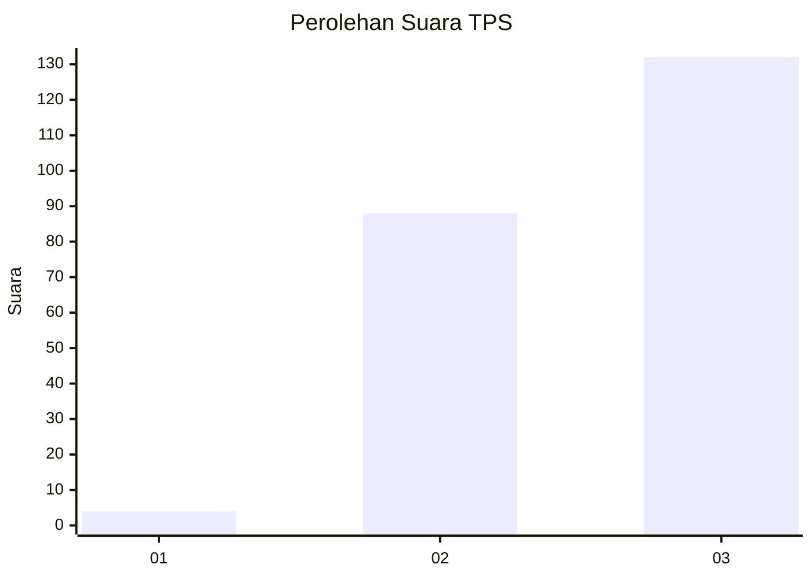
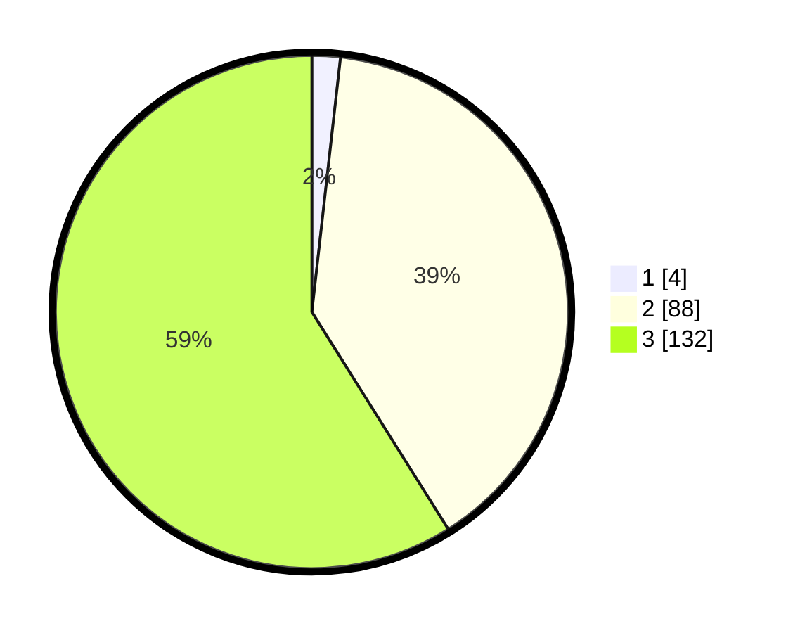

# Hasil

## Grafik

## Tabel

| No. | Nama Paslon    | Suara | Suara (raw) | Persentase |
|:--- |:-------------- | -----:| -----------:| ----------:|
| 1   | ANIES MUHAIMIN | 4     | [4][p-1]    | 1,79       |
| 2   | PRABOWO GIBRAN | 88    | [88][p-2]   | 39,29      |
| 3   | GANJAR MAHFUD  | 132   | [132][p-3]  | 58,93      |

[p-1]: https://github.com/gigit-pemilu/pemilu-2024-51-bali/blob/main/pilpres/hitung-suara/sub/51-bali/sub/02-tabanan/sub/06-kediri/sub/2007-kaba-kaba/sub/014-tps/sub/paslon-1.txt
[p-2]: https://github.com/gigit-pemilu/pemilu-2024-51-bali/blob/main/pilpres/hitung-suara/sub/51-bali/sub/02-tabanan/sub/06-kediri/sub/2007-kaba-kaba/sub/014-tps/sub/paslon-2.txt
[p-3]: https://github.com/gigit-pemilu/pemilu-2024-51-bali/blob/main/pilpres/hitung-suara/sub/51-bali/sub/02-tabanan/sub/06-kediri/sub/2007-kaba-kaba/sub/014-tps/sub/paslon-3.txt

## Foto C Plano

https://sirekap-obj-formc.kpu.go.id/25a8/pemilu/ppwp/51/02/06/20/07/5102062007014-20240214-233224--2d7ba5cd-ff1c-4273-a6cf-1ce5903784aa.jpg

https://sirekap-obj-formc.kpu.go.id/25a8/pemilu/ppwp/51/02/06/20/07/5102062007014-20240215-003832--e1746ae2-95f6-41c2-8cd5-53d302956710.jpg

https://sirekap-obj-formc.kpu.go.id/25a8/pemilu/ppwp/51/02/06/20/07/5102062007014-20240218-173143--bb6f0ece-c5a9-4e42-b1cd-341f554ef3bc.jpg

## Metadata

| Key        | Value               |
| ---------- | ------------------- |
| Time Stamp | 2024-02-19 06:16:00 |

## DATA PEMILIH TETAP

Jumlah pemilih dalam DPT: **240**.
 * L: **119**.
 * P: **121**.

## DATA PENGGUNA HAK PILIH

Jumlah pengguna hak pilih dalam DPT: **229**.
 * L: **114**.
 * P: **115**.

Jumlah pengguna hak pilih dalam DPTb: **0**.
 * L: **0**.
 * P: **0**.

Jumlah pengguna hak pilih dalam DPK: **0**.
 * L: **0**.
 * P: **0**.

Jumlah pengguna hak pilih: **229**.
 * L: **114**.
 * P: **115**.

## JUMLAH SUARA SAH DAN TIDAK SAH

JUMLAH SELURUH SUARA SAH: **224**.

JUMLAH SUARA TIDAK SAH: **5**.

JUMLAH SELURUH SUARA SAH DAN SUARA TIDAK SAH: **229**.

