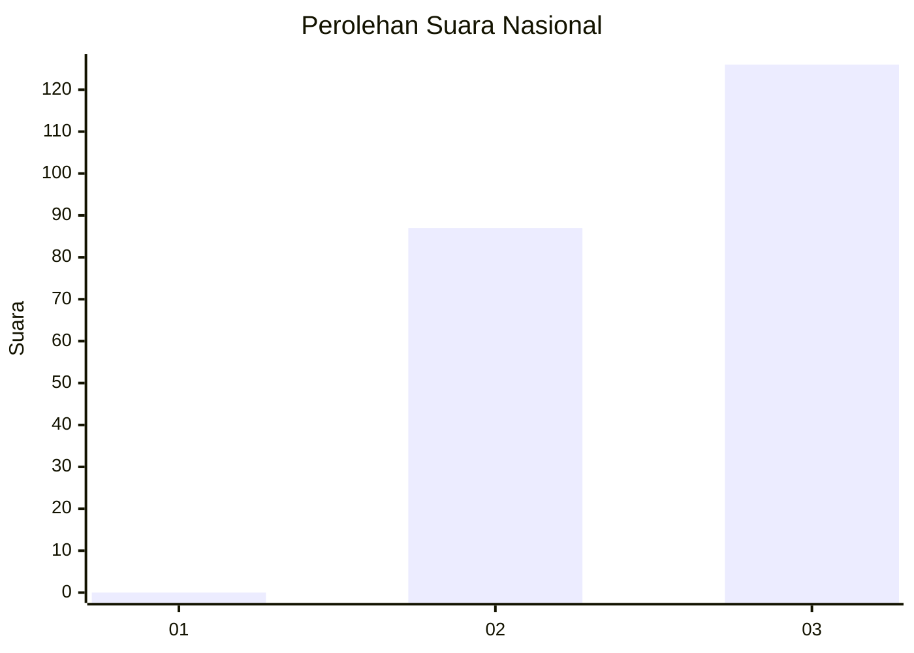
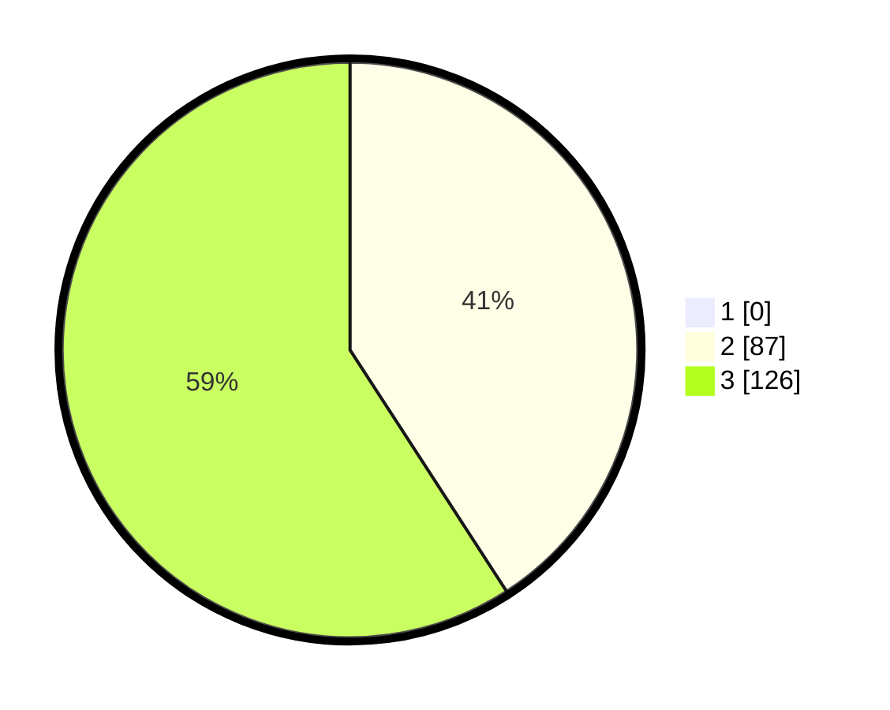

# Hasil

## Grafik

## Tabel

| No. | Nama Paslon    | Suara | Suara (raw) | Persentase |
|:--- |:-------------- | -----:| -----------:| ----------:|
| 1   | ANIES MUHAIMIN | 0     | [0][p-1]    | 0,00       |
| 2   | PRABOWO GIBRAN | 87    | [87][p-2]   | 40,85      |
| 3   | GANJAR MAHFUD  | 126   | [126][p-3]  | 59,15      |

[p-1]: https://github.com/gigit-pemilu/pemilu-2024/blob/main/pilpres/hitung-suara/sub/51-bali/sub/02-tabanan/sub/06-kediri/sub/2007-kaba-kaba/sub/016-tps/sub/paslon-1.txt
[p-2]: https://github.com/gigit-pemilu/pemilu-2024/blob/main/pilpres/hitung-suara/sub/51-bali/sub/02-tabanan/sub/06-kediri/sub/2007-kaba-kaba/sub/016-tps/sub/paslon-2.txt
[p-3]: https://github.com/gigit-pemilu/pemilu-2024/blob/main/pilpres/hitung-suara/sub/51-bali/sub/02-tabanan/sub/06-kediri/sub/2007-kaba-kaba/sub/016-tps/sub/paslon-3.txt

## Foto C Plano

https://sirekap-obj-formc.kpu.go.id/e1df/pemilu/ppwp/51/02/06/20/07/5102062007016-20240214-141612--218b1c69-fad9-4bb1-a827-67ba96187779.jpg

https://sirekap-obj-formc.kpu.go.id/e1df/pemilu/ppwp/51/02/06/20/07/5102062007016-20240214-141825--8b95b1ad-d4d6-447b-bf36-cac897bc3426.jpg

https://sirekap-obj-formc.kpu.go.id/e1df/pemilu/ppwp/51/02/06/20/07/5102062007016-20240215-021831--2b0da9e2-85e4-41df-82aa-48ffac035247.jpg

## Metadata

| Key        | Value               |
| ---------- | ------------------- |
| Time Stamp | 2024-02-15 22:30:27 |

## DATA PEMILIH TETAP

Jumlah pemilih dalam DPT: **244**.
 * L: **124**.
 * P: **120**.

## DATA PENGGUNA HAK PILIH

Jumlah pengguna hak pilih dalam DPT: **211**.
 * L: **105**.
 * P: **106**.

Jumlah pengguna hak pilih dalam DPTb: **3**.
 * L: **2**.
 * P: **1**.

Jumlah pengguna hak pilih dalam DPK: **0**.
 * L: **0**.
 * P: **0**.

Jumlah pengguna hak pilih: **214**.
 * L: **107**.
 * P: **107**.

## JUMLAH SUARA SAH DAN TIDAK SAH

JUMLAH SELURUH SUARA SAH: **213**.

JUMLAH SUARA TIDAK SAH: **1**.

JUMLAH SELURUH SUARA SAH DAN SUARA TIDAK SAH: **214**.

