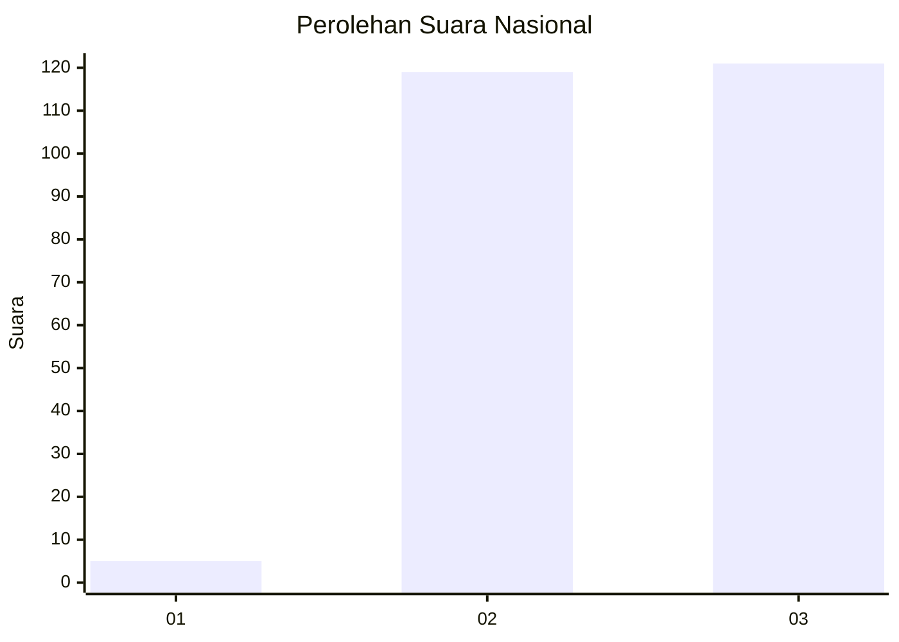
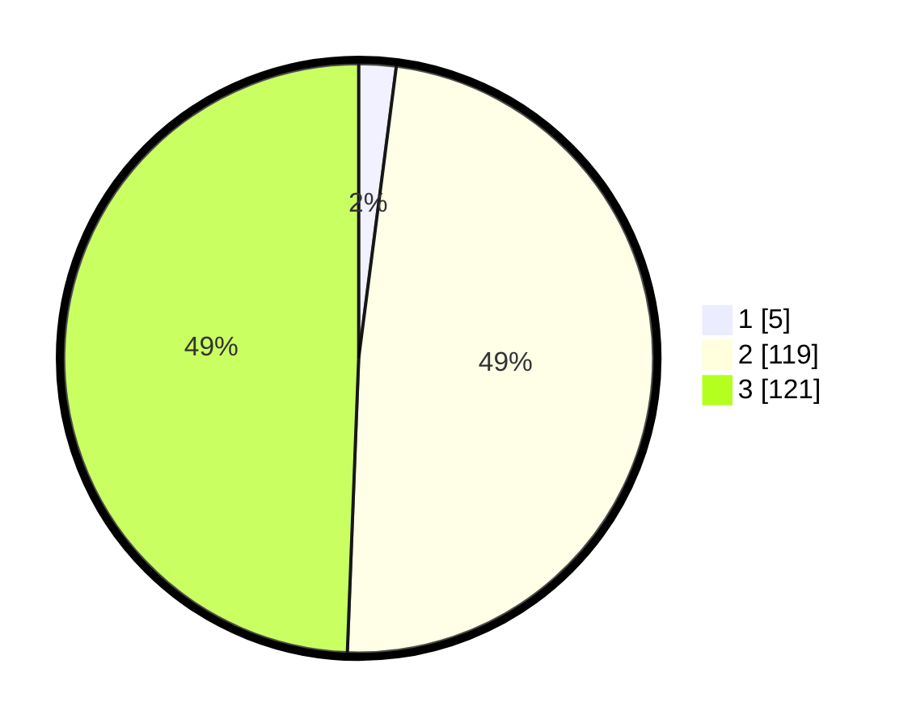

# Hasil

## Grafik

## Tabel

| No. | Nama Paslon    | Suara | Suara (raw) | Persentase |
|:--- |:-------------- | -----:| -----------:| ----------:|
| 1   | ANIES MUHAIMIN | 5     | [5][p-1]    | 2,04       |
| 2   | PRABOWO GIBRAN | 119   | [119][p-2]  | 48,57      |
| 3   | GANJAR MAHFUD  | 121   | [121][p-3]  | 49,39      |

[p-1]: https://github.com/gigit-pemilu/pemilu-2024/blob/main/pilpres/hitung-suara/sub/51-bali/sub/02-tabanan/sub/06-kediri/sub/2007-kaba-kaba/sub/020-tps/sub/paslon-1.txt
[p-2]: https://github.com/gigit-pemilu/pemilu-2024/blob/main/pilpres/hitung-suara/sub/51-bali/sub/02-tabanan/sub/06-kediri/sub/2007-kaba-kaba/sub/020-tps/sub/paslon-2.txt
[p-3]: https://github.com/gigit-pemilu/pemilu-2024/blob/main/pilpres/hitung-suara/sub/51-bali/sub/02-tabanan/sub/06-kediri/sub/2007-kaba-kaba/sub/020-tps/sub/paslon-3.txt

## Foto C Plano

https://sirekap-obj-formc.kpu.go.id/55dd/pemilu/ppwp/51/02/06/20/07/5102062007020-20240214-204950--21dd20ec-1b22-4d73-a92a-7c3edf8312d8.jpg

https://sirekap-obj-formc.kpu.go.id/55dd/pemilu/ppwp/51/02/06/20/07/5102062007020-20240214-205142--5f7d7de1-6eb2-4c4e-8759-7e18547935ed.jpg

https://sirekap-obj-formc.kpu.go.id/55dd/pemilu/ppwp/51/02/06/20/07/5102062007020-20240214-205222--e7534b93-ec6a-4b71-93fe-97484d94132b.jpg

## Metadata

| Key        | Value               |
| ---------- | ------------------- |
| Time Stamp | 2024-02-15 22:40:13 |

