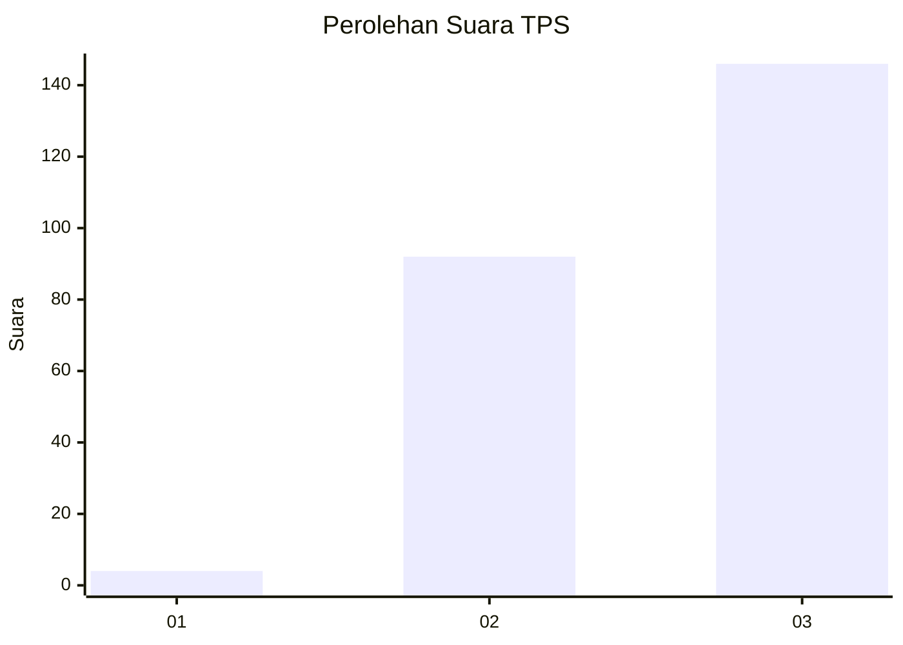
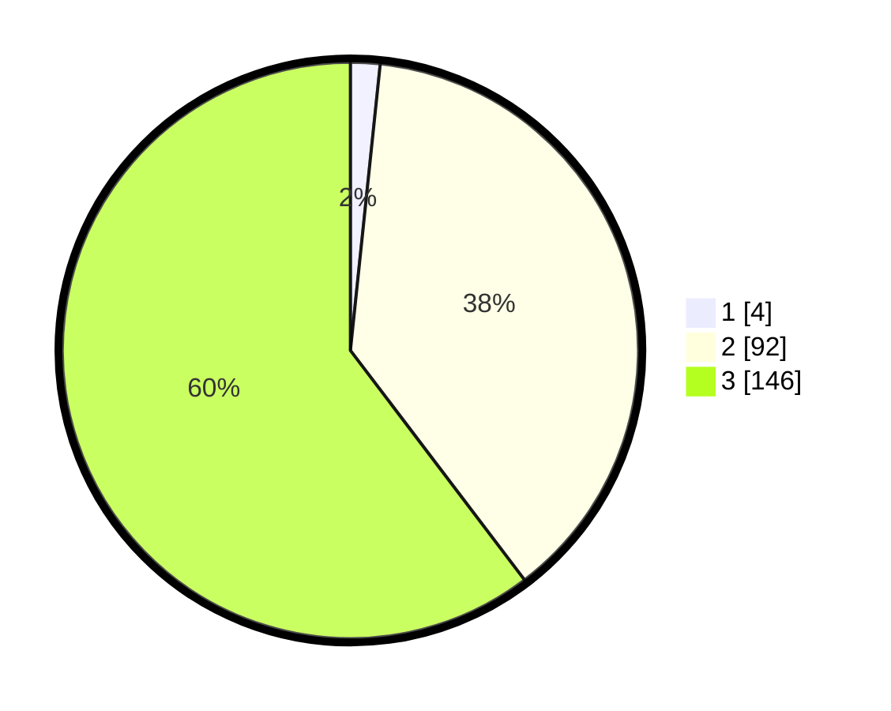

# Hasil

## Grafik

## Tabel

| No. | Nama Paslon    | Suara | Suara (raw) | Persentase |
|:--- |:-------------- | -----:| -----------:| ----------:|
| 1   | ANIES MUHAIMIN | 4     | [4][p-1]    | 1,65       |
| 2   | PRABOWO GIBRAN | 92    | [92][p-2]   | 38,02      |
| 3   | GANJAR MAHFUD  | 146   | [146][p-3]  | 60,33      |

[p-1]: https://github.com/gigit-pemilu/pemilu-2024-51-bali/blob/main/pilpres/hitung-suara/sub/51-bali/sub/02-tabanan/sub/06-kediri/sub/2008-nyambu/sub/002-tps/sub/paslon-1.txt
[p-2]: https://github.com/gigit-pemilu/pemilu-2024-51-bali/blob/main/pilpres/hitung-suara/sub/51-bali/sub/02-tabanan/sub/06-kediri/sub/2008-nyambu/sub/002-tps/sub/paslon-2.txt
[p-3]: https://github.com/gigit-pemilu/pemilu-2024-51-bali/blob/main/pilpres/hitung-suara/sub/51-bali/sub/02-tabanan/sub/06-kediri/sub/2008-nyambu/sub/002-tps/sub/paslon-3.txt

## Foto C Plano

https://sirekap-obj-formc.kpu.go.id/4cd2/pemilu/ppwp/51/02/06/20/08/5102062008002-20240214-223125--cfece1aa-aa17-4674-822f-8d1f2d8f792e.jpg

https://sirekap-obj-formc.kpu.go.id/4cd2/pemilu/ppwp/51/02/06/20/08/5102062008002-20240214-223239--775360ba-ddf1-4478-98b7-1e1a9e7904a5.jpg

https://sirekap-obj-formc.kpu.go.id/4cd2/pemilu/ppwp/51/02/06/20/08/5102062008002-20240214-223350--630e602b-b508-4dd6-993c-f3dffd7b25d2.jpg

## Metadata

| Key        | Value               |
| ---------- | ------------------- |
| Time Stamp | 2024-02-15 22:40:13 |

