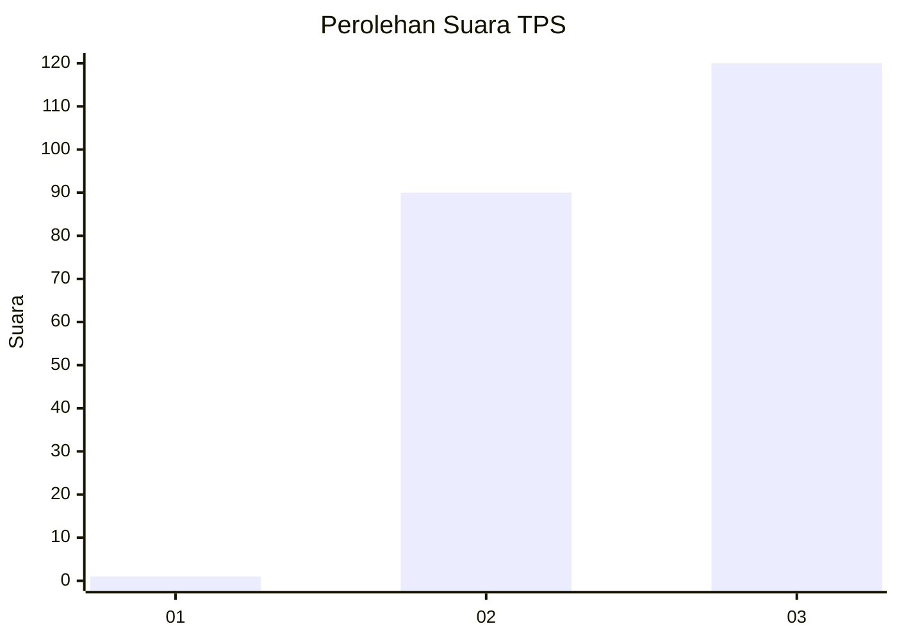
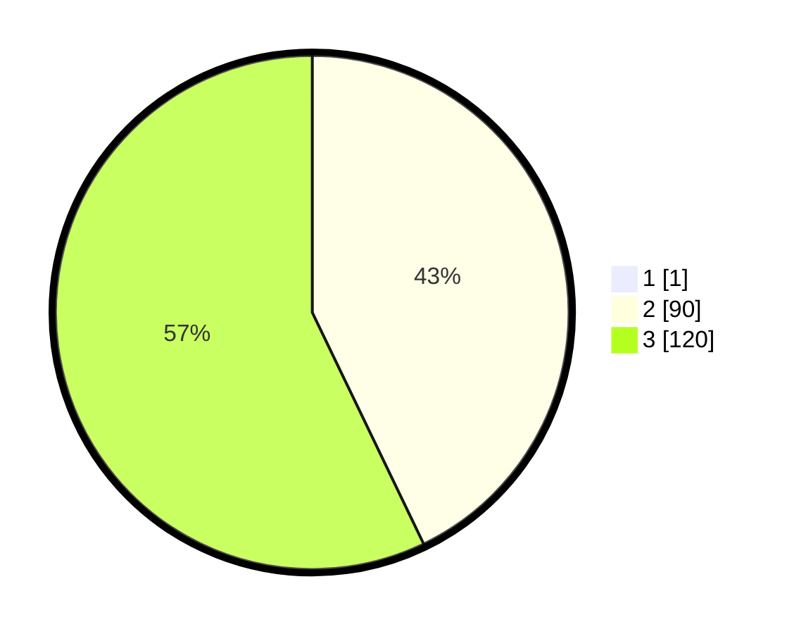

# Hasil

## Grafik

## Tabel

| No. | Nama Paslon    | Suara | Suara (raw) | Persentase |
|:--- |:-------------- | -----:| -----------:| ----------:|
| 1   | ANIES MUHAIMIN | 1     | [1][p-1]    | 0,47       |
| 2   | PRABOWO GIBRAN | 90    | [90][p-2]   | 42,65      |
| 3   | GANJAR MAHFUD  | 120   | [120][p-3]  | 56,87      |

[p-1]: https://github.com/gigit-pemilu/pemilu-2024-51-bali/blob/main/pilpres/hitung-suara/sub/51-bali/sub/02-tabanan/sub/06-kediri/sub/2008-nyambu/sub/003-tps/sub/paslon-1.txt
[p-2]: https://github.com/gigit-pemilu/pemilu-2024-51-bali/blob/main/pilpres/hitung-suara/sub/51-bali/sub/02-tabanan/sub/06-kediri/sub/2008-nyambu/sub/003-tps/sub/paslon-2.txt
[p-3]: https://github.com/gigit-pemilu/pemilu-2024-51-bali/blob/main/pilpres/hitung-suara/sub/51-bali/sub/02-tabanan/sub/06-kediri/sub/2008-nyambu/sub/003-tps/sub/paslon-3.txt

## Foto C Plano

https://sirekap-obj-formc.kpu.go.id/3edf/pemilu/ppwp/51/02/06/20/08/5102062008003-20240214-213844--f59fc8d0-d96c-43e0-bd3a-9a555ebcd085.jpg

https://sirekap-obj-formc.kpu.go.id/3edf/pemilu/ppwp/51/02/06/20/08/5102062008003-20240214-213915--6917b714-68bf-4b9d-b51f-5505542228d1.jpg

https://sirekap-obj-formc.kpu.go.id/3edf/pemilu/ppwp/51/02/06/20/08/5102062008003-20240214-213948--b1b894a4-266c-4f51-86a7-b773668fbc19.jpg

## Metadata

| Key        | Value               |
| ---------- | ------------------- |
| Time Stamp | 2024-02-15 20:00:44 |

## DATA PEMILIH TETAP

Jumlah pemilih dalam DPT: **241**.
 * L: **126**.
 * P: **115**.

## DATA PENGGUNA HAK PILIH

Jumlah pengguna hak pilih dalam DPT: **213**.
 * L: **100**.
 * P: **113**.

Jumlah pengguna hak pilih dalam DPTb: **0**.
 * L: **0**.
 * P: **0**.

Jumlah pengguna hak pilih dalam DPK: **1**.
 * L: **0**.
 * P: **1**.

Jumlah pengguna hak pilih: **214**.
 * L: **100**.
 * P: **114**.

## JUMLAH SUARA SAH DAN TIDAK SAH

JUMLAH SELURUH SUARA SAH: **211**.

JUMLAH SUARA TIDAK SAH: **3**.

JUMLAH SELURUH SUARA SAH DAN SUARA TIDAK SAH: **214**.

