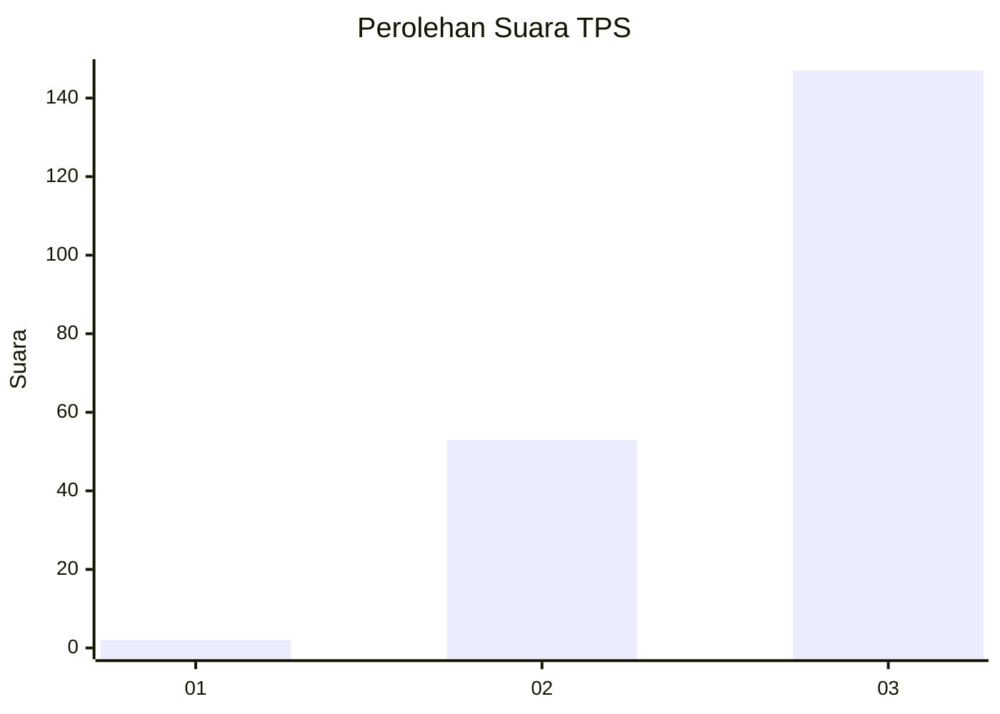
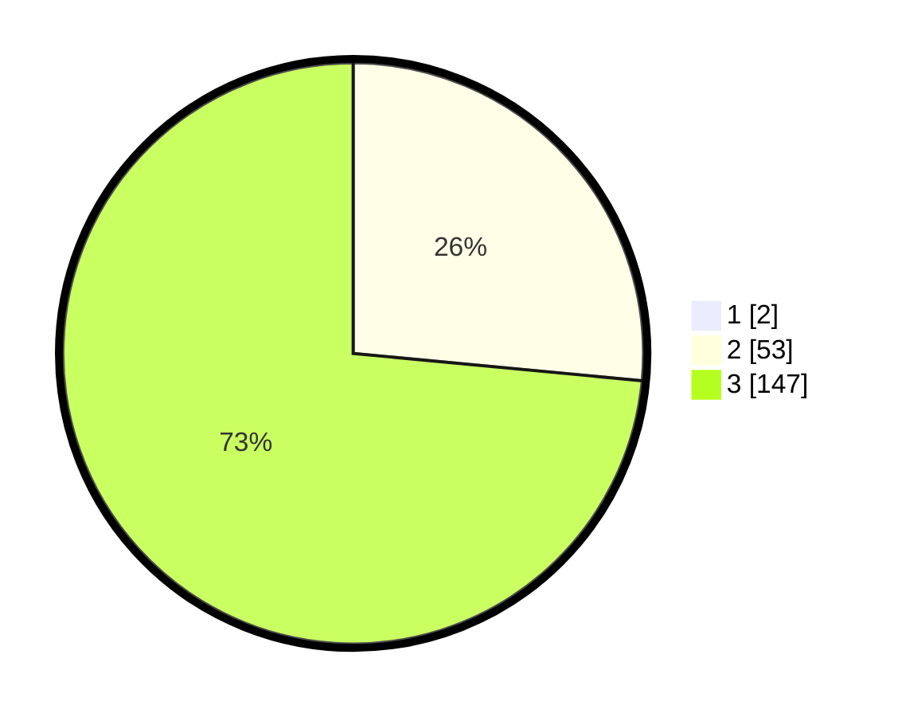

# Hasil

## Grafik

## Tabel

| No. | Nama Paslon    | Suara | Suara (raw) | Persentase |
|:--- |:-------------- | -----:| -----------:| ----------:|
| 1   | ANIES MUHAIMIN | 2     | [2][p-1]    | 0,99       |
| 2   | PRABOWO GIBRAN | 53    | [53][p-2]   | 26,24      |
| 3   | GANJAR MAHFUD  | 147   | [147][p-3]  | 72,77      |

[p-1]: https://github.com/gigit-pemilu/pemilu-2024-51-bali/blob/main/pilpres/hitung-suara/sub/51-bali/sub/02-tabanan/sub/06-kediri/sub/2008-nyambu/sub/006-tps/sub/paslon-1.txt
[p-2]: https://github.com/gigit-pemilu/pemilu-2024-51-bali/blob/main/pilpres/hitung-suara/sub/51-bali/sub/02-tabanan/sub/06-kediri/sub/2008-nyambu/sub/006-tps/sub/paslon-2.txt
[p-3]: https://github.com/gigit-pemilu/pemilu-2024-51-bali/blob/main/pilpres/hitung-suara/sub/51-bali/sub/02-tabanan/sub/06-kediri/sub/2008-nyambu/sub/006-tps/sub/paslon-3.txt

## Foto C Plano

https://sirekap-obj-formc.kpu.go.id/0c10/pemilu/ppwp/51/02/06/20/08/5102062008006-20240214-204609--d8e91283-ddde-4a6a-b642-184fec658920.jpg

https://sirekap-obj-formc.kpu.go.id/0c10/pemilu/ppwp/51/02/06/20/08/5102062008006-20240214-204723--8d170ceb-661e-4f0a-a860-afb5f77cee09.jpg

https://sirekap-obj-formc.kpu.go.id/0c10/pemilu/ppwp/51/02/06/20/08/5102062008006-20240214-204910--a7bd3e11-ea05-4a28-8f91-c12b4ac66f3e.jpg

## Metadata

| Key        | Value               |
| ---------- | ------------------- |
| Time Stamp | 2024-02-15 22:40:13 |

