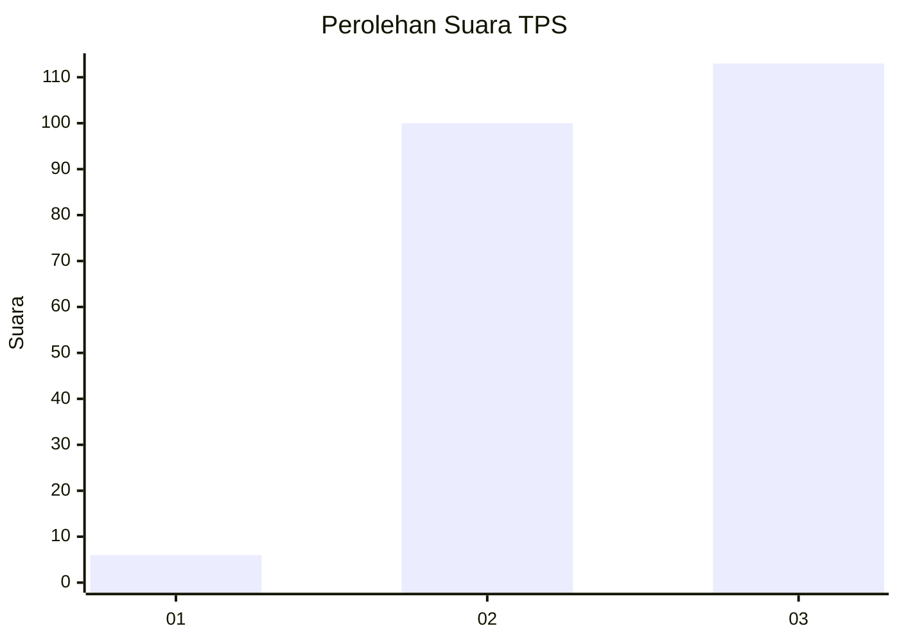
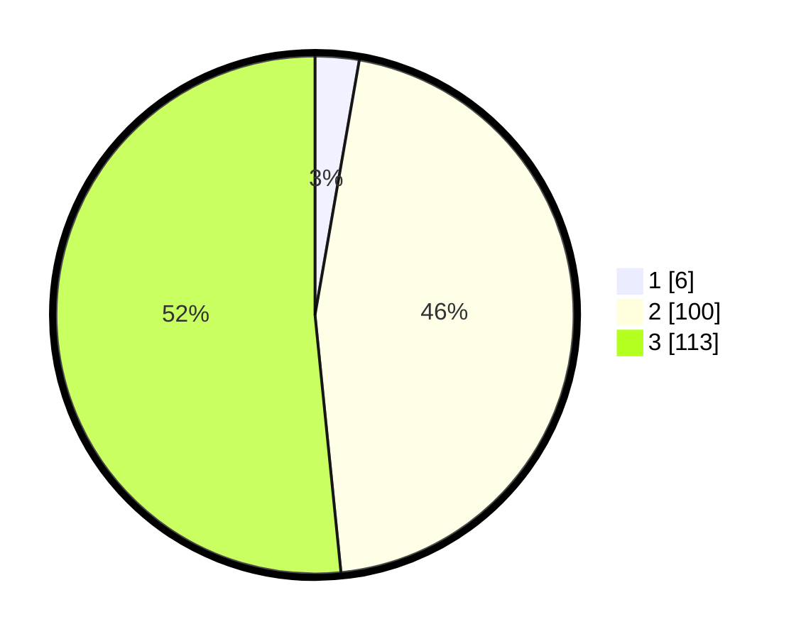

# Hasil

## Grafik

## Tabel

| No. | Nama Paslon    | Suara | Suara (raw) | Persentase |
|:--- |:-------------- | -----:| -----------:| ----------:|
| 1   | ANIES MUHAIMIN | 6     | [6][p-1]    | 2,74       |
| 2   | PRABOWO GIBRAN | 100   | [100][p-2]  | 45,66      |
| 3   | GANJAR MAHFUD  | 113   | [113][p-3]  | 51,60      |

[p-1]: https://github.com/gigit-pemilu/pemilu-2024-51-bali/blob/main/pilpres/hitung-suara/sub/51-bali/sub/02-tabanan/sub/06-kediri/sub/2008-nyambu/sub/007-tps/sub/paslon-1.txt
[p-2]: https://github.com/gigit-pemilu/pemilu-2024-51-bali/blob/main/pilpres/hitung-suara/sub/51-bali/sub/02-tabanan/sub/06-kediri/sub/2008-nyambu/sub/007-tps/sub/paslon-2.txt
[p-3]: https://github.com/gigit-pemilu/pemilu-2024-51-bali/blob/main/pilpres/hitung-suara/sub/51-bali/sub/02-tabanan/sub/06-kediri/sub/2008-nyambu/sub/007-tps/sub/paslon-3.txt

## Foto C Plano

https://sirekap-obj-formc.kpu.go.id/355d/pemilu/ppwp/51/02/06/20/08/5102062008007-20240214-141528--5ca2fe97-ebdd-47fc-8cbc-a1428d5ab17b.jpg

https://sirekap-obj-formc.kpu.go.id/355d/pemilu/ppwp/51/02/06/20/08/5102062008007-20240214-141441--95dff305-f8fd-4c80-abeb-b8f500b5f707.jpg

https://sirekap-obj-formc.kpu.go.id/355d/pemilu/ppwp/51/02/06/20/08/5102062008007-20240214-141344--cde8b8e0-3bab-40c7-8522-6e8956d335fa.jpg

## Metadata

| Key        | Value               |
| ---------- | ------------------- |
| Time Stamp | 2024-02-15 22:30:27 |

## DATA PEMILIH TETAP

Jumlah pemilih dalam DPT: **250**.
 * L: **120**.
 * P: **130**.

## DATA PENGGUNA HAK PILIH

Jumlah pengguna hak pilih dalam DPT: **224**.
 * L: **109**.
 * P: **115**.

Jumlah pengguna hak pilih dalam DPTb: **0**.
 * L: **0**.
 * P: **0**.

Jumlah pengguna hak pilih dalam DPK: **0**.
 * L: **0**.
 * P: **0**.

Jumlah pengguna hak pilih: **224**.
 * L: **109**.
 * P: **115**.

## JUMLAH SUARA SAH DAN TIDAK SAH

JUMLAH SELURUH SUARA SAH: **219**.

JUMLAH SUARA TIDAK SAH: **5**.

JUMLAH SELURUH SUARA SAH DAN SUARA TIDAK SAH: **224**.

