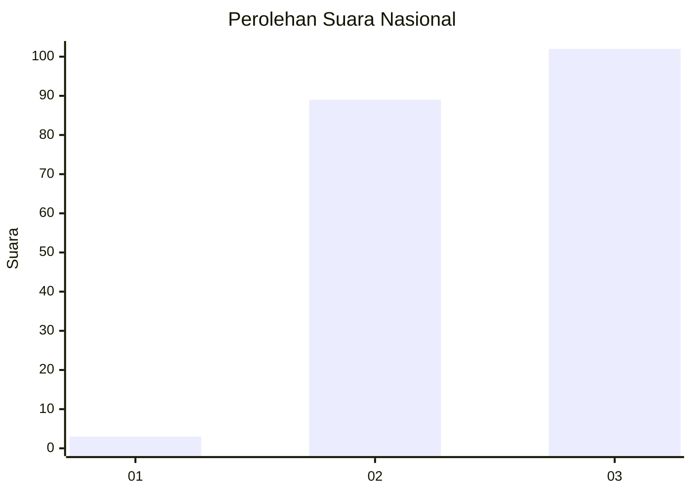
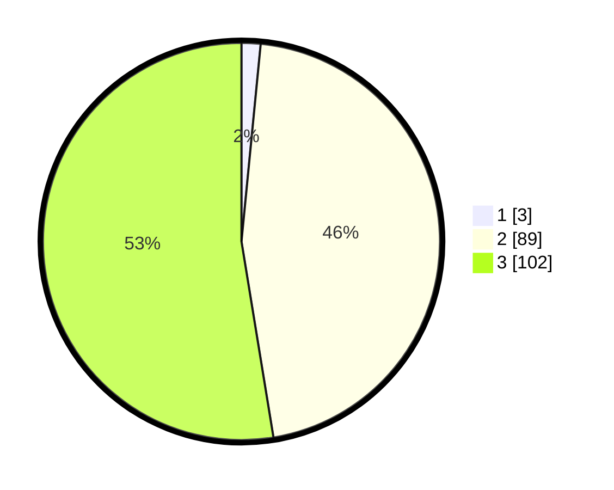

# Hasil

## Grafik

## Tabel

| No. | Nama Paslon    | Suara | Suara (raw) | Persentase |
|:--- |:-------------- | -----:| -----------:| ----------:|
| 1   | ANIES MUHAIMIN | 3     | [3][p-1]    | 1,55       |
| 2   | PRABOWO GIBRAN | 89    | [89][p-2]   | 45,88      |
| 3   | GANJAR MAHFUD  | 102   | [102][p-3]  | 52,58      |

[p-1]: https://github.com/gigit-pemilu/pemilu-2024/blob/main/pilpres/hitung-suara/sub/51-bali/sub/02-tabanan/sub/06-kediri/sub/2008-nyambu/sub/011-tps/sub/paslon-1.txt
[p-2]: https://github.com/gigit-pemilu/pemilu-2024/blob/main/pilpres/hitung-suara/sub/51-bali/sub/02-tabanan/sub/06-kediri/sub/2008-nyambu/sub/011-tps/sub/paslon-2.txt
[p-3]: https://github.com/gigit-pemilu/pemilu-2024/blob/main/pilpres/hitung-suara/sub/51-bali/sub/02-tabanan/sub/06-kediri/sub/2008-nyambu/sub/011-tps/sub/paslon-3.txt

## Foto C Plano

https://sirekap-obj-formc.kpu.go.id/e417/pemilu/ppwp/51/02/06/20/08/5102062008011-20240214-214208--7b69e87c-da3d-4f9c-9353-4f8554747bb5.jpg

https://sirekap-obj-formc.kpu.go.id/e417/pemilu/ppwp/51/02/06/20/08/5102062008011-20240214-214400--de26f0a5-2e84-40b2-a3d0-b5a72b928594.jpg

https://sirekap-obj-formc.kpu.go.id/e417/pemilu/ppwp/51/02/06/20/08/5102062008011-20240214-214552--162b711c-3fac-441f-9c08-bc19fb309981.jpg

## Metadata

| Key        | Value               |
| ---------- | ------------------- |
| Time Stamp | 2024-02-15 22:40:13 |

