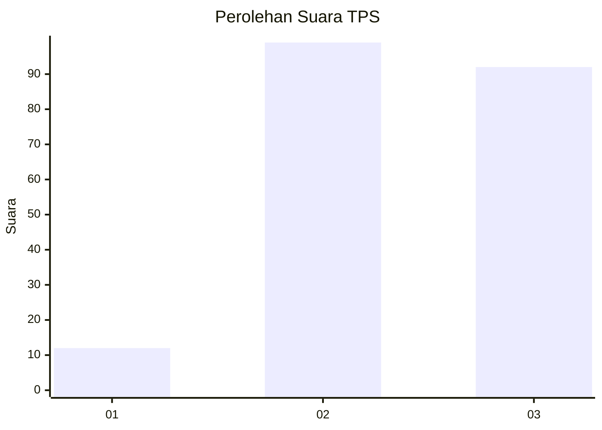
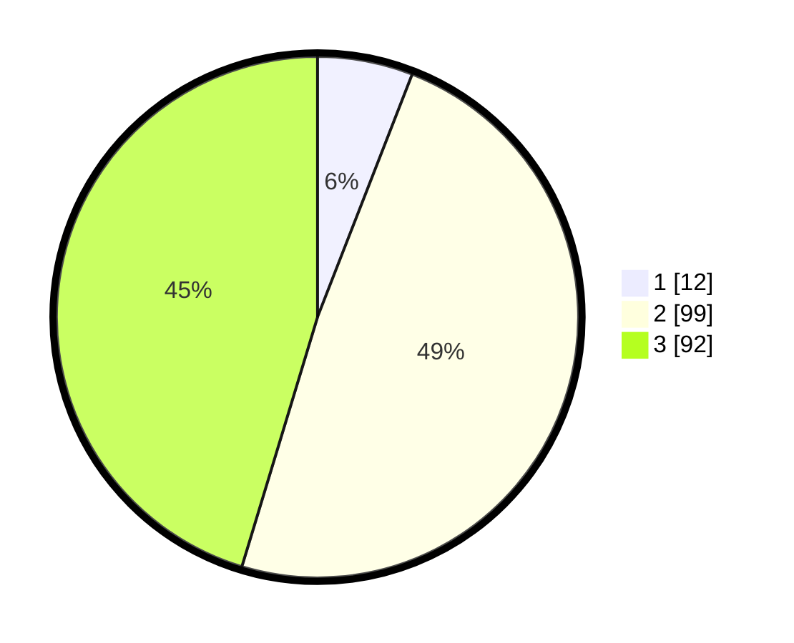

# Hasil

## Grafik

## Tabel

| No. | Nama Paslon    | Suara | Suara (raw) | Persentase |
|:--- |:-------------- | -----:| -----------:| ----------:|
| 1   | ANIES MUHAIMIN | 12    | [12][p-1]   | 5,91       |
| 2   | PRABOWO GIBRAN | 99    | [99][p-2]   | 48,77      |
| 3   | GANJAR MAHFUD  | 92    | [92][p-3]   | 45,32      |

[p-1]: https://github.com/gigit-pemilu/pemilu-2024-51-bali/blob/main/pilpres/hitung-suara/sub/51-bali/sub/02-tabanan/sub/06-kediri/sub/2009-pandak-bandung/sub/003-tps/sub/paslon-1.txt
[p-2]: https://github.com/gigit-pemilu/pemilu-2024-51-bali/blob/main/pilpres/hitung-suara/sub/51-bali/sub/02-tabanan/sub/06-kediri/sub/2009-pandak-bandung/sub/003-tps/sub/paslon-2.txt
[p-3]: https://github.com/gigit-pemilu/pemilu-2024-51-bali/blob/main/pilpres/hitung-suara/sub/51-bali/sub/02-tabanan/sub/06-kediri/sub/2009-pandak-bandung/sub/003-tps/sub/paslon-3.txt

## Foto C Plano

https://sirekap-obj-formc.kpu.go.id/6696/pemilu/ppwp/51/02/06/20/09/5102062009003-20240216-021311--4112cdc1-28c4-4269-9747-ce7ccb8e0728.jpg

https://sirekap-obj-formc.kpu.go.id/6696/pemilu/ppwp/51/02/06/20/09/5102062009003-20240216-021313--d91bd820-642b-4627-833b-635d27e21d2d.jpg

https://sirekap-obj-formc.kpu.go.id/6696/pemilu/ppwp/51/02/06/20/09/5102062009003-20240216-021312--35c17f54-ed3e-49de-8c03-859e1ae1d698.jpg

## Metadata

| Key        | Value               |
| ---------- | ------------------- |
| Time Stamp | 2024-02-16 11:00:29 |

## DATA PEMILIH TETAP

Jumlah pemilih dalam DPT: **239**.
 * L: **118**.
 * P: **121**.

## DATA PENGGUNA HAK PILIH

Jumlah pengguna hak pilih dalam DPT: **204**.
 * L: **99**.
 * P: **105**.

Jumlah pengguna hak pilih dalam DPTb: **0**.
 * L: **0**.
 * P: **0**.

Jumlah pengguna hak pilih dalam DPK: **0**.
 * L: **0**.
 * P: **0**.

Jumlah pengguna hak pilih: **204**.
 * L: **99**.
 * P: **105**.

## JUMLAH SUARA SAH DAN TIDAK SAH

JUMLAH SELURUH SUARA SAH: **203**.

JUMLAH SUARA TIDAK SAH: **1**.

JUMLAH SELURUH SUARA SAH DAN SUARA TIDAK SAH: **204**.

