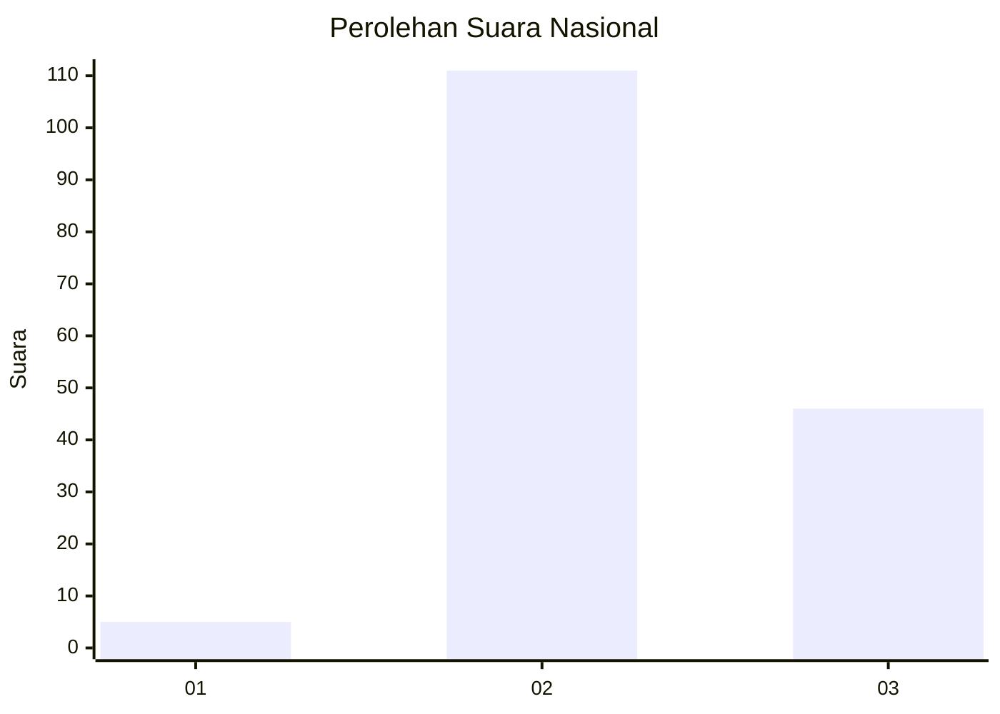
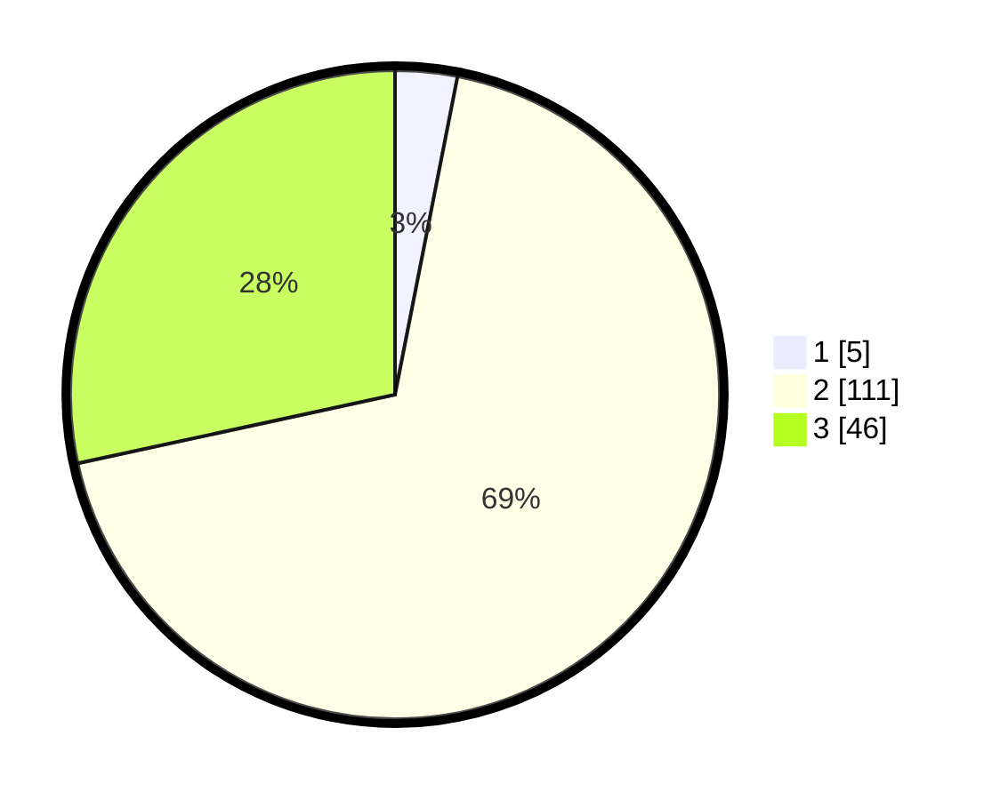

# Hasil

## Grafik

## Tabel

| No. | Nama Paslon    | Suara | Suara (raw) | Persentase |
|:--- |:-------------- | -----:| -----------:| ----------:|
| 1   | ANIES MUHAIMIN | 5     | [5][p-1]    | 3,09       |
| 2   | PRABOWO GIBRAN | 111   | [111][p-2]  | 68,52      |
| 3   | GANJAR MAHFUD  | 46    | [46][p-3]   | 28,40      |

[p-1]: https://github.com/gigit-pemilu/pemilu-2024/blob/main/pilpres/hitung-suara/sub/51-bali/sub/02-tabanan/sub/06-kediri/sub/2010-pandak-gede/sub/004-tps/sub/paslon-1.txt
[p-2]: https://github.com/gigit-pemilu/pemilu-2024/blob/main/pilpres/hitung-suara/sub/51-bali/sub/02-tabanan/sub/06-kediri/sub/2010-pandak-gede/sub/004-tps/sub/paslon-2.txt
[p-3]: https://github.com/gigit-pemilu/pemilu-2024/blob/main/pilpres/hitung-suara/sub/51-bali/sub/02-tabanan/sub/06-kediri/sub/2010-pandak-gede/sub/004-tps/sub/paslon-3.txt

## Foto C Plano

https://sirekap-obj-formc.kpu.go.id/d006/pemilu/ppwp/51/02/06/20/10/5102062010004-20240214-224450--b6a54a31-7bea-4416-955f-e3a0c65c91b1.jpg

https://sirekap-obj-formc.kpu.go.id/d006/pemilu/ppwp/51/02/06/20/10/5102062010004-20240214-224456--7a74d5de-5744-40cc-ac97-455e69784947.jpg

https://sirekap-obj-formc.kpu.go.id/d006/pemilu/ppwp/51/02/06/20/10/5102062010004-20240214-224459--39623db6-cca4-46f5-9698-696c23f33f65.jpg

## Metadata

| Key        | Value               |
| ---------- | ------------------- |
| Time Stamp | 2024-02-15 23:29:50 |

