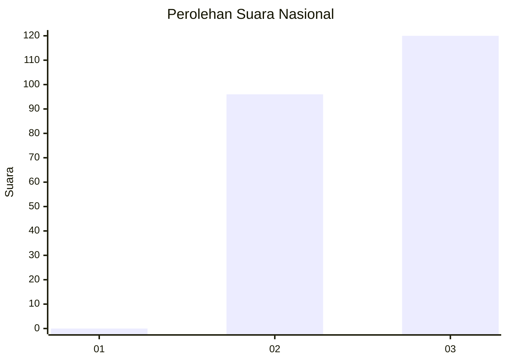
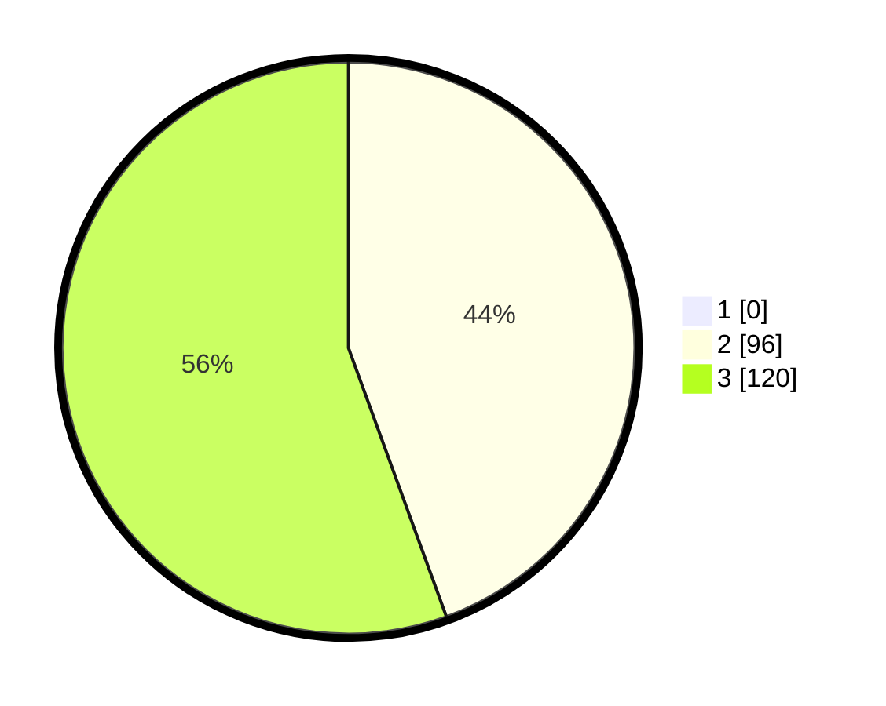

# Hasil

## Grafik

## Tabel

| No. | Nama Paslon    | Suara | Suara (raw) | Persentase |
|:--- |:-------------- | -----:| -----------:| ----------:|
| 1   | ANIES MUHAIMIN | 0     | [0][p-1]    | 0,00       |
| 2   | PRABOWO GIBRAN | 96    | [96][p-2]   | 44,44      |
| 3   | GANJAR MAHFUD  | 120   | [120][p-3]  | 55,56      |

[p-1]: https://github.com/gigit-pemilu/pemilu-2024/blob/main/pilpres/hitung-suara/sub/51-bali/sub/02-tabanan/sub/06-kediri/sub/2010-pandak-gede/sub/009-tps/sub/paslon-1.txt
[p-2]: https://github.com/gigit-pemilu/pemilu-2024/blob/main/pilpres/hitung-suara/sub/51-bali/sub/02-tabanan/sub/06-kediri/sub/2010-pandak-gede/sub/009-tps/sub/paslon-2.txt
[p-3]: https://github.com/gigit-pemilu/pemilu-2024/blob/main/pilpres/hitung-suara/sub/51-bali/sub/02-tabanan/sub/06-kediri/sub/2010-pandak-gede/sub/009-tps/sub/paslon-3.txt

## Foto C Plano

https://sirekap-obj-formc.kpu.go.id/c9d5/pemilu/ppwp/51/02/06/20/10/5102062010009-20240214-215746--4d45cc8a-6cc4-40ec-b356-edb966e39358.jpg

https://sirekap-obj-formc.kpu.go.id/c9d5/pemilu/ppwp/51/02/06/20/10/5102062010009-20240214-215844--b9d722a4-1ffb-49e3-b752-086338e508f2.jpg

https://sirekap-obj-formc.kpu.go.id/c9d5/pemilu/ppwp/51/02/06/20/10/5102062010009-20240214-215930--c657f7f6-44ee-430d-a97d-c9cb7c501b86.jpg

## Metadata

| Key        | Value               |
| ---------- | ------------------- |
| Time Stamp | 2024-02-15 23:29:50 |

## DATA PEMILIH TETAP

Jumlah pemilih dalam DPT: **214**.
 * L: **103**.
 * P: **111**.

## DATA PENGGUNA HAK PILIH

Jumlah pengguna hak pilih dalam DPT: **211**.
 * L: **104**.
 * P: **107**.

Jumlah pengguna hak pilih dalam DPTb: **4**.
 * L: **2**.
 * P: **2**.

Jumlah pengguna hak pilih dalam DPK: **2**.
 * L: **1**.
 * P: **1**.

Jumlah pengguna hak pilih: **217**.
 * L: **107**.
 * P: **110**.

## JUMLAH SUARA SAH DAN TIDAK SAH

JUMLAH SELURUH SUARA SAH: **216**.

JUMLAH SUARA TIDAK SAH: **1**.

JUMLAH SELURUH SUARA SAH DAN SUARA TIDAK SAH: **217**.

