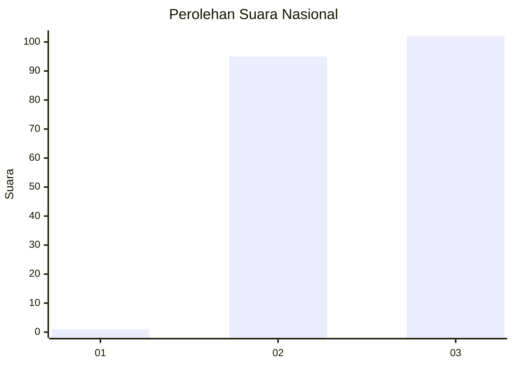
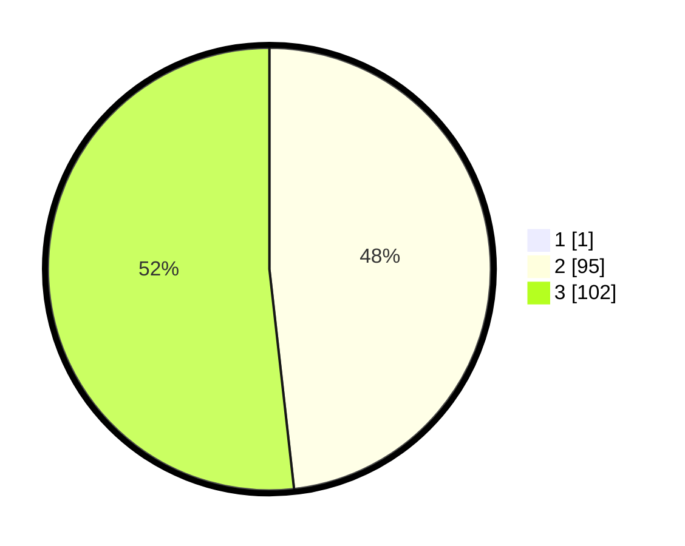

# Hasil

## Grafik

## Tabel

| No. | Nama Paslon    | Suara | Suara (raw) | Persentase |
|:--- |:-------------- | -----:| -----------:| ----------:|
| 1   | ANIES MUHAIMIN | 1     | [1][p-1]    | 0,51       |
| 2   | PRABOWO GIBRAN | 95    | [95][p-2]   | 47,98      |
| 3   | GANJAR MAHFUD  | 102   | [102][p-3]  | 51,52      |

[p-1]: https://github.com/gigit-pemilu/pemilu-2024/blob/main/pilpres/hitung-suara/sub/51-bali/sub/02-tabanan/sub/06-kediri/sub/2010-pandak-gede/sub/011-tps/sub/paslon-1.txt
[p-2]: https://github.com/gigit-pemilu/pemilu-2024/blob/main/pilpres/hitung-suara/sub/51-bali/sub/02-tabanan/sub/06-kediri/sub/2010-pandak-gede/sub/011-tps/sub/paslon-2.txt
[p-3]: https://github.com/gigit-pemilu/pemilu-2024/blob/main/pilpres/hitung-suara/sub/51-bali/sub/02-tabanan/sub/06-kediri/sub/2010-pandak-gede/sub/011-tps/sub/paslon-3.txt

## Foto C Plano

https://sirekap-obj-formc.kpu.go.id/94d9/pemilu/ppwp/51/02/06/20/10/5102062010011-20240215-002730--3023cd27-5642-4ef8-ac59-2fce839d7983.jpg

https://sirekap-obj-formc.kpu.go.id/94d9/pemilu/ppwp/51/02/06/20/10/5102062010011-20240215-001552--8f682120-2318-486a-be66-891f279bd672.jpg

https://sirekap-obj-formc.kpu.go.id/94d9/pemilu/ppwp/51/02/06/20/10/5102062010011-20240215-001654--3551966f-66ee-4f96-929f-2f0dd320d68b.jpg

## Metadata

| Key        | Value               |
| ---------- | ------------------- |
| Time Stamp | 2024-02-24 22:31:28 |

## DATA PEMILIH TETAP

Jumlah pemilih dalam DPT: **0**.
 * L: **61**.
 * P: **200**.

## DATA PENGGUNA HAK PILIH

Jumlah pengguna hak pilih dalam DPT: **0**.
 * L: **64**.
 * P: **250**.

Jumlah pengguna hak pilih dalam DPTb: **522**.
 * L: **0**.
 * P: **5**.

Jumlah pengguna hak pilih dalam DPK: **5**.
 * L: **554**.
 * P: **500**.

Jumlah pengguna hak pilih: **0**.
 * L: **244**.
 * P: **950**.

## JUMLAH SUARA SAH DAN TIDAK SAH

JUMLAH SELURUH SUARA SAH: **198**.

JUMLAH SUARA TIDAK SAH: **6**.

JUMLAH SELURUH SUARA SAH DAN SUARA TIDAK SAH: **204**.

