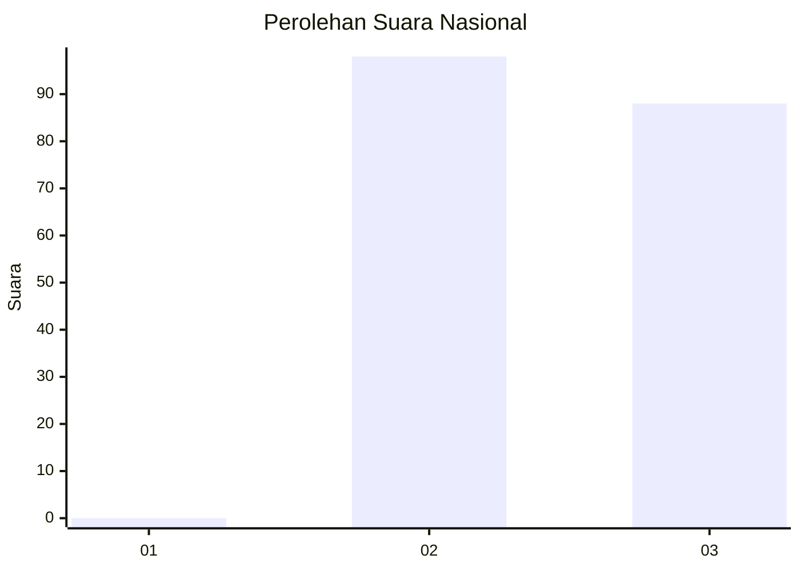
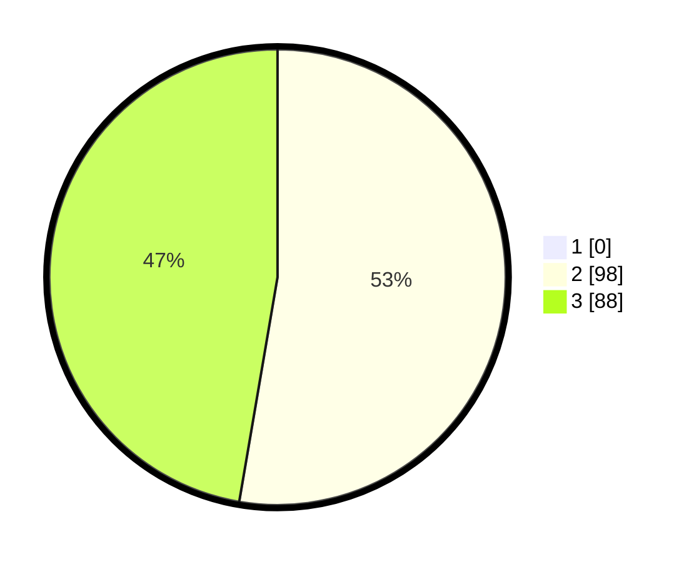

# Hasil

## Grafik

## Tabel

| No. | Nama Paslon    | Suara | Suara (raw) | Persentase |
|:--- |:-------------- | -----:| -----------:| ----------:|
| 1   | ANIES MUHAIMIN | 0     | [0][p-1]    | 0,00       |
| 2   | PRABOWO GIBRAN | 98    | [98][p-2]   | 52,69      |
| 3   | GANJAR MAHFUD  | 88    | [88][p-3]   | 47,31      |

[p-1]: https://github.com/gigit-pemilu/pemilu-2024/blob/main/pilpres/hitung-suara/sub/51-bali/sub/02-tabanan/sub/06-kediri/sub/2010-pandak-gede/sub/012-tps/sub/paslon-1.txt
[p-2]: https://github.com/gigit-pemilu/pemilu-2024/blob/main/pilpres/hitung-suara/sub/51-bali/sub/02-tabanan/sub/06-kediri/sub/2010-pandak-gede/sub/012-tps/sub/paslon-2.txt
[p-3]: https://github.com/gigit-pemilu/pemilu-2024/blob/main/pilpres/hitung-suara/sub/51-bali/sub/02-tabanan/sub/06-kediri/sub/2010-pandak-gede/sub/012-tps/sub/paslon-3.txt

## Foto C Plano

https://sirekap-obj-formc.kpu.go.id/7872/pemilu/ppwp/51/02/06/20/10/5102062010012-20240214-220732--8131ab2a-ff05-4332-b1f0-004681624e8f.jpg

https://sirekap-obj-formc.kpu.go.id/7872/pemilu/ppwp/51/02/06/20/10/5102062010012-20240214-155455--40b8b56f-a896-42ae-a52f-6c4523fe8724.jpg

https://sirekap-obj-formc.kpu.go.id/7872/pemilu/ppwp/51/02/06/20/10/5102062010012-20240214-220356--a636ffd1-53bf-4796-8aa8-e175a09f5db6.jpg

## Metadata

| Key        | Value               |
| ---------- | ------------------- |
| Time Stamp | 2024-02-15 15:00:29 |

